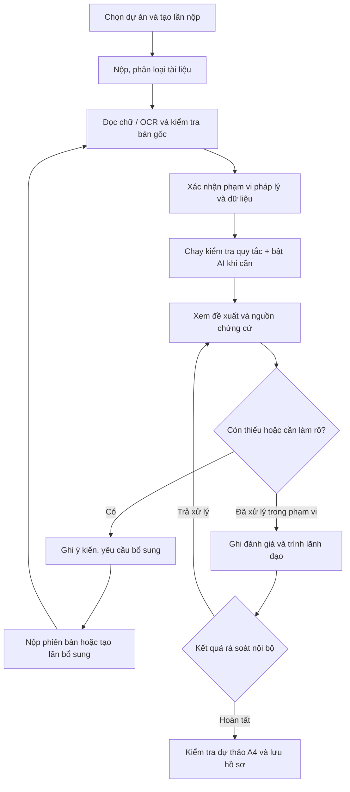

# HƯỚNG DẪN QUY TRÌNH THẨM ĐỊNH HỒ SƠ CÓ HỖ TRỢ AI

**Hệ thống:** BuildAppraisal AI — Hỗ trợ nghiệp vụ Sở Xây dựng  
**Phiên bản tài liệu:** 1.0 — ngày 27/09/2026  
**Đối tượng:** Chuyên viên, trưởng phòng, lãnh đạo và người trình diễn hệ thống  
**Phạm vi:** Chức năng đã triển khai trên bản demo tại [localhost:3008](http://localhost:3008/projects/appraisal).

> Tài liệu hướng dẫn thao tác phần mềm hiện có. Các đầu ra là dự thảo phục vụ rà soát nội bộ. Việc ký, cấp số và ban hành văn bản thuộc người có thẩm quyền; chưa được thực hiện tự động trong hệ thống.

## Mục lục

1. [Phạm vi hỗ trợ và nguyên tắc sử dụng](#1-phạm-vi-hỗ-trợ-và-nguyên-tắc-sử-dụng)
2. [Vai trò và trách nhiệm](#2-vai-trò-và-trách-nhiệm)
3. [Chuẩn bị trước khi thao tác](#3-chuẩn-bị-trước-khi-thao-tác)
4. [Sơ đồ quy trình](#4-sơ-đồ-quy-trình)
5. [Tiếp nhận, liên kết dự án và nộp tài liệu](#5-tiếp-nhận-liên-kết-dự-án-và-nộp-tài-liệu)
6. [Đọc PDF scan bằng OCR](#6-đọc-pdf-scan-bằng-ocr)
7. [Xác nhận phạm vi pháp lý](#7-xác-nhận-phạm-vi-pháp-lý)
8. [Kiểm tra dữ liệu trích xuất](#8-kiểm-tra-dữ-liệu-trích-xuất)
9. [Chạy kiểm tra và phân tích bằng AI](#9-chạy-kiểm-tra-và-phân-tích-bằng-ai)
10. [Đọc kết quả và đối chiếu chứng cứ](#10-đọc-kết-quả-và-đối-chiếu-chứng-cứ)
11. [Rà soát tổng mức đầu tư](#11-rà-soát-tổng-mức-đầu-tư)
12. [Yêu cầu bổ sung và quản lý phiên bản](#12-yêu-cầu-bổ-sung-và-quản-lý-phiên-bản)
13. [Trình lãnh đạo và hoàn tất rà soát nội bộ](#13-trình-lãnh-đạo-và-hoàn-tất-rà-soát-nội-bộ)
14. [Xem, tải và kiểm tra văn bản đầu ra](#14-xem-tải-và-kiểm-tra-văn-bản-đầu-ra)
15. [Tra cứu pháp luật bằng AI](#15-tra-cứu-pháp-luật-bằng-ai)
16. [Cấp giấy phép xây dựng và nghiệm thu](#16-cấp-giấy-phép-xây-dựng-và-nghiệm-thu)
17. [Kịch bản thực hành và tiêu chí kiểm tra](#17-kịch-bản-thực-hành-và-tiêu-chí-kiểm-tra)
18. [Xử lý lỗi và tình huống thường gặp](#18-xử-lý-lỗi-và-tình-huống-thường-gặp)
19. [Checklist bàn giao hồ sơ](#19-checklist-bàn-giao-hồ-sơ)
20. [Tài liệu và bộ mẫu liên quan](#20-tài-liệu-và-bộ-mẫu-liên-quan)

## 1. Phạm vi hỗ trợ và nguyên tắc sử dụng

### 1.1. Những chức năng đang có

| Thành phần | Hệ thống thực hiện | Chuyên viên cần thực hiện |
| --- | --- | --- |
| Tiếp nhận | Lưu tài liệu, nhóm thành phần, phiên bản và liên kết dự án | Chọn đúng dự án, lần nộp và loại tài liệu |
| Đọc tài liệu | Đọc chữ từ PDF/DOCX/TXT; OCR PDF scan | Kiểm tra khả năng đọc, bản gốc và phụ lục |
| Trích xuất | Nhận diện một số trường thông tin, chỉ tiêu và khoản mục chi phí theo cấu trúc hỗ trợ | Xác nhận, sửa hoặc loại bỏ giá trị trích sai |
| Kiểm tra theo quy tắc | Kiểm tra thành phần, tính nhất quán, phép tính, dữ liệu và điều kiện còn thiếu | Đánh giá cảnh báo trong bối cảnh cụ thể |
| Phân tích AI trong BCNCKT | Đề xuất vấn đề cần làm rõ từ các trích đoạn, kèm nguồn | Đối chiếu từng nhận xét và chứng cứ trước khi sử dụng |
| Trợ lý pháp luật | Tìm nguồn trong kho, tổng hợp trả lời khi bật AI | Đọc văn bản gốc, kiểm tra phạm vi và điều kiện áp dụng |
| Quy trình | Phân công, ghi ý kiến, bổ sung, trình và rà soát nội bộ | Chịu trách nhiệm về nhận xét và quyết định xử lý |
| Văn bản | Tạo dự thảo PDF/DOCX A4 | Hoàn thiện dữ liệu, thể thức, nội dung và thủ tục ban hành |

**BCNCKT** hiện có luồng phân tích hồ sơ bằng mô hình AI. **GPXD và Hậu kiểm & Nghiệm thu** hiện có OCR, checklist pháp lý, phiếu chuyên môn, theo dõi xử lý và xuất dự thảo; chưa có nút phân tích hồ sơ bằng mô hình tương đương BCNCKT.

### 1.2. Ba loại kết quả cần phân biệt

1. **Kết quả kiểm tra theo quy tắc:** phép đối chiếu do phần mềm thực hiện; có thể tồn tại ngay cả khi không gọi AI.
2. **Đề xuất từ AI:** nhận xét do mô hình tạo từ phần tài liệu được cung cấp; phải có nguồn để chuyên viên kiểm tra.
3. **Đánh giá của chuyên viên:** ý kiến do người dùng lưu sau khi xem chứng cứ, điều kiện áp dụng và phạm vi nhiệm vụ.

Trạng thái **Đã kiểm tra** chỉ cho biết đã có lượt xử lý. Muốn biết AI có thực sự trả lời, phải đọc thông báo kết quả AI của lượt chạy.

### 1.3. Giới hạn cần hiểu khi đọc kết quả

- AI phân tích trích đoạn được gửi vào lượt chạy. Nếu vượt giới hạn dung lượng, phần thông báo kết quả ghi rõ chỉ phân tích trích đoạn.
- Số lượng đề xuất thay đổi theo hồ sơ và lượt chạy; không yêu cầu luôn có một số lượng cố định.
- Không có đề xuất AI không đồng nghĩa toàn bộ hồ sơ đã phù hợp.
- Có tệp đọc được không đồng nghĩa tệp đã hợp lệ, đủ phụ lục hoặc đã xác thực chữ ký.
- Mô hình không tự kiểm định an toàn kết cấu, xác nhận hiện trường, xác minh chứng chỉ trên hệ thống bên ngoài hoặc kết luận điều kiện ban hành thay cán bộ.
- Kho nguồn và bộ quy tắc có phạm vi xác định. Không coi việc tìm được một điều khoản là đã rà soát đầy đủ mọi quy định liên quan.

## 2. Vai trò và trách nhiệm

| Vai trò | Công việc chính trong bản hiện tại |
| --- | --- |
| Chuyên viên | Tiếp nhận, nộp tài liệu, đọc OCR, xác nhận dữ liệu, chạy kiểm tra, ghi nhận xét, giải trình và trình rà soát trong phạm vi được cấp |
| Trưởng phòng | Phân công, xác nhận hạn nội bộ, trả chuyên viên xử lý, rà soát và hoàn tất nội bộ |
| Lãnh đạo Sở | Rà soát, trả xử lý hoặc hoàn tất nội bộ trong phạm vi quyền được cấp |
| Quản trị | Hỗ trợ cấu hình và dữ liệu thử nghiệm; không dùng vai trò quản trị thay người có quyền duyệt nghiệp vụ |

Quyền thực tế phụ thuộc tỉnh, phòng ban, phân công và trạng thái hồ sơ. Một nút có thể không xuất hiện hoặc bị vô hiệu hóa khi tài khoản không có quyền hoặc hồ sơ không ở bước phù hợp.

**Cách thử vai trò:** đăng xuất rồi chọn tài khoản đăng nhập nhanh tương ứng trên màn hình đăng nhập, nếu môi trường demo đang bật chức năng này. Thử vai trò Chuyên viên trước; chuyển Trưởng phòng khi đến bước phân công hoặc hoàn tất.

## 3. Chuẩn bị trước khi thao tác

### 3.1. Điều kiện truy cập

1. Mở [hệ thống](http://localhost:3008/projects/appraisal).
2. Đăng nhập bằng tài khoản được cấp hoặc tài khoản thử nghiệm theo vai trò.
3. Kiểm tra thấy đúng dự án/hồ sơ thuộc phạm vi của mình.
4. Nếu cần phân tích bằng AI, vào **Cài đặt hệ thống → Kiểm tra kết nối AI**.
5. Chỉ coi kết nối đã được xác nhận khi có thông báo **Đã nhận phản hồi từ mô hình**. Trạng thái **Đã cấu hình** chưa phải kết quả kiểm tra kết nối.

Thao tác kiểm tra kết nối gửi lời nhắn thử. Khi chạy phân tích hồ sơ có bật AI, các trích đoạn hồ sơ được gửi đến nhà cung cấp mô hình để xử lý.

### 3.2. Chọn cách thực hành

- **Xem kết quả có sẵn:** mở hồ sơ mẫu mới nhất, bấm **Xem kết quả** nếu đã có kết quả. Không cần chạy lại chỉ để đọc.
- **Thử phân tích lại:** dùng lần nộp mới nhất còn được phép xử lý; ghi nhớ việc chạy lại tạo bộ kết quả mới.
- **Thử trọn quy trình tiếp nhận:** tạo lần nộp riêng, đặt tên rõ ràng, ví dụ `THỬ NGHIỆM AI — BCNCKT — 27/09/2026`.

Hồ sơ mới do người dùng tạo có thể được hiển thị là **Tự tạo**. Tên có chữ “thử nghiệm” không tự thay đổi nhãn phân loại của hệ thống; cần phân biệt khi thống kê.

### 3.3. Chuẩn bị tệp đầu vào

| Nhóm | Tài liệu nên chuẩn bị cho việc thử BCNCKT |
| --- | --- |
| Tiếp nhận | Tờ trình và danh mục tài liệu kèm theo |
| Pháp lý | Các quyết định, văn bản và tài liệu làm căn cứ áp dụng cho chính hồ sơ |
| Khảo sát | Hồ sơ địa hình, địa chất và kết quả có liên quan |
| Thiết kế | Thuyết minh BCNCKT, thiết kế cơ sở, chỉ tiêu và phụ lục |
| Chi phí | Bảng tổng mức đầu tư, các khoản mục và tổng công bố |
| Năng lực | Tài liệu tổ chức, nhân sự và phạm vi năng lực cần đối chiếu |
| Chuyên ngành | Các văn bản/quy hoạch/PCCC/môi trường/đấu nối… theo điều kiện của hồ sơ |

Đây là cách tổ chức dữ liệu để sử dụng phần mềm, **không phải danh mục pháp lý bắt buộc giống nhau cho mọi dự án**. Thành phần áp dụng phải được xác định tại tab **Căn cứ pháp lý** và từ tờ trình thực tế.

Định dạng nộp hiện tại: **PDF, DOCX, TXT; tối đa 18 MB/tệp**. Với Excel, DWG, ảnh rời hoặc ZIP, cần chuẩn bị bản xuất PDF phù hợp để nộp qua luồng này. Không chỉ đổi đuôi tệp.

Nên đặt tên có nội dung và phiên bản, ví dụ `BCNCKT_ThuyetMinh_Lan02.pdf`, `TMĐT_Lan02.pdf`. Không dùng tên tệp để thay nội dung còn thiếu trong văn bản.

## 4. Sơ đồ quy trình

Có thể chạy sơ bộ trước khi xác nhận hết dữ liệu để xác định vấn đề cần xử lý. Kết quả sơ bộ cần được cập nhật sau khi chuyên viên sửa dữ liệu hoặc bổ sung tài liệu.

## 5. Tiếp nhận, liên kết dự án và nộp tài liệu

### 5.1. Hai đường vào cùng một hồ sơ

- **Danh sách tổng:** Quản lý Dự án → Thẩm định BCNCKT.
- **Theo dự án:** Quản lý Dự án → mở tên dự án → tab Thẩm định BCNCKT.

Danh sách tổng chứa hồ sơ của các dự án trong phạm vi quyền truy cập. Tab dự án chỉ hiển thị các lần nộp gắn với dự án đang mở. Đây là cùng dữ liệu, không cần tạo lại ở hai nơi.

Bảng hiển thị tên hồ sơ, số tài liệu, loại dữ liệu, trạng thái/phòng thụ lý, địa điểm và thời gian. Có thể tìm kiếm, lọc, bấm tiêu đề để sắp xếp và kéo ranh giới cột để đổi độ rộng.

### 5.2. Tạo lần nộp

1. Bấm **Tạo lần nộp hồ sơ**.
2. Chọn đúng dự án nếu đang ở danh sách tổng.
3. Nhập tên hồ sơ/lần nộp, địa phương công trình và thời điểm áp dụng quy định.
4. Bấm **Tạo hồ sơ**.
5. Kiểm tra lại tên và dự án liên kết trong panel vừa mở.

Phòng thụ lý/phạm vi truy cập được gắn theo tài khoản. Địa điểm công trình không dùng để tự cấp quyền xem hồ sơ.

Nếu gắn nhầm dự án, dùng **Đổi dự án/Gắn dự án** tại danh sách tổng. Sau khi đổi phải rà soát lại kết quả cũ.

### 5.3. Phân công và bắt đầu xử lý

1. Trưởng phòng/lãnh đạo có quyền mở phần **Quy trình xử lý**.
2. Bấm **Phân công**, chọn chuyên viên, nhập hạn nội bộ nếu đã xác định và căn cứ.
3. Bấm **Lưu xử lý**.
4. Chuyên viên được phân công mở hồ sơ, chọn **Bắt đầu xử lý** khi nút này xuất hiện.

Hạn đang nhập là hạn nội bộ do người phụ trách xác nhận; không coi là thời hạn pháp luật đã được hệ thống tự tính đầy đủ.

### 5.4. Nộp tài liệu đúng nhóm

Trong tab **Hồ sơ đầu vào**:

1. Chọn thành phần, ví dụ **Thuyết minh BCNCKT** hoặc **Tổng mức đầu tư**.
2. Chọn vai trò tệp:
   - **Tài liệu đầu vào:** tài liệu áp dụng cho lần nộp này.
   - **Kết quả cũ / tham khảo:** tài liệu để đối chiếu, không thay bộ đầu vào hiện tại.
3. Bấm **Nộp tài liệu**, chọn tệp và chờ lưu xong.
4. Kiểm tra tên tệp, phiên bản, ghi chú đọc tệp và trạng thái chữ ký.
5. Lặp lại với các thành phần còn lại.

Nếu có thành phần chưa có trong danh mục, chọn **Thêm thành phần** và nhập tên/nhóm phù hợp. Nếu hệ thống nhận diện danh mục từ tờ trình, đọc trích dẫn trước khi bấm **Xác nhận thành phần**.

**Quy tắc phiên bản:** với luồng phân tích hiện tại, nên nộp một tài liệu đầy đủ cho mỗi nhóm/thành phần ở một phiên bản. Tệp nộp tiếp vào cùng nhóm có thể được chọn là phiên bản mới nhất để phân tích. Không chia một bộ nhiều tệp thành cùng nhóm rồi mặc định AI sẽ đọc tất cả như các thành phần độc lập; cần gộp PDF phù hợp hoặc tạo thành phần riêng.

### 5.5. Kiểm tra thành phần

Bấm **Kiểm tra thành phần** tại từng dòng, ghi tình trạng và nhận xét. Không đánh dấu đã kiểm tra chỉ vì thấy tên tài liệu. Cần xem khả năng đọc, phạm vi nội dung, phụ lục và dấu hiệu thiếu trang.

## 6. Đọc PDF scan bằng OCR

### 6.1. Khi nào dùng OCR?

Dùng khi PDF là ảnh quét, không chọn/copy được chữ hoặc phần mềm báo chưa đọc đủ nội dung. PDF đã có lớp chữ thường không cần thao tác OCR riêng.

Có hai mức xử lý hiện tại:

- **Khi nộp tệp:** bộ đọc có thể OCR tự động tối đa 2 trang scan trong một tệp.
- **Khi bấm Đọc OCR:** công việc nền cho PDF đã nộp, tối đa 300 trang được xử lý OCR theo giới hạn hiện tại. Thời gian tối đa của công việc là 15 phút; tệp vẫn giới hạn 18 MB.

Vì vậy, dòng thông tin “2 trang scan/tệp” ở phần nộp tài liệu không mô tả giới hạn của nút **Đọc OCR** riêng.

### 6.2. Cách thao tác

1. Nộp PDF vào đúng thành phần.
2. Tìm khối **Đọc tài liệu scan bằng OCR**. Khối chỉ xuất hiện khi hồ sơ có PDF.
3. Chọn PDF cần đọc → bấm **Đọc OCR**.
4. Chờ thông báo hoàn tất. Có thể dùng **Hủy công việc** nếu cần dừng.
5. Mở nội dung và bản gốc để so sánh.
6. Kiểm tra lại dữ liệu trích xuất và phiếu liên quan; chạy lại phân tích nếu kết quả cũ hết hiệu lực.

### 6.3. Nội dung cần kiểm tra sau OCR

- Tên dự án, địa điểm, tên tổ chức và nhân sự.
- Số hiệu văn bản, ngày tháng, điều/khoản được dẫn.
- Dấu chấm/phẩy, đơn vị tiền, đơn vị diện tích và số chữ số.
- Bảng chi phí, dòng tổng, số âm và chú thích.
- Trang bị xoay, mờ, thiếu lề, thiếu phụ lục hoặc bản vẽ không đọc được.

Bản gốc được giữ nguyên. Văn bản OCR không xác thực chữ ký và không thay việc đọc bản vẽ/bảng tính chuyên môn.

## 7. Xác nhận phạm vi pháp lý

### 7.1. Chọn phạm vi và ngày trình

1. Mở **Căn cứ pháp lý**.
2. Bấm **Xác nhận phạm vi và ngày trình**.
3. Nhập/đối chiếu:
   - Ngày trình hồ sơ.
   - Phạm vi cơ quan chuyên môn về xây dựng, đơn vị của người quyết định đầu tư hoặc trường hợp khác trong danh sách.
   - Trình mới, điều chỉnh hoặc giai đoạn còn lại.
   - Tình trạng trước 01/07/2026 nếu hồ sơ có lịch sử liên quan.
4. Ghi căn cứ và ý kiến, tối thiểu 10 ký tự.
5. Bấm **Lưu đối chiếu**.

Không đổi ngày hồ sơ chỉ để ép phần mềm chọn bộ quy tắc mong muốn. Hồ sơ chuyển tiếp cần nhập lịch sử thực tế. Bản demo đang được cấu hình phục vụ quy trình sau 01/07/2026; xem nhánh pháp lý hệ thống đề xuất và nguồn đi kèm.

### 7.2. Đối chiếu từng thành phần pháp lý

Tại mỗi dòng bấm **Đối chiếu**:

1. Đọc điều kiện áp dụng và căn cứ liên kết.
2. Với mục có điều kiện, chọn **Áp dụng**, **Không áp dụng** hoặc giữ **Chưa xác định** khi chưa đủ căn cứ.
3. Chọn nhóm tài liệu chứa chứng cứ đã nộp.
4. Ghi lý do, tên/số văn bản và vị trí cần xem.
5. Lưu đối chiếu.

**Đã liên kết tệp** chỉ xác nhận đã gắn tài liệu vào dòng kiểm tra. Nó chưa chứng minh tệp có đủ nội dung hoặc chữ ký hợp lệ. Khi còn mục chưa xác định điều kiện áp dụng, cần xử lý trước bước hoàn tất rà soát.

## 8. Kiểm tra dữ liệu trích xuất

1. Mở **Dữ liệu trích xuất**.
2. Dùng tìm kiếm/lọc để tìm trường cần xử lý.
3. Bấm **nguồn chứng cứ** để xem tệp, vị trí và trích đoạn.
4. Bấm **Bản gốc** khi cần xem đầy đủ ngữ cảnh.
5. Chọn **Xem và xác nhận**:
   - Giữ giá trị đúng và xác nhận.
   - Sửa giá trị đọc sai, ghi căn cứ rồi xác nhận.
   - Chọn không sử dụng nếu dữ liệu không phù hợp với phạm vi.
6. Bấm **Lưu đánh giá**.

Ưu tiên kiểm tra tổng mức đầu tư, đơn vị, diện tích, số tầng, cấp công trình, chứng chỉ, tiêu chuẩn và dữ liệu có giá trị khác nhau giữa các tài liệu.

Trích xuất hiện dựa trên các trường/nhãn và cấu trúc được hỗ trợ. Không phải mọi thông tin trong một tệp bất kỳ đều tự xuất hiện thành trường dữ liệu. Khi thiếu trường quan trọng, phải đọc bản gốc và ghi nhận/giải trình; không tự suy ra rằng tài liệu không có nội dung đó.

**Thứ tự nên dùng:** sửa và xác nhận dữ liệu → chạy lại kiểm tra → đánh giá nhận xét mới. Chạy lại sau khi đã đánh giá nhận xét sẽ tạo lượt kết quả mới, các đánh giá cũ không tự được chấp nhận cho lượt mới.

## 9. Chạy kiểm tra và phân tích bằng AI

### 9.1. Chọn chế độ

| Chế độ | Cách dùng |
| --- | --- |
| Kiểm tra đầu vào hiện tại | Kiểm tra bộ tài liệu hiện hành trong lần nộp; dùng làm bước chính |
| Đối chiếu cả tài liệu tham khảo | Dùng khi cần đưa tài liệu tham khảo đã lưu vào phạm vi đối chiếu |

Chế độ đối chiếu không tự tải mọi lần nộp khác hoặc mọi tệp trong thư mục máy tính. Muốn so sánh, phải có các tài liệu cần thiết trong phạm vi hồ sơ đang xử lý.

### 9.2. Bắt đầu lượt chạy

1. Chọn chế độ kiểm tra.
2. Tích **Phân tích thêm bằng mô hình AI** nếu muốn gọi AI.
3. Bấm **Chạy kiểm tra hồ sơ** một lần.
4. Quan sát thông báo **Đang gửi yêu cầu kiểm tra…**, sau đó **Đang kiểm tra hồ sơ và phân tích bằng AI…**.
5. Theo dõi thời gian chờ. Khi hoàn tất, hệ thống tự mở **Nội dung thẩm định** và đưa vùng kết quả vào tầm nhìn.

Không cần bấm liên tục. Nếu việc lấy tiến trình gặp lỗi mạng, hệ thống báo đang thử kết nối lại. Nút **Hủy lượt chạy** dùng để dừng công việc đang chạy; lượt cũ vẫn có thể được giữ để tham khảo.

### 9.3. Nhận biết kết quả

| Thông báo | Ý nghĩa và thao tác tiếp theo |
| --- | --- |
| Đã có kết quả kiểm tra | Đọc số nội dung và số đề xuất AI, bấm Xem kết quả |
| Đã nhận … đề xuất từ Vertex AI | Đã nhận kết quả mô hình; tiếp tục xác minh nội dung và nguồn |
| Chưa gọi mô hình AI; kết quả kiểm tra bằng quy tắc | Lượt chạy không có kết quả AI; kiểm tra lựa chọn bật AI |
| Chỉ có kết quả quy tắc; có thể chạy lại | Phần AI gặp lỗi; vẫn đọc được phần quy tắc, nhưng không coi lượt AI đã thành công |
| Đã nhận 0 đề xuất | Đọc thông báo đầy đủ; có thể không có đề xuất đủ căn cứ, không phải chứng nhận hồ sơ phù hợp |
| Kết quả cần chạy lại | Tài liệu/dữ liệu liên quan đã thay đổi; chạy lại trước bước đánh giá cuối và xuất |
| Lượt kiểm tra chưa thành công / bị gián đoạn | Chưa có kết quả mới; kiểm tra kết nối và thử lại sau khi xác định tình trạng |

Khi mở lại một hồ sơ đã có kết quả, dùng **Xem kết quả**. Không cần gọi AI lại chỉ để xem nội dung đã lưu.

## 10. Đọc kết quả và đối chiếu chứng cứ

### 10.1. Đề xuất từ AI

Ở đầu tab **Nội dung thẩm định** có phần **Đề xuất từ AI**. Mỗi đề xuất gồm nội dung và nút mở nguồn chứng cứ.

Thực hiện cho từng đề xuất:

1. Xác định AI đang nêu vấn đề gì, liên quan tài liệu nào.
2. Bấm **nguồn chứng cứ**, đọc trích đoạn và vị trí trong tệp.
3. Mở **Bản gốc** để kiểm tra cả đoạn trước/sau, phụ lục hoặc bản vẽ liên quan.
4. Kiểm tra đơn vị, phiên bản, phạm vi tính toán và điều kiện áp dụng.
5. Ghi ý kiến xử lý trong **Ý kiến và giải trình** nếu cần sử dụng nhận xét đó.

Hiện phần đề xuất AI chưa có nút duyệt riêng cho từng thẻ. **Ghi đánh giá** nằm ở các dòng kiểm tra theo quy tắc bên dưới. Khi ghi ý kiến về đề xuất AI, nên chép nội dung vấn đề và nguồn, không chỉ ghi “đề xuất số 2” vì thứ tự có thể thay đổi ở lượt sau.

Ví dụ cách ghi:

> Cần đối chiếu diện tích sàn ghi tại thuyết minh với bảng tổng hợp thiết kế cơ sở. Đề nghị xác định phạm vi tính phần hành lang và hạng mục phụ trợ; chưa lựa chọn giá trị đúng khi chưa có giải trình kèm bản vẽ.

### 10.2. Đối chiếu theo quy tắc

Bên dưới đề xuất AI là bảng **Đối chiếu theo quy tắc**.

| Kết quả | Cách hiểu |
| --- | --- |
| Khớp trong phạm vi kiểm tra | Phép kiểm tra cụ thể khớp theo dữ liệu đang có; không suy rộng thành toàn bộ hồ sơ hợp lệ |
| Cần làm rõ | Có chênh lệch hoặc dữ liệu không nhất quán cần đối chiếu |
| Chưa đủ dữ liệu | Thiếu dữ liệu đọc được, liên kết chứng cứ hoặc xác nhận cần thiết |
| Cần chuyên viên | Nội dung cần nhận định chuyên môn/pháp lý vượt phạm vi kiểm tra tự động |

Với từng dòng:

1. Đọc **Kết quả và điều kiện**, công thức nếu có và nội dung “Cần”.
2. Mở **Bằng chứng** và căn cứ liên quan.
3. Bấm **Ghi đánh giá**.
4. Chọn **Ghi nhận nhận xét**, **Không chấp nhận nhận xét** hoặc **Chờ làm rõ**.
5. Ghi giải thích cụ thể, bấm **Lưu đánh giá**.

Không chọn ghi nhận hàng loạt để vượt điều kiện trình duyệt. Nếu không chấp nhận, cần ghi rõ vì sao nhận xét không phù hợp hoặc đã được chứng cứ khác giải thích.

### 10.3. Không thấy dòng mong muốn

- Bấm **Đặt lại bộ lọc** để xóa bộ lọc đang lưu.
- Kiểm tra đang xem đúng tab và lượt kết quả mới nhất.
- Đề xuất AI hiển thị riêng; bộ lọc nhóm/trạng thái áp dụng cho bảng kiểm tra theo quy tắc.
- Trong khi lượt mới đang chạy, nếu xem được kết quả cũ thì màn hình ghi rõ đó là **lượt trước**.

## 11. Rà soát tổng mức đầu tư

Mở tab **Tổng mức đầu tư** để xem kết quả khi có đủ dữ liệu nhận diện.

Bộ quy tắc hiện đối chiếu 7 khoản mục: GPMB, xây dựng, thiết bị, quản lý dự án, tư vấn, chi phí khác và dự phòng.

1. Kiểm tra mỗi khoản mục và tổng công bố được trích từ đúng tài liệu, cùng đơn vị.
2. So sánh tổng kê với tổng cộng lại.
3. Nếu có nhiều phiên bản chi phí được nhận diện trong hồ sơ, xem lần đầu, lần hiện tại và chênh lệch từng khoản.
4. Mở nguồn để xác nhận lý do thay đổi, phạm vi tính và dữ liệu đầu vào.
5. Ghi nhận xét trong nội dung thẩm định/giải trình.

Thông báo **Chưa đủ 7 khoản mục chi phí để đối chiếu** có thể do thiếu dữ liệu hoặc cấu trúc tệp chưa được nhận diện. Kiểm tra cả tài liệu và dữ liệu trích xuất trước khi kết luận chủ đầu tư chưa nộp.

Chênh lệch số học không tự xác nhận tiết kiệm, tính đúng khối lượng, đơn giá, nguồn giá địa phương hoặc cơ sở dự phòng. Việc so sánh này không tự lấy toàn bộ bảng chi phí từ các lần nộp khác.

## 12. Yêu cầu bổ sung và quản lý phiên bản

### 12.1. Ghi yêu cầu và giải trình

1. Mở **Ý kiến và giải trình → Ghi ý kiến hoặc giải trình**.
2. Ghi vấn đề, tài liệu/vị trí liên quan, thông tin cần bổ sung và lý do.
3. Nhập giải trình đã nhận nếu có.
4. Lưu.
5. Tại **Quy trình xử lý**, chọn **Yêu cầu bổ sung** khi phù hợp trạng thái và quyền.

Chỉ ghi tên tài liệu trong giải trình không thay việc nộp tệp chứng cứ. Một cảnh báo máy cần được chuyên viên xem xét trước khi chuyển thành yêu cầu xử lý hành chính.

### 12.2. Phiên bản mới trong cùng lần nộp

Dùng khi cần cập nhật tài liệu của lần xử lý đang mở:

1. Nộp tệp sửa vào đúng thành phần.
2. Kiểm tra phiên bản mới, giữ được bản cũ.
3. Đối chiếu lại dữ liệu.
4. Chạy kiểm tra mới và đánh giá lại các nhận xét liên quan.

### 12.3. Tạo lần bổ sung riêng

Dùng để ghi nhận đợt nộp bổ sung mới:

1. Mở lần nộp mới nhất.
2. Trong **Các lần nộp hồ sơ**, bấm **Tạo lần bổ sung**.
3. Nhập tên, ngày đánh giá, nội dung bổ sung và lưu.
4. Mở lần mới, kiểm tra dự án và danh mục được kế thừa.
5. **Nộp bộ tài liệu áp dụng cho lần này.** Không mặc định toàn bộ tệp/kết quả của lần trước đã trở thành đầu vào hiện hành.
6. Xác nhận phạm vi, dữ liệu, chạy lại kiểm tra và tiếp tục quy trình.

Lần cũ có lần bổ sung được giữ để đối chiếu và chuyển sang chỉ đọc. Không cố sửa lần cũ để thay kết quả của lần mới.

## 13. Trình lãnh đạo và hoàn tất rà soát nội bộ

### 13.1. Trước khi trình

- Có tài liệu đầu vào và kết quả kiểm tra còn hiệu lực.
- Đã xác nhận phạm vi/ngày trình và điều kiện áp dụng các thành phần pháp lý.
- Dữ liệu quan trọng được xác nhận hoặc loại bỏ có căn cứ.
- Nhận xét được đánh giá; các vấn đề chưa giải quyết được ghi rõ.
- Có ý kiến/giải trình và tài liệu bổ sung tương ứng.

### 13.2. Chuyên viên trình

1. Mở **Quy trình xử lý**.
2. Nếu đang tiếp nhận/đã phân công, thực hiện **Bắt đầu xử lý** trước.
3. Chọn **Trình lãnh đạo rà soát** khi nút xuất hiện.
4. Ghi tóm tắt nội dung, căn cứ và vấn đề cần xem xét; bấm **Lưu xử lý**.

### 13.3. Trưởng phòng/lãnh đạo xử lý

1. Đăng nhập vai trò phù hợp, mở hồ sơ đang chờ rà soát.
2. Đọc dữ liệu, nguồn, nhận xét chuyên viên và dự thảo.
3. Chọn:
   - **Trả chuyên viên xử lý** nếu còn vấn đề.
   - **Hoàn tất rà soát nội bộ** nếu đáp ứng yêu cầu trong phạm vi xử lý.
4. Ghi căn cứ và lưu.

Hệ thống còn có nút **Rà soát nội bộ** ở tab **Dự thảo kết quả** cho vai trò phù hợp. Khi chọn hoàn tất BCNCKT, hệ thống chặn nếu kết quả cũ, chưa xác nhận phạm vi pháp lý, còn mục pháp lý chưa xác định, nhận xét chưa đánh giá/đang chờ làm rõ hoặc dữ liệu trích xuất còn chờ xác nhận.

Đây là các điều kiện kiểm soát của phần mềm, không phải chứng nhận rằng mọi yêu cầu pháp luật và kỹ thuật đã được đáp ứng chỉ nhờ vượt qua các bước kiểm tra.

### 13.4. Mở lại sau khi đã khóa

Trưởng phòng/lãnh đạo có quyền dùng **Mở lại để rà soát**, nhập lý do rồi cập nhật hồ sơ. Chỉ thao tác ở lần nộp mới nhất. Việc mở lại được lưu lịch sử; kết quả cần được kiểm tra lại trước khi hoàn tất tiếp.

## 14. Xem, tải và kiểm tra văn bản đầu ra

### 14.1. Đầu ra BCNCKT

Trong **Dự thảo kết quả**:

| Lựa chọn | Mục đích sử dụng |
| --- | --- |
| Báo cáo hỗ trợ kiểm tra | Tổng hợp kết quả, tình trạng xử lý và nguồn phục vụ rà soát |
| Dự thảo bổ sung — Mẫu 15 | Chuẩn bị nội dung đề nghị bổ sung sau khi chuyên viên xác định căn cứ |
| Dự thảo tạm dừng — Mẫu 16 | Chuẩn bị nội dung tạm dừng theo trường hợp được xác định |
| Dự thảo kết quả — Mẫu 03 | Chuẩn bị thông báo kết quả theo phạm vi biểu mẫu hệ thống hỗ trợ |
| Khung quyết định — Mẫu 09 | Khung để người có nhiệm vụ hoàn thiện, rà soát |

Đây là tên lựa chọn trong phần mềm. Chuyên viên cần kiểm tra đúng phạm vi và mẫu áp dụng; không dùng một mẫu thay mọi loại kết quả của các cơ quan khác nhau.

1. Bấm **Xem A4** để đọc trước.
2. Bấm **PDF** hoặc **DOCX** để tải.
3. Nếu cần lưu dữ liệu truy vết phục vụ kỹ thuật, dùng **Tải dữ liệu và nguồn JSON**.
4. Có thể sử dụng phân hệ **Văn bản & In ấn A4** để truy cập các đầu ra được cung cấp.

### 14.2. Kiểm tra trước khi sử dụng dự thảo

- Đúng tên dự án, lần nộp, chủ đầu tư, địa điểm và phạm vi.
- Ngày tháng, số liệu và đơn vị đúng bản gốc đã xác nhận.
- Không còn chỗ trống/chưa xác nhận bị hiểu nhầm là thông tin chính thức.
- Mỗi kết luận có căn cứ, phản ánh đúng đánh giá của chuyên viên.
- Đúng loại dự thảo; nội dung yêu cầu bổ sung và tạm dừng được phân biệt theo trường hợp thực tế.
- A4, lề, số trang, bảng, chữ ký và phần nơi nhận hiển thị đúng.

PDF đã được dựng và kiểm tra bằng ảnh trong đợt hoàn thiện demo. DOCX đã kiểm tra cấu hình A4/lề; vẫn cần mở bằng Word để kiểm tra phân trang trên máy sử dụng trước khi in. Tải được tệp không có nghĩa văn bản đã ký hoặc ban hành.

## 15. Tra cứu pháp luật bằng AI

### 15.1. Thao tác

1. Mở **Trợ lý AI Pháp luật**.
2. Nhập câu hỏi có nội dung, thời điểm và phạm vi rõ ràng.
3. Bật **Dùng Gemini 3.8 Flash tổng hợp câu trả lời** nếu cần tổng hợp bằng mô hình; bỏ tích để xem kết quả truy hồi nguồn.
4. Bấm **Tra cứu**.
5. Đọc trạng thái: đề xuất từ mô hình, chỉ tra cứu văn bản hoặc chưa đủ nguồn.
6. Bấm trích dẫn của từng đoạn; chọn **Mở nguồn chính thức** để đối chiếu.

### 15.2. Câu hỏi mẫu

> Hồ sơ trình thẩm định BCNCKT sau ngày 01/07/2026 gồm những thành phần nào? Phân biệt thành phần cơ bản và thành phần chỉ áp dụng có điều kiện; dẫn điều khoản cho từng nhóm.

> Phân biệt yêu cầu bổ sung hồ sơ và tạm dừng thẩm định. Nêu căn cứ, điều kiện áp dụng và nội dung cần chuyên viên xác nhận.

> Đối với gia hạn giấy phép xây dựng, cần đối chiếu tài liệu nào và nội dung nào của giấy phép gốc? Dẫn nguồn trong kho hiện có.

> Kiểm tra nghiệm thu có điều kiện cần ghi nhận những thông tin và chứng cứ nào về tồn tại, hạn khắc phục và điều kiện sử dụng?

Trợ lý pháp luật là luồng hỏi đáp nguồn, không tự đọc toàn bộ tài liệu của hồ sơ đang mở. Với câu hỏi cần thông tin dự án cụ thể, dùng nội dung/chứng cứ trong hồ sơ và chuyên viên đối chiếu. Không coi câu trả lời chung là kết luận riêng cho dự án.

## 16. Cấp giấy phép xây dựng và nghiệm thu

### 16.1. Luồng chung

1. Vào phân hệ con hoặc tab tương ứng trong dự án.
2. Mở lần nộp mới nhất, nộp tài liệu theo nhóm.
3. Đọc OCR nếu có PDF scan.
4. Tại **Phiếu rà soát chuyên môn**, chọn **Lập phiếu rà soát/Cập nhật phiếu**.
5. Chọn đúng loại thủ tục; đọc checklist và nguồn.
6. Điền thông tin, dẫn chứng, nhận xét, đề xuất và lưu.
7. Trình/hoàn tất nội bộ theo quyền và trạng thái.
8. Xuất phiếu và dự thảo tương ứng.

### 16.2. GPXD

Các loại đang hỗ trợ: **Xây dựng mới; Theo giai đoạn; Nhóm công trình; Nhà ở riêng lẻ; Sửa chữa, cải tạo; Di dời; Có thời hạn; Điều chỉnh; Gia hạn; Cấp lại**.

Trong phiếu:

- Nhập cơ quan có thẩm quyền, chủ đầu tư, địa điểm, phạm vi, thông số và căn cứ thiết kế.
- Mở **Thông tin chi tiết để điền dự thảo** để bổ sung các trường áp dụng.
- Với điều chỉnh/gia hạn, xác định giấy phép và mẫu gốc; với gia hạn chọn lần gia hạn.
- Với công trình có thời hạn, ghi thời hạn tồn tại có căn cứ.
- Mã dự án nội bộ không tự thay mã định danh dự án/công trình trên cơ sở dữ liệu quốc gia.

Tại từng mục checklist:

| Lựa chọn | Điều kiện sử dụng trong phần mềm |
| --- | --- |
| Chưa đánh giá | Giữ khi chưa có đủ căn cứ |
| Đã đối chiếu, đáp ứng | Phải chọn tài liệu dẫn chứng thuộc lần nộp và ghi giải thích |
| Thiếu / chưa đáp ứng | Nêu rõ nội dung còn thiếu và cần xử lý |
| Không áp dụng | Chỉ dùng với mục cho phép theo điều kiện; cần giải thích |

Khi đổi loại thủ tục, checklist và đề xuất được đặt lại để rà soát theo loại mới. Khi bộ pháp lý được nâng phiên bản, phiếu cũ phải được cập nhật trước khi trình/xuất theo bộ mới.

Các đầu ra hiện có: **Phiếu PDF/DOCX**, **Dự thảo PDF/DOCX**, **Đơn đề nghị PDF/DOCX** và phiếu xử lý. Nội dung điều chỉnh/gia hạn được chuẩn bị theo giấy phép gốc; không mặc định tạo giấy phép xây dựng mới.

### 16.3. Hậu kiểm & Nghiệm thu

Chọn một trong ba loại **Hoàn thành**, **Có điều kiện**, **Một phần**.

Ngoài checklist, cần ghi:

- Ngày kiểm tra, thành phần tham gia và ghi nhận hiện trường.
- Mỗi tồn tại: nội dung, đơn vị/người phụ trách, hạn, tài liệu và giải trình khắc phục.
- Trạng thái **Đã đối chiếu tài liệu khắc phục** chỉ lưu khi có chứng cứ và giải trình phù hợp.
- Với đề xuất nghiệm thu có điều kiện còn tồn tại mở: cần xác nhận các điều kiện an toàn được nêu trong phiếu, dẫn chứng, hạn và điều kiện sử dụng. Không tích xác nhận chỉ để vượt kiểm tra.
- Với nghiệm thu một phần: bổ sung phạm vi và biện pháp bảo đảm an toàn cho phần tiếp tục thi công.

Quy trình hiện trường có các bước **Ghi lịch kiểm tra hiện trường → Yêu cầu khắc phục → Xác nhận theo dõi khắc phục**, xuất hiện theo trạng thái. Bước xác nhận theo dõi khắc phục yêu cầu các tồn tại trong phiếu đã được ghi nhận và đối chiếu khắc phục.

Các đầu ra: phiếu chuyên môn, dự thảo thông báo, **Báo cáo hoàn thành PDF/DOCX**, **Biên bản hiện trường DOCX** và phiếu xử lý. Biên bản ghi nhận hiện trường trong phần mềm không thay toàn bộ biên bản nghiệm thu của chủ đầu tư.

## 17. Kịch bản thực hành và tiêu chí kiểm tra

### 17.1. Kịch bản trình diễn nhanh 15–20 phút

1. **Chuẩn bị:** đăng nhập Chuyên viên, mở hồ sơ mẫu lần mới nhất và kiểm tra kết nối AI nếu chưa xác nhận.
2. **Đầu vào:** chỉ ra các tài liệu, mở một nguồn và bản gốc.
3. **Pháp lý/dữ liệu:** trình diễn cách xác nhận phạm vi và một trường số liệu.
4. **Chạy:** bật AI, bấm Chạy kiểm tra hồ sơ; theo dõi tiến trình.
5. **Kết quả:** đọc đề xuất AI ở đầu tab, mở nguồn và đối chiếu một nhận xét quy tắc.
6. **Đầu ra:** mở Báo cáo hỗ trợ kiểm tra bằng Xem A4, tải PDF.
7. **Nếu còn thời gian:** hỏi một câu trong Trợ lý AI Pháp luật và mở trích dẫn.

Thời gian chạy phụ thuộc mạng, dung lượng và mô hình; không coi mốc 15–20 phút là cam kết xử lý mọi hồ sơ.

### 17.2. Ma trận tự kiểm tra

| STT | Tình huống | Thao tác | Kết quả mong đợi |
| --- | --- | --- | --- |
| 1 | Đọc kết quả đã có | Mở hồ sơ, Xem kết quả | Thấy lượt chạy, nhận xét và nguồn; không phải gọi AI lại |
| 2 | Chỉ kiểm tra quy tắc | Bỏ tích AI rồi chạy trên hồ sơ thực hành | Thông báo chưa gọi mô hình, có kết quả quy tắc |
| 3 | Phân tích có AI | Bật AI rồi chạy | Có tiến trình, kết quả tự mở; trạng thái AI nêu kết quả thực tế |
| 4 | Kiểm tra nguồn AI | Mở chứng cứ của một đề xuất | Trích đoạn, vị trí và bản gốc liên quan đọc được |
| 5 | Thiếu đầu vào | Tạo hồ sơ thử, chưa nộp một thành phần cần thiết | Có cảnh báo thiếu dữ liệu/thành phần; không tự kết luận hợp lệ |
| 6 | PDF scan | Nộp PDF scan mẫu, Đọc OCR | Đọc được chữ; giữ bản gốc; dữ liệu cần xác nhận |
| 7 | Sửa giá trị trích xuất | Sửa/xác nhận một trường có căn cứ | Lưu lịch sử; kết quả cần được chạy lại nếu bị đánh dấu cũ |
| 8 | Nộp phiên bản mới | Nộp tài liệu sửa vào cùng thành phần | Thấy phiên bản mới và cảnh báo kết quả cũ |
| 9 | Lần bổ sung | Tạo lần mới từ lần mới nhất | Giữ liên kết và lịch sử; lần trước chỉ đọc; nộp bộ áp dụng cho lần mới |
| 10 | Bộ lọc đang lưu | Lọc hẹp rồi bấm Xem kết quả | Mở đúng tab, bộ lọc kết quả được đặt lại |
| 11 | Phân quyền | Chuyên viên thử bước hoàn tất dành lãnh đạo | Không được tự hoàn tất bằng quyền chuyên viên |
| 12 | Điều kiện hoàn tất | Còn nhận xét chờ làm rõ rồi thử hoàn tất bằng vai trò phù hợp | Có thông báo yêu cầu xử lý nội dung còn thiếu |
| 13 | Xuất dự thảo | Xem A4, tải PDF/DOCX | Đúng dự án, dữ liệu và trạng thái dự thảo |
| 14 | GPXD thiếu chứng cứ | Đánh dấu đáp ứng nhưng không chọn tài liệu | Hệ thống yêu cầu tài liệu dẫn chứng |
| 15 | Nghiệm thu còn tồn tại | Đề xuất đủ điều kiện khi chưa đáp ứng ràng buộc phiếu | Bị chặn và nêu điều kiện cần bổ sung |

Không ghi cố định “phải có 6 đề xuất AI” hoặc “phải có 31 dòng” làm tiêu chí đạt. Các con số phụ thuộc bộ hồ sơ và lượt chạy.

## 18. Xử lý lỗi và tình huống thường gặp

| Hiện tượng | Cách xử lý |
| --- | --- |
| Bấm chạy xong tưởng không có gì | Đọc khối kết quả dưới thanh chạy; bấm Xem kết quả hoặc mở Nội dung thẩm định |
| Nút AI không bật được | Vào Cài đặt hệ thống kiểm tra cấu hình/kết nối; phần quy tắc vẫn có thể dùng |
| Có kết quả nhưng không có đề xuất AI | Đọc thông báo AI; kiểm tra đã tích AI chưa, có lỗi mô hình hay không, hoặc mô hình không trả đề xuất có nguồn hợp lệ |
| Đang chạy lâu | Theo dõi thời gian và thông báo; không bấm thêm lượt. Nếu cần, hủy rồi kiểm tra tình trạng trước khi chạy lại |
| Không lấy được tiến trình | Hệ thống tự thử lại. Có thể dùng Tải lại khi kết nối ổn định; kiểm tra trạng thái trước khi tạo lượt mới |
| OCR không xuất hiện | Hồ sơ chưa có PDF; nộp PDF rồi kiểm tra lại |
| OCR lỗi/đọc sai | Xem chất lượng ảnh, trang xoay, dung lượng và ghi chú; dùng bản có lớp chữ nếu có; đối chiếu bản gốc |
| Không thấy dữ liệu trích xuất | Kiểm tra nội dung đọc được, nhóm tài liệu và cấu trúc trường. Không mặc định AI đã trích toàn bộ tệp |
| Bảng kết quả trống | Đặt lại bộ lọc, kiểm tra đúng lần nộp và đã có lượt chạy |
| Không có bảng chi phí | Kiểm tra nhóm Tổng mức đầu tư, đơn vị, đủ 7 khoản và tổng trong tài liệu được nhận diện |
| Hồ sơ chỉ đọc/nút sửa bị khóa | Mở lần mới nhất; nếu khóa sau rà soát, dùng vai trò phù hợp để mở lại có lý do |
| Hồ sơ đã thay đổi, yêu cầu tải lại | Có phiên bản mới từ thao tác khác; tải lại rồi đối chiếu trước khi lưu, tránh ghi đè |
| Không trình được | Kiểm tra bước quy trình, tài liệu đầu vào, kết quả còn hiệu lực và phiếu chuyên môn |
| Không hoàn tất được | Xử lý phạm vi pháp lý, điều kiện áp dụng, dữ liệu chờ xác nhận và các nhận xét chưa đánh giá |
| Không xuất được bản mới | Chạy lại nếu kết quả cũ; cập nhật phiếu nếu đổi phiên bản pháp lý; kiểm tra đã lưu phiếu chưa |
| Hồ sơ không nằm trong danh sách | Kiểm tra bộ lọc, dự án liên kết và tài khoản/phòng ban; không tự đổi địa phương để tìm cách vượt quyền |
| Trợ lý trả lời chưa đủ nguồn | Làm rõ câu hỏi/thời điểm/phạm vi; đọc nguồn hiện có, bổ sung nguồn qua người quản trị khi cần |
| DOCX xuống dòng khác PDF | Mở bằng Word và kiểm tra font, A4, lề, bảng và phân trang trước khi sử dụng |

Khi báo lỗi, gửi: **mã/tên dự án, tên lần nộp, vai trò, thời điểm, thao tác vừa làm, thông báo và ảnh màn hình**. Không gửi mật khẩu, khóa API hoặc mã phiên đăng nhập.

## 19. Checklist bàn giao hồ sơ

### 19.1. Chuyên viên tự kiểm tra

- [ ] Đúng dự án và lần nộp hiện hành.
- [ ] Tài liệu được xếp đúng nhóm, đúng vai trò đầu vào/tham khảo.
- [ ] Đã kiểm tra cảnh báo đọc tệp, OCR và phần chưa đọc được.
- [ ] Đã xác nhận ngày trình, phạm vi và điều kiện áp dụng.
- [ ] Các trường dữ liệu quan trọng có nguồn và đã xử lý trạng thái chờ.
- [ ] Lượt kiểm tra mới nhất phản ánh bộ tài liệu đang dùng.
- [ ] Đã đọc thông báo để biết AI có trả kết quả hay chỉ có quy tắc.
- [ ] Đề xuất AI sử dụng trong xử lý đã được đối chiếu bản gốc.
- [ ] Các nhận xét quy tắc đã có đánh giá phù hợp, còn vướng mắc được ghi rõ.
- [ ] Bổ sung/giải trình có tài liệu và lịch sử liên quan.
- [ ] Dự thảo đúng tên, phạm vi, số liệu và loại biểu mẫu.

### 19.2. Người rà soát kiểm tra

- [ ] Đúng quyền và thẩm quyền xử lý hồ sơ.
- [ ] Kiểm tra được cơ sở nhận xét và chứng cứ của chuyên viên.
- [ ] Không lấy trạng thái Đã kiểm tra thay kết luận chuyên môn.
- [ ] Các điểm cần làm rõ đã được xử lý hoặc có hướng xử lý cụ thể.
- [ ] Quyết định trả xử lý/hoàn tất nội bộ có nội dung và căn cứ.
- [ ] Đầu ra vẫn được nhận diện đúng là dự thảo nếu chưa ký/ban hành.

## 20. Tài liệu và bộ mẫu liên quan

- [Báo cáo rà soát pháp lý và biểu mẫu](LEGAL_FORMS_DEMO_REVIEW_2026_09_27.md).
- [Phiếu duyệt nghiệp vụ demo](PHIEU_DUYET_NGHIEP_VU_DEMO.md).
- [Hướng dẫn bộ mẫu BCNCKT](../output/appraisal/HUONG-DAN.md).
- [Bộ mẫu đầu vào/đầu ra BCNCKT](../output/appraisal/bo-ho-so-mau-bcnckt.zip).
- [Bộ mẫu GPXD và nghiệm thu](../output/appraisal/bo-mau-gpxd-nghiem-thu.zip).
- [PDF scan thực hành OCR](../output/appraisal/gpxd-nghiem-thu/ho-so-scan-mau.pdf).

**Ghi chú phiên bản:** tài liệu được đối chiếu với giao diện và luồng xử lý ngày 27/09/2026, gồm thông báo tiến trình, tự mở kết quả sau lượt chạy và đề xuất AI ở đầu tab. Khi thay đổi bộ quy tắc, biểu mẫu hoặc quyền, cần cập nhật hướng dẫn tương ứng. Domain, SMTP và triển khai production không thuộc tài liệu sử dụng bản demo này.
