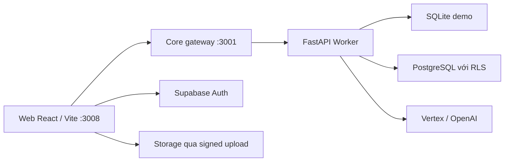

# Review dự án BuildAppraisal AI — 28/09/2026

## 1. Phạm vi và kết luận

Rà soát cấu trúc repository, tài liệu bàn giao, router/giao diện, Core API, Worker, mô hình dữ liệu, migration, AI/OCR, xuất văn bản và bộ kiểm thử. Đã đọc `.env` và `.env.example`, gọi các endpoint chỉ đọc của Core đang chạy và chạy kiểm tra TypeScript cùng unit test cách ly.

Không sửa mã ứng dụng, không chạy migration, không ghi dữ liệu cloud và không gọi mô hình AI thật. Chưa kiểm tra tương tác trình duyệt hoặc xác minh quyền/schema Supabase đang triển khai. Những con số cloud trong báo cáo cũ được ghi riêng là bằng chứng lịch sử.

**Nhận định:** Đây là ứng dụng hỗ trợ xử lý hồ sơ xây dựng cho Sở Xây dựng Điện Biên, có nền tảng nghiệp vụ và kiểm soát bằng chứng tương đối rõ. Code đã có ba nghiệp vụ, workflow nội bộ, phiên bản tài liệu, chuỗi lần nộp, phân quyền cloud và dự thảo A4. Tuy nhiên, máy hiện tại đang chạy demo, chưa cấu hình AI/OCR; một số giao diện chỉ hoạt động ở cloud. Chưa có đủ bằng chứng để kết luận sẵn sàng vận hành chính thức.

## 2. Kiến trúc thực tế

| Thành phần | Công nghệ/vị trí | Trách nhiệm |
| --- | --- | --- |
| Web | React 19, Vite, TypeScript, Tailwind; `src/` | Danh sách, panel thực thể, tiếp nhận, đối chiếu, đánh giá, bản đồ, xem văn bản |
| Core | NestJS/Express; `services/core/main.ts` | Gateway `/api/appraisal`, kiểm tra origin/method, chuyển token và request tới Worker |
| Worker | FastAPI; `ai/app/` | Phần lớn nghiệp vụ, xác thực, truy vấn dữ liệu, xử lý tài liệu, quy tắc, AI, OCR, xuất file |
| Demo | SQLite, `.appraisal-data/` | Hồ sơ, bản gốc và hàng đợi cục bộ; danh sách dự án trong `projects.json` |
| Cloud | Supabase Auth, PostgreSQL/RLS, private Storage | Danh tính, phạm vi tỉnh/phòng, danh mục, hồ sơ, audit, jobs, tài liệu gốc |
| AI | Adapter Vertex và OpenAI | Đề xuất có tham chiếu nguồn; kết quả cần chuyên viên xác nhận |

- Repository hiện tại chưa tổ chức theo `apps/web`, Turborepo hoặc Next.js. `pnpm-workspace.yaml` chỉ có cấu hình cho phép build esbuild.
- Core chưa có module nghiệp vụ/controller riêng; hầu hết xử lý nằm ở FastAPI. Worker hiện có khoảng 750 dòng trong `main.py`, ngoài các module chuyên biệt.
- Web cố định cổng **3008**, Core cố định **3001**. Thay đổi chưa commit đặt mặc định Worker **8200**, khác yêu cầu **8000** trong AGENTS.md.
- Chưa có Swagger tại `/api/docs` như quy định mô tả: Core là gateway; Worker đặt `docs_url=None` và `redoc_url=None`.
- Chưa có Redis, Prisma hoặc vector database trong triển khai đang đọc.

## 3. Mô hình nghiệp vụ tôi đã nắm

### Cấu trúc hồ sơ

**Dự án → Hồ sơ gốc → Các lần nộp → Tài liệu/phiếu/kết quả của từng lần.**

- `projects`: danh mục dự án, chủ đầu tư, địa bàn, nhóm/cấp, tổng mức đầu tư và thông tin quản lý.
- `appraisal_dossiers`: định danh hồ sơ gốc.
- `appraisal_cases`: từng lần nộp, liên kết dự án, nghiệp vụ, lần trước, revision; phần lớn nội dung trong JSONB `payload`.
- Payload gồm thành phần hồ sơ, tài liệu, đoạn trích, dữ liệu trích xuất, kết quả kiểm tra, ý kiến/giải trình, workflow, phiếu chuyên môn và lịch sử.
- `appraisal_jobs`: hàng đợi, snapshot đầu vào, số lần thử và lease.
- Các bảng audit/AI/upload session bổ sung khả năng truy vết và kiểm soát tiếp nhận tệp.

`Dossier` trong TypeScript hiện đại diện cho một lần nộp. Cần phân biệt `id` của lần nộp với `dossierId` của hồ sơ gốc khi phát triển tiếp.

### Ba luồng chính

| Nghiệp vụ | Luồng hiện có | Đặc điểm |
| --- | --- | --- |
| BCNCKT | Tiếp nhận → đọc tài liệu → xác nhận dữ liệu/phạm vi → chạy quy tắc/AI → đánh giá nhận xét → rà soát nội bộ → xuất dự thảo | Kiểm tra đủ hồ sơ, số học chi phí/diện tích, đối chiếu dữ liệu và nguồn |
| GPXD | Tiếp nhận → phiếu chuyên môn → checklist theo thủ tục → trình/rà soát → dự thảo | 10 loại thủ tục trong bộ quy tắc hiện tại |
| Nghiệm thu | Tiếp nhận → phiếu chuyên môn → lịch hiện trường → theo dõi khắc phục → trình/rà soát → dự thảo | 3 loại: hoàn thành, có điều kiện, một phần |

Tên các mẫu và chế độ pháp lý ở đây mô tả cách code đang tổ chức; đợt review này không xác nhận độc lập tính đúng pháp luật của toàn bộ kho tài liệu.

### Vai trò và trạng thái

- `officer`: chuyên viên xử lý hồ sơ; bị hạn chế khi hồ sơ đã phân công cho người khác.
- `head_of_department`, `director`: phân công, trả xử lý, hoàn tất và mở lại rà soát trong phạm vi được cấp.
- `admin`: quản trị dữ liệu; code cloud không cho thay lãnh đạo hoàn tất nghiệp vụ.
- Trạng thái workflow: tiếp nhận, phân công, đang xử lý, chờ bổ sung, chờ rà soát, hiện trường, khắc phục, hoàn tất.
- `status` của lần nộp và `workflow.state` là hai trường khác nhau, được dùng ở các màn hình khác nhau; cần giữ đồng bộ khi thêm thao tác.

### Những kiểm soát đáng giữ

- Revision/CAS chống ghi đè khi hồ sơ đã đổi.
- Tạo bổ sung có request ID và fingerprint; gọi lặp cùng nội dung trả lần đã tạo.
- Lần đã có bổ sung được giữ chỉ đọc; lần mới không tự kế thừa kết luận đã duyệt.
- Thay đổi bằng chứng làm kết quả cũ hết hiệu lực, lưu lịch sử phiếu trước và xóa kết luận hiện hành.
- Tài liệu gốc giữ hash SHA-256; có vai trò nộp/tham khảo và phiên bản.
- Tài liệu tham khảo không tự đáp ứng yêu cầu đầu vào.
- Kết quả trích xuất và đề xuất AI phải được chuyên viên xác nhận.
- Hàng đợi có snapshot, lease, retry và kiểm tra revision trước khi ghi kết quả.
- PDF/DOCX được tạo với A4 và lề 30/20/22/20 mm; hoàn tất hiện là rà soát nội bộ, chưa ký/cấp số/phát hành.

## 4. Các phân hệ và vị trí code

| Phân hệ | Điểm vào chính |
| --- | --- |
| Router, đăng nhập, phân quyền giao diện | `src/App.tsx`, `src/context/AuthContext.tsx`, `src/components/auth/RequireAuth.tsx` |
| Danh sách và chi tiết dự án | `src/pages/ProjectsPage.tsx`, `src/pages/projects/ProjectDetailSlidePanel.tsx` |
| Danh sách ba nghiệp vụ | `src/pages/AppraisalPage.tsx` |
| Workspace BCNCKT | `src/pages/projects/appraisal/AppraisalWorkspace.tsx` |
| Workspace GPXD/nghiệm thu | `src/components/appraisal/SubmissionWorkspace.tsx`, `ProcedureReview.tsx` |
| Workflow/lần bổ sung/OCR | `WorkflowPanel.tsx`, `SubmissionHistory.tsx`, `OcrPanel.tsx` trong `src/components/appraisal/` |
| Dashboard, danh mục, kho văn bản | `CloudDashboard.tsx`, `CatalogPage.tsx`, `DocumentHub.tsx` |
| GIS hiện dùng | `src/components/appraisal/ProjectMap.tsx`; Leaflet, nền Esri và GeoJSON ngoại tuyến |
| API phía Web | `src/services/apiClient.ts`, `appraisalService.ts`, `projectService.ts` |
| Nghiệp vụ và persistence | `ai/app/main.py`, `store.py`, `database.py`, `workflow.py`, `catalog.py` |
| Đọc/trích tài liệu | `ai/app/ingestion.py`, `ocr.py`, `ocr_jobs.py`, `uploads.py` |
| Quy tắc và pháp lý | `ai/app/rules.py`, `legal.py`, `procedure_rules.py`, `procedure_review.py` |
| AI và truy hồi | `ai/app/provider.py`, `vertex.py`, `legal_assistant.py` |
| Xuất văn bản | `ai/app/reporting.py`, `draft_templates.py`, `procedure_templates.py` |
| Dữ liệu/tài liệu mẫu | `src/data/`, `01_phap_ly_quy_chuan/`, `knowledge-base/`, `output/appraisal/` |
| Triển khai/đối soát | `scripts/`, `supabase/migrations/`, `docs/` |

Các import từ `mockData.ts` trong những trang đang dùng API chủ yếu là **import type**. Không nên kết luận còn dùng mock runtime chỉ từ tên file chứa kiểu dữ liệu.

## 5. Kết quả đọc env và runtime hiện tại

| Nội dung | Kết quả |
| --- | --- |
| `.env` | Có Supabase URL, anon key, `DATABASE_URL`, `DIRECT_URL`, management access token; Google Maps key rỗng |
| Supabase URL | `https://cekaigfnriatarytvymb.supabase.co` |
| Pooler PostgreSQL | Host `aws-0-ap-northeast-1.pooler.supabase.com`; hai cổng 6543 và 5432 |
| `.env.local` | Không có tại workspace |
| Runtime mặc định ngoài repo | Không có `C:/Users/Personal/.config/buildappraisal/runtime.env` |
| `APPRAISAL_DATABASE_URL` | Không có trong `.env` đang đọc; đây là biến `database.py` sử dụng |
| AI | Không có cấu hình AI trong `.env`; `.env.example` chỉ chứa giá trị mẫu |
| `/runtime` đang chạy | `mode=demo`, `environment=demo`, `authenticationRequired=false` |
| `/health` đang chạy | Provider `openai`, model rỗng, `modelConfigured=false`, `ocrAvailable=false` |
| `/projects?limit=1` | HTTP 200; tổng 26 dự án demo |
| `/dashboard` | HTTP 422: dashboard tập trung yêu cầu cloud |
| `/catalog/organizations?limit=1` | HTTP 422: danh mục tập trung yêu cầu cloud |

Đã che mọi giá trị key, token, mật khẩu và connection string. `.env` không được Git theo dõi; `.env.example` được theo dõi.

Script khởi động đọc lần lượt `.env`, `.env.local`, rồi runtime env ngoài repo hoặc đường dẫn `APPRAISAL_CONFIG_FILE`; biến đã có trong process được ưu tiên. Backend không tự dùng `DATABASE_URL`/`DIRECT_URL` thay cho `APPRAISAL_DATABASE_URL`.

Tài liệu bàn giao 27/09 ghi nhận Vertex, OCR và cloud ở máy/tài khoản runtime trước. Cấu hình ngoài repo đó chưa hiện diện ở vị trí mặc định trên máy hiện tại. Có URL/key Supabase trong env không đồng nghĩa ứng dụng đang chạy cloud.

## 6. Phát hiện cần chú ý

### R01 — P0 nếu triển khai: migration mới mở lại quyền quá rộng

**Bằng chứng:** `supabase/migrations/20260928000001_restore_dev_anon_read.sql:7`–`:23`.

Migration cấp SELECT mọi bảng, EXECUTE mọi hàm cho `anon`/`authenticated`, mở default privileges và tạo policy `anon_dev_read` với `USING true` trên toàn bộ bảng public. Nếu áp dụng, quyền đọc không còn được giới hạn theo tỉnh/phòng cho anonymous; quyền gọi cả các hàm đã được thu hồi trong migration bảo mật cũng được cấp lại. Một số hàm backend dùng SECURITY DEFINER và không có kiểm tra scope riêng cho thao tác claim job.

Đây là file **chưa được Git theo dõi** tại thời điểm review. Chưa xác minh đã áp lên cloud. Cần xử lý trước khi dùng chuỗi migration này với dữ liệu nghiệp vụ; màn hình đăng nhập không bảo vệ được truy cập trực tiếp Supabase khi DB mở quyền như vậy.

### R02 — P1: cấu hình hiện tại không chạy được đầy đủ các màn hình cloud

**Bằng chứng:** `ai/app/database.py:12`, `ai/app/catalog.py:72`, `:91`; phản hồi runtime/API trong mục 5.

Ứng dụng đưa dashboard và danh mục vào router trong cả demo, nhưng backend từ chối các endpoint đó ở demo. `.env` hiện cũng thiếu kết nối backend chuyên dụng. Vì vậy những màn hình này trả lỗi dù dự án demo vẫn tải được. Đây là trạng thái vừa xác minh trên máy hiện tại, không phải suy luận từ tài liệu cũ.

### R03 — P1: thêm ảnh mới chưa lưu bền vững và thiếu guard form con

**Bằng chứng:** `src/pages/projects/ProjectGalleryTab.tsx:29`, `:73`, `:100`, `:447`.

Thêm ảnh chỉ cập nhật React state, không gọi API hoặc lưu Storage/DB; đóng rồi mở lại panel hoặc reload sẽ mất ảnh vừa thêm. Form dùng overlay riêng, bấm backdrop đóng ngay, chưa dùng `useChildFormGuard`/`useUnsavedChangesGuard`; panel cha cũng có handler Escape. Luồng này chưa có bảo vệ tương đương các modal nghiệp vụ mới.

### R04 — P1: thiếu baseline để dựng database mới từ repository

**Bằng chứng:** initial schema chỉ tạo 8 bảng chính; `20260927000003_security_identity.sql:6` sử dụng `staff_users`, đồng thời tham chiếu `material_prices`, `holidays`, `schema_migrations`, các bảng/view/hàm workflow cũ.

Trong chuỗi migration hiện có chưa thấy định nghĩa tạo những đối tượng tiền đề này. Các script bootstrap cũng giả định cloud cũ đã có chúng. Một Supabase trống không thể được tái tạo đầy đủ chỉ bằng chuỗi migration hiện tại. Đây là kết luận từ DDL, chưa thử chạy migration trên database mới.

### R05 — P2: quy chuẩn UI chưa áp dụng đồng đều

- `ProjectsPage.tsx:243` dùng `MasterTable`; component chưa có resize cột hoặc sort khi bấm header.
- Còn `title=` native tại `SlidePanelStack.tsx`, `AppLayout.tsx`, `ProjectTT39InfoTab.tsx`, `ProjectGalleryTab.tsx`.
- Còn native select và `toLocaleDateString()` ở phần giao diện cũ.
- Chưa tìm thấy implementation `AutoTableTooltip`, `AppProviders.tsx`, `GridToolbar` hoặc script `lint:ui` trong code/package hiện tại, dù quy định mô tả đã có.
- Một số tên thực thể trong panel vẫn là văn bản thuần. Các phần mới đã dùng EntityLink và các input chuẩn ở nhiều vị trí.

Do dùng CSS token theo theme, thiếu `dark:` không tự chứng minh màu hiển thị sai. Tuy nhiên, yêu cầu tĩnh trong AGENTS.md chưa được tuân thủ đầy đủ; chưa đánh giá bằng trình duyệt trong đợt này.

### R06 — P2: còn giới hạn ở AI, kiểm thử và khả năng bảo trì

- AI BCNCKT lấy các đoạn đầu đến 55.000 ký tự, tối đa 8 đề xuất (`provider.py:59`); phần cuối hồ sơ lớn có thể không được phân tích ngữ nghĩa.
- Legal assistant truy hồi theo từ khóa/BM25 trên registry 7 nguồn, tối đa 6 đoạn; chưa truy hồi toàn bộ kho pháp lý bằng vector. Kiểm tra ID/quote không chứng minh diễn giải pháp lý đúng.
- Legal assistant hiện gọi Vertex trực tiếp, dù adapter BCNCKT hỗ trợ chọn Vertex/OpenAI.
- Kho văn bản chỉ tải 50 lần nộp theo tìm kiếm và chưa có chuyển trang (`DocumentHub.tsx:13`). Có thể tìm để thu hẹp, nhưng chưa duyệt được toàn bộ danh sách không lọc.
- TypeScript `strict=false`, nhiều kiểu `any`; tsconfig chỉ include `src`, nên kiểm tra hiện tại chưa kiểm tra kiểu cho `services/core/main.ts`.
- Chưa thấy cấu hình CI, bộ E2E trình duyệt hoặc container triển khai trong repository được quét. Unit test hiện không thay thế test RLS, migration, tải và phục hồi.
- Payload tổng hợp JSONB giúp triển khai nhanh nhưng làm mỗi lần sửa kéo theo đọc/ghi nhiều dữ liệu và khó ràng buộc từng thao tác ở DB; đây là điểm cần theo dõi khi quy mô tăng.

### R07 — P2: cấu hình cổng và tài liệu chưa thống nhất

`scripts/appraisal.mjs:19` và `services/core/main.ts:27` đang mặc định Worker 8200, trái cổng 8000 trong AGENTS.md/README. Hai file này đang có thay đổi chưa commit từ trước review. Quy định về đường dẫn `apps/web`, Swagger và công cụ UI cũng khác triển khai thực tế.

## 7. Kiểm chứng thực hiện trong đợt này

| Kiểm tra | Kết quả/phạm vi |
| --- | --- |
| `pnpm exec tsc --noEmit` | Đạt; phạm vi `src/` theo tsconfig |
| `pnpm test:appraisal` | **56/56 đạt**, chạy demo cách ly và bỏ cấu hình cloud/provider thật |
| Runtime và health | Đọc trực tiếp Core cổng 3001, kết quả trong mục 5 |
| Dashboard/danh mục/dự án | GET chỉ đọc, xác minh các mã HTTP trong mục 5 |
| Migration/quyền | Review DDL trong repo; không áp hoặc kiểm thử trực tiếp trên cloud |
| AI/OCR thật | Chưa chạy; health hiện báo chưa sẵn sàng |
| Build Vite/E2E/visual QA | Chưa chạy trong đợt này |

Các test bao phủ nguồn, số học, revision, tài liệu tham khảo, A4, hàng đợi, phân trang vượt 1.000 dòng, pháp lý/chuyển tiếp theo bộ quy tắc, chuỗi bổ sung, 13 loại phiếu, OCR, và lọc trích dẫn AI giả. Có cảnh báo deprecation `httpx`/Starlette TestClient nhưng không làm test thất bại.

Theo tài liệu bàn giao trước: 26 dự án, 161 lần nộp, 868 tài liệu, 83 hồ sơ gốc, 78 liên kết bổ sung, 52 phiếu GPXD/nghiệm thu. Những số này không được đối soát lại trên cloud trong đợt này; chỉ số 26 dự án demo đã đọc lại từ runtime hiện tại.

## 8. Mức độ hoàn thiện và thứ tự ưu tiên

1. Xử lý migration mở quyền anonymous trước khi triển khai hoặc tiếp nhận hồ sơ thật.
2. Thống nhất môi trường chạy: demo đầy đủ hoặc cloud có Auth/profile, `APPRAISAL_DATABASE_URL`, Storage, schema và quyền đúng; cấu hình AI/OCR riêng nếu sử dụng.
3. Hoàn thiện lưu ảnh và guard, resize/sort bảng dự án, đồng bộ các component UI theo quy định.
4. Bổ sung baseline database và kiểm chứng dựng mới/khôi phục; xác minh quyền RLS và RPC của cloud thực tế.
5. Tiếp tục chất lượng AI/OCR, giám sát, hạn mức, SLA/lịch nghỉ/ủy quyền và kiểm thử đầu cuối theo vai trò.

Ký số, cấp số/phát hành, dịch vụ công, lớp quy hoạch chính thức và nguồn giá tự động vẫn thuộc phạm vi chưa hoàn tất theo tài liệu và giao diện hiện tại. SMTP/domain/production đã được ghi nhận là hoãn trong bàn giao cũ; review này không thay đổi quyết định đó.

**Tóm tắt để làm việc tiếp:** trọng tâm cần bảo toàn là bằng chứng nguồn, chuyên viên xác nhận, revision, lịch sử từng lần nộp và quyền theo tỉnh/phòng. Các báo cáo full stack cũ phản ánh nhiều thời điểm khác nhau; khi sửa tiếp nên lấy code, env và runtime hiện tại làm căn cứ, đối chiếu riêng với schema cloud thực tế.
