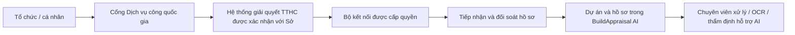

# Yêu cầu tích hợp tiếp nhận hồ sơ từ dịch vụ công

**Ngày ghi nhận:** 27/09/2026  
**Trạng thái:** Đề xuất để làm việc với Sở Xây dựng; chưa có tài liệu API, tài khoản tích hợp hoặc kết nối thật.  
**Phạm vi trước mắt:** Tự động nhận hồ sơ, tài liệu và các lần bổ sung vào BuildAppraisal AI. Domain/production tiếp tục để sau theo yêu cầu người dùng.

## 1. Mục tiêu

Khi tổ chức/cá nhân nộp hồ sơ qua Cổng Dịch vụ công quốc gia và hồ sơ được chuyển tới đúng cơ quan giải quyết, phần mềm nhận dữ liệu được phép chia sẻ để chuyên viên xử lý, không phải nhập lại hoặc tải từng tệp bằng tay.

Kết quả mong muốn:

- Có mã hồ sơ dịch vụ công gốc và liên kết với hồ sơ nội bộ.
- Hồ sơ hiện trong phân hệ BCNCKT, GPXD hoặc nghiệm thu theo mã thủ tục đã thống nhất.
- Tài liệu gốc và bản bổ sung được lưu đúng lần nộp, có phiên bản và nguồn.
- Gắn đúng dự án, phòng thụ lý và phạm vi truy cập.
- Có trạng thái đồng bộ, lỗi, khả năng thử lại và nhật ký truy vết.

## 2. Xác định đúng hệ thống nguồn trước khi lập trình bộ kết nối

Cổng nơi người dân nộp hồ sơ và hệ thống xử lý nghiệp vụ phía sau có thể là các thành phần khác nhau. Không mặc định có API công khai để một phần mềm bất kỳ tải hồ sơ trực tiếp từ giao diện Cổng Dịch vụ công quốc gia.

Bộ Xây dựng đã công bố việc đưa hệ thống giải quyết thủ tục hành chính tập trung vào vận hành trong thông tin sơ kết 6 tháng đầu năm 2026. Đây là căn cứ để cần xác nhận cả đầu mối hệ thống của Bộ khi trao đổi với Sở, thay vì mặc định chỉ kết nối hệ thống cấp tỉnh. Nguồn: [Bộ Xây dựng — thông tin sơ kết 6 tháng đầu năm 2026](https://moc.gov.vn/vn/_layouts/15/NCS.Webpart.MOC/mt_poup/Intrangweb.aspx?IdNews=95414).

**Chưa xác định:** hệ thống nào đang là nguồn xử lý chính thức cho từng thủ tục BCNCKT/GPXD/nghiệm thu tại Điện Biên; bên nào có quyền cấp API; nguồn có hỗ trợ thông báo sự kiện hay truy vấn định kỳ.

Sơ đồ dưới đây là phương án đề xuất, chưa phải sơ đồ kết nối đã được cơ quan vận hành xác nhận:

## 3. Luồng tiếp nhận dự kiến

1. Hệ thống nguồn phát sinh hồ sơ mới, bản bổ sung hoặc sự kiện cập nhật được phép chia sẻ.
2. Bộ kết nối nhận sự kiện từ nguồn hoặc truy vấn những thay đổi kể từ lần đồng bộ trước, tùy API được cung cấp.
3. Xác thực nguồn, cơ quan đích, mã thủ tục và quyền truy cập.
4. Ghi sự kiện vào hàng đợi bền vững; nhận lại cùng sự kiện không tạo hồ sơ trùng.
5. Lấy dữ liệu hồ sơ và tải tài liệu qua kênh được cấp quyền; lưu bản gốc và kiểm tra tính toàn vẹn.
6. Ánh xạ mã thủ tục sang phân hệ, mã cơ quan sang phạm vi tỉnh/phòng được cấu hình.
7. Gắn với dự án bằng mã định danh đã được đối soát. Trường hợp chưa có hoặc có nhiều dự án phù hợp đưa vào danh sách chờ cán bộ xác nhận; không tự ghép chỉ vì gần giống tên.
8. Tạo hồ sơ/lần bổ sung theo quan hệ do nguồn cung cấp. Lưu lịch sử, không ghi đè kết quả cũ.
9. Thông báo hồ sơ mới cho bộ phận tiếp nhận theo thiết kế UI thống nhất với Sở.
10. Chỉ đánh dấu đồng bộ đủ khi dữ liệu và tài liệu cần nhận đã được lưu thành công.

**Tách trạng thái:** “đã đồng bộ vào phần mềm” không tự có nghĩa “đã tiếp nhận hợp lệ” hoặc “đã đủ điều kiện thẩm định”. Những trạng thái nghiệp vụ này phải được ánh xạ và xác nhận theo quy trình của hệ thống nguồn.

## 4. Dữ liệu cần thống nhất

| Nhóm | Trường/thông tin cần có |
| --- | --- |
| Nhận diện | Hệ thống nguồn, mã hồ sơ nguồn, mã thủ tục, phiên bản/sự kiện cập nhật |
| Nơi xử lý | Mã cơ quan tiếp nhận, cơ quan giải quyết, đơn vị/phòng và phạm vi được chia sẻ |
| Người nộp | Tổ chức/cá nhân, thông tin đại diện/liên hệ thuộc phạm vi cần thiết được cấp quyền |
| Dự án | Mã định danh dự án/công trình nếu có, tên, địa điểm, chủ đầu tư và khóa liên kết |
| Thời gian | Thời điểm nộp, tiếp nhận, bổ sung, hạn trả nếu hệ thống nguồn cung cấp |
| Tài liệu | Mã tài liệu, mã thành phần, tên, định dạng, dung lượng, phiên bản, cách lấy bản gốc và dấu kiểm tra nếu có |
| Bổ sung | Mã hồ sơ/lần nộp cha, mã đợt bổ sung, tài liệu mới/thay thế và lý do |
| Vòng đời | Rút hồ sơ, từ chối, chuyển cơ quan, tạm dừng hoặc sự kiện khác được nguồn hỗ trợ |
| Ký số | Thông tin chữ ký/chứng thư và khả năng xác thực từ nguồn, nếu được cung cấp |

Tên trường, kiểu dữ liệu và mã trạng thái sẽ theo tài liệu chính thức nhận từ đầu mối tích hợp. Không sử dụng bảng trên như đặc tả API của Cổng quốc gia.

## 5. Chức năng dự kiến trên phần mềm

### 5.1. Đối với chuyên viên

- Danh sách có nguồn hồ sơ, mã dịch vụ công và thời điểm nhận.
- Hồ sơ đã ghép dự án xuất hiện trong đúng tab dự án và danh sách nghiệp vụ hiện có.
- Tài liệu thể hiện nguồn, phiên bản và lần nộp.
- Chỉ hiện cảnh báo khi thiếu tệp, chưa xác định dự án/thủ tục hoặc có lỗi cần xử lý.
- Giữ luồng kiểm tra chứng cứ, OCR, đánh giá chuyên viên và xuất dự thảo hiện tại.

### 5.2. Đối với quản trị tích hợp

- Cấu hình nguồn và ánh xạ mã thủ tục/cơ quan.
- Danh sách chờ ghép dự án, sự kiện lỗi và thao tác thử lại có quyền.
- Đối soát số lượng hồ sơ/tài liệu, thời điểm đồng bộ gần nhất, lịch sử xử lý.
- Không hiển thị khóa truy cập trong màn hình nghiệp vụ hoặc nhật ký thông thường.

## 6. Yêu cầu kỹ thuật quan trọng

- Kết nối qua API hoặc kênh trao đổi chính thức được đơn vị vận hành cấp; không thiết kế tự động đăng nhập bằng tài khoản cá nhân để cào màn hình.
- Xác thực máy với máy, chứng thư, VPN/IP cho phép… áp dụng theo tài liệu của nguồn; chưa chốt trước một cơ chế cụ thể.
- Bộ kết nối có danh tính và phạm vi riêng; không dùng tài khoản đăng nhập thử nghiệm để nhận hồ sơ thật.
- Ràng buộc chống trùng theo hệ thống nguồn, cơ quan/phạm vi, mã hồ sơ, lần nộp/sự kiện.
- Xử lý sự kiện đến trễ, sai thứ tự, mất kết nối và thử lại; có bước đối soát để phát hiện sự kiện bỏ sót.
- Tách dữ liệu nguồn khỏi đánh giá nội bộ; bản đồng bộ mới không ghi đè ý kiến chuyên viên hoặc kết luận đã khóa.
- Tệp tải về lưu ở kho riêng có quyền, giữ nguyên bản gốc; kiểm tra nguồn URL, chuyển hướng, dung lượng, định dạng và mã độc theo phương án vận hành được duyệt.
- Tài liệu không được công cụ AI hỗ trợ vẫn cần được ghi nhận đầy đủ; không bỏ tệp âm thầm vì khác PDF/DOCX/TXT hoặc lớn hơn giới hạn xử lý hiện tại.
- Không tự gửi mọi hồ sơ thật sang mô hình AI ngay khi nhận. Chính sách xử lý AI, loại dữ liệu và phạm vi gửi phải được Sở xác nhận riêng; giai đoạn đầu chuyên viên chủ động chọn lượt phân tích.
- Lưu nhật ký nhận, tải tệp, ánh xạ, thử lại và thay đổi dữ liệu; tránh ghi dữ liệu cá nhân nhạy cảm hoặc token vào log lỗi.

## 7. Đối chiếu với kiến trúc hiện tại

Phần mềm đã có dự án, hồ sơ, lần bổ sung, tài liệu gốc, Supabase Auth/RLS/Storage, audit và hàng đợi xử lý tài liệu. Chưa tìm thấy bộ kết nối dịch vụ công hoặc ánh xạ mã hồ sơ ngoài trong luồng tiếp nhận hiện tại.

Phần cần phát triển sau khi chốt API:

| Thành phần | Công việc dự kiến |
| --- | --- |
| Core API / bộ kết nối | Nhận sự kiện hoặc đồng bộ định kỳ; xác thực nguồn; chuẩn hóa dữ liệu |
| CSDL | Nguồn kết nối, mã ngoài, sự kiện nhận, tiến độ tải tệp, ánh xạ và chống trùng |
| Kho tài liệu | Tải qua quyền máy, lưu bản gốc, kiểm tra tệp, hỗ trợ lỗi từng tài liệu |
| Nghiệp vụ | Tạo/gắn dự án, tạo hồ sơ/lần bổ sung, kiểm soát phiên bản và xung đột |
| Giao diện | Nguồn hồ sơ, danh sách chờ xác nhận và màn hình quản trị đồng bộ |
| Quyền / audit | Quyền tích hợp theo cơ quan, ghi lịch sử và đối soát |

Không tái sử dụng nguyên trạng endpoint nộp tệp dành cho trình duyệt nếu cơ chế đó đòi JWT cá nhân hoặc không đáp ứng mô hình giao dịch của kết nối máy với máy.

## 8. Nội dung cần xin khi làm việc với Sở

1. Đầu mối nghiệp vụ phụ trách ba nhóm thủ tục và đầu mối kỹ thuật của hệ thống nguồn.
2. Tên hệ thống, đơn vị vận hành và địa chỉ môi trường kiểm thử.
3. Danh sách mã thủ tục/mã cơ quan đang sử dụng, phạm vi được chia sẻ cho phần mềm.
4. Tài liệu API hoặc cơ chế trao đổi: sự kiện hồ sơ mới, bổ sung, trạng thái; cách lấy danh sách và chi tiết.
5. Đặc tả tải tệp, thời hạn liên kết tải, dung lượng/định dạng và chữ ký số.
6. Cơ chế xác thực, cấp quyền, yêu cầu mạng và chứng thư; nhận bí mật qua kênh bảo mật được thống nhất.
7. Bộ dữ liệu kiểm thử đã ẩn thông tin nhạy cảm: hồ sơ mới, bổ sung, rút/chuyển và lỗi.
8. Thời điểm được phép đồng bộ: ngay khi người dân nộp hay khi cơ quan đã tiếp nhận/chuyển xử lý.
9. Quy tắc xác định dự án và xử lý trường hợp chưa có mã dự án/công trình.
10. Đầu mối đối soát, giới hạn tần suất API, số lượng hồ sơ/tệp và quy trình khi gián đoạn.
11. Chính sách lưu trữ, khai thác hồ sơ và sử dụng AI đối với dữ liệu nhận về.
12. Có yêu cầu gửi ngược tiến độ/kết quả không; nếu có, ai được xác nhận và loại văn bản nào được phép gửi.

## 9. Triển khai theo giai đoạn

### Giai đoạn 1 — Khảo sát và thống nhất

Chốt nguồn, thủ tục, quyền, đặc tả, mẫu dữ liệu và tiêu chí nghiệm thu với Sở/đơn vị vận hành.

### Giai đoạn 2 — Kết nối kiểm thử một chiều

Nhận hồ sơ/tài liệu thử, chống trùng, ghép dự án, nhận bổ sung và đối soát. Nếu cần trình diễn trước khi có API, chỉ xây dựng nguồn mô phỏng có nhãn rõ ràng, không hiển thị là đã kết nối quốc gia.

### Giai đoạn 3 — Hoàn thiện tiếp nhận

Xử lý tài liệu lớn/định dạng khác, lỗi từng phần, rút/chuyển hồ sơ, quyền và báo cáo đối soát. Triển khai thật chỉ sau khi có điều kiện hạ tầng và cho phép vận hành.

### Giai đoạn 4 — Đồng bộ ngược nếu được yêu cầu

Tách thành phạm vi riêng sau khi có API và quy trình duyệt. Không gửi dự thảo chưa ký hoặc chuyển trạng thái “hoàn tất rà soát nội bộ” thành “đã giải quyết TTHC” một cách tự động.

## 10. Tiêu chí nghiệm thu dự kiến

- Một hồ sơ hợp lệ từ nguồn xuất hiện đúng phân hệ và đúng cơ quan/phòng.
- Nhận lặp sự kiện không tạo trùng hồ sơ, tài liệu hoặc lần bổ sung.
- Tài liệu tải đủ, giữ nguyên nội dung; lỗi tải từng tệp được phát hiện và thử lại.
- Hồ sơ thiếu mã dự án vào danh sách chờ xác nhận, không tự gắn nhầm.
- Bổ sung được liên kết đúng hồ sơ cha và giữ lịch sử trước đó.
- Rút/chuyển hồ sơ không xóa mất chứng cứ và không tiếp tục xử lý sai thẩm quyền.
- Sự kiện đến muộn không làm lùi phiên bản mới đã nhận.
- Mất mạng rồi kết nối lại không bỏ sót hồ sơ; có đối soát với nguồn.
- Người ngoài phạm vi không xem được hồ sơ/tệp đồng bộ.
- Không gửi dữ liệu đến AI hoặc đẩy kết quả ra bên ngoài ngoài chính sách đã thống nhất.
- Nhật ký cho biết hồ sơ đến từ đâu, nhận khi nào, xử lý ra sao và ai giải quyết lỗi.

**Kết luận hiện tại:** yêu cầu đã được ghi nhận và có phương án làm việc. Chưa triển khai hoặc công bố kết nối thật khi chưa có đầu mối, tài liệu và quyền do hệ thống nguồn cấp.
