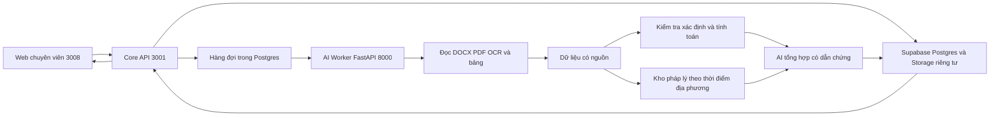

# Kế hoạch phát triển hỗ trợ thẩm định BCNCKT bằng AI từ hồ sơ Hương Xuân

Ngày nghiên cứu: 27/09/2026. Trạng thái: chờ người dùng review trước khi triển khai. Lượt này chỉ nghiên cứu và viết tài liệu; chưa sửa ứng dụng, chạy migration hoặc triển khai dịch vụ.

## 1. Mục tiêu và phạm vi

Xây dựng quy trình hỗ trợ thẩm định Báo cáo nghiên cứu khả thi (BCNCKT), bắt đầu từ danh mục đầu vào tại mục II của tờ trình dự án Trường phổ thông nội trú liên cấp Tiểu học và THCS Hương Xuân. AI đọc tài liệu, trích dữ liệu có nguồn, kiểm tra số học và tính nhất quán, đối chiếu quy định đã xác minh, tổng hợp vấn đề và soạn dự thảo để chuyên viên xét duyệt.

Ưu tiên: kiểm soát đầu vào → đối chiếu hồ sơ và chi phí → hỗ trợ đánh giá từng nội dung → báo cáo có dẫn chứng → kiểm tra chuyên ngành khi đủ dữ liệu. AI có thể tự thực hiện bước đọc và kiểm tra đã định nghĩa; kết luận an toàn, tính hợp pháp, thẩm định và phê duyệt thuộc người/cơ quan có thẩm quyền. Chưa có cơ sở đưa tỷ lệ tự động hóa hoặc khẳng định có thể thẩm định toàn bộ bằng AI.

## 2. Bộ tài liệu đã nghiên cứu

Đã đọc nội dung cả 5 tệp trong `docs/THCS Hương Xuân/`, gồm bảng DOCX và 21 trang PDF; đối chiếu trực quan một số trang về thông tin văn bản, chứng chỉ, quy hoạch và chi phí. Chưa xác thực chữ ký bằng chuỗi chứng thư/OCSP/CRL.

| Mã | Tệp nguồn | Vai trò và vị trí tham chiếu |
|---|---|---|
| S1 | `5.-TTr-tham-dinh-BC-NCKT-Huong-Xuan_phanquocbao-20-05-2026_10h44p07.docx` | Tờ trình; mục I thông tin, mục II danh mục gửi kèm |
| S2 | `5.-TTr-tham-dinh-BC-NCKT-Huong-Xuan_phanquocbao-20-05-2026_10h44p07(20.05.2026_10h51p46)_signed.pdf` | Tờ trình 4 trang; chi phí tr.2, tiêu chuẩn tr.2–3, đầu vào tr.3–4 |
| S3 | `Thong-bao-ket-qua-tham-dinh-truong-lien-cap-Huong-Xuan-1-.docx` | Thông báo số 3339/SXD-QLN6, ngày 08/06/2026 |
| S4 | `Thong-bao-ket-qua-tham-dinh-truong-lien-cap-Huong-Xuan-1-(09.06.2026_16h59p51)_signed.pdf` | Thông báo 17 trang; hồ sơ tr.4–6, quy mô tr.7–13, phạm vi tr.13, kết quả tr.14–16, kết luận tr.16–17 |
| S5 | `Du-thao-QD-phe-duyet-du-an-Truong-Huong-Xuan-ok-.docx` | Dự thảo quyết định, còn trống số/ngày; Điều 1 thông tin, quy mô, bảng chi phí |

Năm tệp tương ứng ba loại văn bản, không phải năm thành phần đầu vào độc lập. Chưa có tệp khảo sát, thuyết minh BCNCKT, bản vẽ TKCS, bảng tính TMĐT, chứng chỉ và văn bản pháp lý đính kèm được kê trong tờ trình. “Được nhắc đến” không đồng nghĩa “đã nhận tệp”; thiếu trong thư mục nghiên cứu không chứng minh hồ sơ nộp thực tế thiếu.

Dự án ở xã Hương Xuân, tỉnh Hà Tĩnh, nhóm B, dân dụng cấp III, thực hiện 2026–2027, TMĐT 217.230.000.000 đồng. Không đổi địa danh thành Điện Biên. Khi sử dụng làm hồ sơ mẫu trong phần mềm Điện Biên, phải là hồ sơ tham khảo ngoài tỉnh được phân quyền; giữ địa phương công trình riêng với đơn vị sở hữu dữ liệu, không tự chuyển thành hồ sơ thụ lý chính thức.

S2 tr.1 còn trống số/ngày tờ trình khi đọc và xem ảnh. S4 dẫn Tờ trình 88/TTr-BQLDA ngày 20/05/2026, nhận ngày 21/05/2026. Phải lưu hai quan sát có nguồn, không tự sửa bản gốc. Tương tự, ngày trong tên tệp S4 là 09/06/2026, ngày trong văn bản là 08/06/2026: tách ngày văn bản, ngày ký, ngày tải/tên tệp; không tự kết luận sai ngày.

## 3. Đầu vào theo tờ trình và khả năng hỗ trợ AI

Danh mục dưới đây bám mục II, S2 tr.3–4. Đây là danh mục của Hương Xuân; khi áp dụng cho dự án khác phải chọn theo loại dự án, thời điểm, thẩm quyền và các điều kiện liên quan.

### 3.1. Bảy văn bản pháp lý được kê gửi kèm

| Mã | Văn bản trong tờ trình | AI có thể hỗ trợ | Điều kiện và giới hạn |
|---|---|---|---|
| PL01 | Thông báo kết luận 81-TB/TW ngày 18/07/2025 về chủ trương xây dựng trường học cho xã biên giới | Trích đối tượng, mục tiêu, điều kiện; đối chiếu mục tiêu trường nội trú liên cấp | Cần toàn văn, danh mục liên quan và chuyên viên xác nhận phạm vi dự án |
| PL02 | Nghị quyết 298/NQ-CP ngày 26/09/2025 thực hiện Thông báo 81 | Tổng hợp nhiệm vụ, cơ quan, thời gian; kiểm tra sự thống nhất với dự án | Không suy ra đã được bố trí đủ vốn chỉ từ kế hoạch |
| PL03 | Kế hoạch 564/KH-UBND ngày 20/10/2025 của tỉnh Hà Tĩnh | Đối chiếu địa phương, trường, quy mô, tiến độ | Cần phụ lục/danh mục; không thay xác nhận của cơ quan quản lý |
| PL04 | Quyết định 539/QĐ-UBND ngày 04/03/2026 giao chủ đầu tư các trường tại Hương Xuân, Vũ Quang, Hương Bình, Sơn Hồng, Sơn Kim 2 | So tên chủ đầu tư, tên dự án, phạm vi nhiệm vụ | Phân biệt giao chủ đầu tư với quyết định chủ trương/quyết định đầu tư |
| PL05 | Văn bản 1989/BGDĐT-KHTC ngày 17/04/2026 về trường nội trú liên cấp tại xã biên giới đất liền | Trích yêu cầu; đối chiếu quy mô, mục tiêu trong BCNCKT | Không tự suy sĩ số, số học sinh nội trú hoặc định mức diện tích |
| PL06 | Quyết định 119/QĐ-BQLDA ngày 20/04/2026 phê duyệt đề cương nhiệm vụ và dự toán chi phí chuẩn bị đầu tư | So phạm vi khảo sát, thiết kế và chi phí chuẩn bị đầu tư với hồ sơ thực hiện | Cần đề cương/dự toán đính kèm; không xác nhận chất lượng khảo sát hiện trường |
| PL07 | Văn bản 545/UBND-KT ngày 15/05/2026 chấp thuận quy hoạch tổng mặt bằng | Trích chỉ tiêu được chấp thuận, đối chiếu thuyết minh và TKCS | Cần bản đồ/phụ lục/ranh giới; chỉ thấy số công văn chưa đủ kết luận phù hợp |

Cả PL01–PL07 mới được kê, chưa thấy tệp độc lập trong thư mục nghiên cứu. Các luật/nghị định/thông tư ở phần “Căn cứ” của tờ trình thuộc kho pháp lý tham chiếu; không tự biến toàn bộ chúng thành yêu cầu chủ đầu tư phải nộp bản sao.

### 3.2. Năm bộ khảo sát, thiết kế và tổng mức đầu tư

| Mã | Đầu vào được kê | Dữ liệu cần đọc để hỗ trợ chuyên sâu | AI và công cụ tính hỗ trợ được | Phần chưa thể tự kết luận |
|---|---|---|---|---|
| KT01 | Hồ sơ khảo sát địa hình | Báo cáo; nhiệm vụ/phương án và nghiệm thu nếu có; bản vẽ, tọa độ, cao độ; CAD/GIS nếu có | Kiểm kê thành phần; trích hệ tọa độ/cao độ; so diện tích, vị trí, ranh giới với tổng mặt bằng; phát hiện sai đơn vị | Độ chính xác đo đạc, hiện trạng, ranh đất, ngập lụt; không tính san nền nếu thiếu bề mặt địa hình |
| KT02 | Hồ sơ khảo sát địa chất | Báo cáo; nhật ký hố khoan, mặt cắt, thí nghiệm, bảng chỉ tiêu, kiến nghị móng | Trích lớp đất, độ sâu, chỉ tiêu; đối chiếu kiến nghị với loại móng từng khối nhà | Không chứng nhận thí nghiệm hoặc an toàn móng; cần kỹ sư địa kỹ thuật và tính toán |
| KT03 | Thuyết minh BCNCKT | Đầy đủ chương, phụ lục, bảng quy mô/phòng học, nhu cầu, tiến độ | Kiểm tra cấu trúc; trích mục tiêu, vốn, quy mô; đối chiếu tờ trình, chủ trương, TKCS, TMĐT; phát hiện thiếu/mâu thuẫn | Nhu cầu đầu tư, hiệu quả kinh tế xã hội, lựa chọn phương án và khả năng cân đối vốn cần chuyên viên |
| KT04 | Hồ sơ thiết kế cơ sở | Thuyết minh TKCS và bản vẽ tổng mặt bằng, kiến trúc, kết cấu, điện, nước, PCCC, hạ tầng; bảng tính liên quan | Lập danh mục bản vẽ; trích khối nhà, phòng, kích thước; so diện tích/tầng/công năng; kiểm quy tắc có đủ tham số xác nhận | Không tự kết luận an toàn chịu lực, thoát nạn, thủy lực hay công suất điện; bản vẽ khó đọc/thiếu tỷ lệ phải báo thiếu dữ liệu |
| KT05 | Tổng mức đầu tư | Bảng tổng hợp PDF xác nhận; bảng tính XLSX, phụ lục khối lượng, suất vốn, định mức, đơn giá, thiết bị, thuế, dự phòng | Cộng kiểm 7 khoản mục; so phiên bản, phát hiện trùng/thiếu; kiểm công thức bằng mã tính; tra giá đúng địa bàn/thời điểm | Chỉ có tổng hợp thì chưa kiểm được khối lượng, giá thực tế, GPMB; không tự đưa mức cắt giảm |

Các thành phần chi tiết ở cột dữ liệu là đề xuất phục vụ kiểm tra, không khẳng định mọi thành phần đều bắt buộc nộp ở mọi bước. Năm bộ KT01–KT05 đều chưa có tệp đầy đủ trong thư mục đang nghiên cứu.

### 3.3. Hồ sơ năng lực

Tờ trình kê 2 tổ chức: Công ty Cổ phần Kiến trúc Xây dựng Quốc tế 1+1>2 (`BXD-00010270`), Công ty Cổ phần Đầu tư Xây dựng Alpha Việt Nam (`NGA-00029622`); cùng 6 nhân sự:

| Vai trò theo tờ trình | Cá nhân | Mã tại S2 tr.4 |
|---|---|---|
| Chủ nhiệm dự án | Hoàng Thúc Hào | HAN-02-2023-107 |
| Chủ trì kiến trúc | Nguyễn Duy Thanh | HAN-01-2022-061 |
| Chủ trì kết cấu | Tô Chu Trinh | NGA-00041870 |
| Chủ trì điện, cấp thoát nước, PCCC | Phạm Tuấn | NGA-00174518 |
| Chủ trì lập dự toán | Nguyễn Thị Thanh Hiền | NGA-00041869 |
| Chủ trì khảo sát địa hình, địa chất | Lê Như Hà | NGA-00044652 |

AI đọc bản chứng chỉ, ghép người với vai trò, so số/ngày/hạng/phạm vi/hiệu lực, tra công bố năng lực nếu nguồn chính thức truy cập được. Cần bản chứng chỉ và phụ lục để xác nhận phạm vi; không suy năng lực PCCC từ vai trò điện/nước. “Không tra được” khác “không hợp lệ”. Chưa có bản chứng chỉ trong thư mục này.

### 3.4. Đầu vào phát sinh khi phối hợp thẩm định

S4 tr.4–6 dẫn thêm: ý kiến PCCC 45/PCCC; môi trường 3995/SNNMT-MT; khoa học công nghệ 1415/SKHCN-CN&ĐMST; giáo dục 1855/SGDĐT-VP; tài chính 3812/STC-TĐ&TCĐT; điện lực 2123/PCHT-KT và thỏa thuận đấu nối; công thương 1331/SCT-QLNL, 13/TĐ-SCT; UBND xã 617/UBND-KT, 655/UBND-KT; giải trình 579/BQLDA-DA1; thẩm tra 205/BC-TTKĐ; cùng căn cứ bổ sung trong quá trình xử lý.

Đây là đầu vào theo các vòng phối hợp/giải trình, không phải toàn bộ đều thuộc danh mục gửi kèm tờ trình ban đầu. Cần quản lý “ý kiến → giải trình → bản sửa → người xác nhận”. Thông báo kết quả và dự thảo quyết định là đầu ra/tham khảo, không thay thế khảo sát, thiết kế hay báo cáo thẩm tra gốc.

## 4. Mức độ hỗ trợ và giới hạn

| Mức | Công việc | Kết quả sản phẩm |
|---|---|---|
| Tự động kiểm tra sau xác nhận đầu vào | Phân loại/kiểm kê, trích số liệu, so tên/mã/ngày, số học, so phiên bản, dẫn nguồn | Kết quả kiểm tra cụ thể và công thức; không mở rộng thành kết luận hồ sơ đạt |
| AI phân tích có điều kiện | Căn cứ pháp lý, quy hoạch, khảo sát với TKCS, quy mô trường, tiêu chuẩn, chi phí, ý kiến liên ngành | Đề xuất, điều kiện, bằng chứng thiếu, chất lượng trích xuất, người được giao xác nhận |
| Không giao AI tự quyết | Hiện trường/thí nghiệm; an toàn kết cấu, PCCC toàn diện; đất đai; thẩm quyền/chuyển tiếp phức tạp; quyết định phê duyệt | Chuyển chuyên viên/cơ quan chuyên ngành, giữ trạng thái chưa xác nhận |

Chữ ký số có thể kiểm bằng phần mềm mật mã chuyên dụng. LLM chỉ đọc/tóm tắt kết quả xác minh, không phán đoán từ ảnh dấu, tên `_signed` hoặc trường `/Sig`.

Checklist phải bao phủ 7 nhóm kết quả tại phần V S4: lập dự án và năng lực; TKCS với quy hoạch; chủ trương/chương trình; đấu nối hạ tầng; an toàn/cháy nổ/môi trường; quy chuẩn/tiêu chuẩn; tổng mức đầu tư. Với pháp luật thời kỳ khác, chọn checklist và phạm vi cơ quan thẩm định theo bộ quy tắc được duyệt, không đóng cứng mẫu lịch sử.

## 5. Phát hiện cụ thể và ca ứng dụng

### 5.1. Chi phí thay đổi cơ cấu, tổng không giảm

Đơn vị: triệu đồng. Nguồn S2 tr.2, S4 tr.16, S5 Điều 1 mục 11/bảng chi phí. Chênh lệch = thông báo trừ tờ trình.

| Khoản mục | Tờ trình | Thông báo / dự thảo QĐ | Chênh lệch |
|---|---:|---:|---:|
| GPMB | 9.000 | 14.352 | +5.352 |
| Xây dựng | 170.129 | 173.075 | +2.946 |
| Thiết bị | 10.744 | 6.033 | -4.711 |
| Quản lý dự án | 3.090 | 3.101 | +11 |
| Tư vấn | 9.530 | 9.391 | -139 |
| Khác | 1.587 | 1.194 | -393 |
| Dự phòng | 13.150 | 10.084 | -3.066 |
| Tổng | 217.230 | 217.230 | 0 |

HX01: Tổng tăng = tổng giảm = 8.309 triệu đồng; tiết kiệm ròng = 0. Không coi tổng giảm ở vài dòng là tiết kiệm của toàn dự án. Chưa có thẩm tra 205/giải trình 579 nên không tự tạo lý do điều chỉnh. Thay đổi giữa hai thời điểm không tự chứng minh sai sót.

### 5.2. Những điểm cần kiểm tra hoặc làm rõ

| Mã | Quan sát có nguồn | Xử lý đề xuất |
|---|---|---|
| HX02 | Phạm Tuấn: S2 tr.4 NGA-00174518; S4 tr.6 NGA-00026158 | Khác mã; yêu cầu bản chứng chỉ/bản sửa, không khẳng định mã nào giả/sai |
| HX03 | Lê Như Hà: S2 tr.4 NGA-00044652; S4 tr.6 HAN-00044652 | Khác tiền tố; giữ cả hai nguồn |
| HX04 | S2 tr.3: TCVN 8793:2011, 8794:2011; S4 tr.3/S5 mục 10.2 ghi 2021 | Tra danh mục VSQI, yêu cầu xác nhận năm; không sửa bản gốc |
| HX05 | S2 tr.3 ghi QCVN 10:2014/BXD; nguồn chính thức công bố bản 2024 thay thế | Cảnh báo phiên bản và rà điều kiện áp dụng/chuyển tiếp, chưa kết luận vi phạm thiết kế |
| HX06 | S4 tr.7: 8.338/46.694 × 100 = 17,8567%; 17.140/46.694 = 0,36707; 8.338 + 38.356 = 46.694 | Số học khớp làm tròn 17,9% và 0,37; chưa chứng minh phù hợp quy hoạch |
| HX07 | S4 tr.7–10: sàn A1–A6, B, C, D cộng 16.828 m²; thêm G1 503 và G2 220 thành 17.551 m²; tổng nêu 17.140 m² | Chênh 411 m² ở tập hạng mục này; cần bảng diện tích, phạm vi tính, xử lý bán hầm/hành lang; chưa kết luận sai tổng pháp lý |
| HX08 | S4 tr.10/S5 mục 8.13: bể khoảng 45 m³, kích thước 7,12 × 5,35 × 2,25 m; tích hình hộp 85,707 m³ | Làm rõ kích thước ngoài/trong, ngăn bể, mực nước, dung tích hữu ích; không kết luận đủ/thiếu nước PCCC bằng phép nhân |
| HX09 | S2 tr.1 ghi 63/2025/QĐ-UBND; S4 tr.2/S5 ghi 63/QĐ-UBND cùng ngày 24/09/2025 | Nguồn chính thức ghi 63/2025/QĐ-UBND Hà Tĩnh; đề xuất chuẩn hóa dẫn chiếu |
| HX10 | S5 trống số/ngày quyết định và một phần thông báo dẫn chiếu | Nhận diện dự thảo chưa hoàn thiện, không phải quyết định ban hành |
| HX11 | Cả hai PDF có trường chữ ký, dữ liệu đứng trước `%PDF`, pypdf báo phục hồi con trỏ | Giữ nguyên bản/hash, ghi tình trạng đọc phục hồi; không ghi đè bản ký; xác minh chữ ký riêng |

HX07/HX08 là kiểm tra sàng lọc có giả thiết, chưa phải kết luận kỹ thuật. Mỗi dữ liệu phải truy về trang/đoạn; không coi kết luận “đủ điều kiện” trong S4 là bằng chứng rằng mọi số liệu đều không cần kiểm tra.

## 6. Pháp lý theo thời điểm và địa phương

Hồ sơ tháng 5 và thông báo 08/06/2026 viện dẫn Luật Xây dựng 2014 đã sửa đổi và NĐ 175/2024. NĐ 217/2026 ban hành 19/06/2026, hiệu lực 01/07/2026 theo [Cổng văn bản Chính phủ](https://vanban.chinhphu.vn/?classid=1&docid=218509&pageid=27160&typegroupid=4). Không dùng NĐ 217 để tự động chấm lại kết quả 08/06 theo quy tắc hiện tại. [Luật 135/2025/QH15](https://vanban.chinhphu.vn/?classid=1&docid=216514&orggroupid=1&pageid=27160) có hiệu lực chung 01/07/2026; vẫn phải quản lý hiệu lực từng phần và chuyển tiếp.

Mỗi hồ sơ lưu ngày trình, tiếp nhận hợp lệ, đánh giá, ngày/phạm vi điều chỉnh; địa phương, cơ quan, nguồn vốn, loại/nhóm/cấp công trình; bộ quy tắc và ngoại lệ được chuyên viên xác nhận. Không chỉ lấy “văn bản mới nhất” hoặc một mốc ngày áp dụng cho mọi điều khoản.

Các đối chiếu chính thức phục vụ kế hoạch, chưa phải kiểm toán pháp lý toàn bộ:

- [Thông tư 06/2024/TT-BXD](https://vbpl.vn/TW/Pages/vbpq-toanvan.aspx?ItemID=169517): ban hành QCVN 10:2024/BXD, hiệu lực 01/02/2025 và bãi bỏ thông tư ban hành bản 2014. Kết luận áp dụng còn cần xem trường hợp cụ thể.
- [VSQI TCVN 8794:2011](https://tieuchuan.vsqi.gov.vn/tieuchuan/view?sohieu=TCVN+8794%3A2011) và [danh mục có TCVN 8793:2011](https://tieuchuan.vsqi.gov.vn/tim-kiem?page=474&si=1): căn cứ kiểm tra lại năm 2021 ghi trong S4/S5; chưa xác minh toàn bộ tiêu chuẩn.
- [Quyết định 63/2025/QĐ-UBND Hà Tĩnh](https://vbpl.vn/hatinh/Pages/vbpq-thuoctinh.aspx?ItemID=182342): xác nhận số hiệu, ngày 24/09/2025.
- [Giới thiệu NĐ 175/2024](https://xaydungchinhsach.chinhphu.vn/nghi-dinh-so-175-2024-nd-cp-ve-quan-ly-hoat-dong-xay-dung-119241231085735892.htm): nguồn định danh; xây rules phải có toàn văn và sửa đổi liên quan.

Kho dự án có file tên `qcvn_bca_10_2025_xay_dung_cong_trinh_dam_bao_nguoi_khuyet_tat_tiep_can_su_dung.md` nhưng nội dung mở đầu là quy chuẩn trang bị phương tiện PCCC. Phải rà metadata theo bản gốc, không lấy tên file làm nội dung. Phân biệt QCVN 10 của BXD/BCA; TCVN được lựa chọn/viện dẫn với quy chuẩn bắt buộc. Quy tắc chưa đủ nguồn phải ở trạng thái chưa duyệt.

## 7. Hiện trạng mã nguồn

| Thành phần | Quan sát | Hướng thay đổi |
|---|---|---|
| React/Vite/TypeScript tại `src/` và Supabase client | README monorepo chưa đúng checkout | Giữ web cổng 3008; bổ sung API/worker từng bước, cập nhật tài liệu |
| `ProjectsPage.tsx`, `DashboardPage.tsx` | Dùng dữ liệu mẫu | Nối dữ liệu thật, nhận diện rõ môi trường demo |
| `mockAppraisalData.ts` | Sinh đánh giá theo tên công trình; mặc định tiết kiệm 4,5%; `||` thay cả giá trị 0 | Tách mẫu khỏi nghiệp vụ; facts/findings từ backend; bảo toàn 0 |
| `projectService.ts` | Mặc định đạt quy hoạch/quy chuẩn/PCCC; `grade.includes('I')` có thể đổi III thành I; tìm id sau tải danh sách; fallback mock | Map enum chính xác, unknown/null; query theo id/quyền/phân trang; hiển thị lỗi thật |
| `ProjectDetailSlidePanel.tsx` | Có quy chuẩn/quy hoạch/PCCC/chi phí/in, thiếu checklist đầu vào và nhiều nội dung nghiệp vụ | Workspace BCNCKT, đủ nhóm thẩm định, bằng chứng và chuyên viên xác nhận |
| `AiChatWidget.tsx`, `LegalAiPage.tsx` | Câu trả lời/căn cứ viết sẵn | API theo hồ sơ/thời điểm, kiểm chứng trích dẫn; demo phải ghi rõ |
| `DocumentsPage.tsx`, `A4DocumentPreview.tsx` | Văn bản mẫu, nhãn ký sẵn; khung một trang; nút PDF mặc định gọi in | Dự thảo theo dữ liệu duyệt, phân trang A4, không giả trạng thái ký/ban hành |
| Migration Supabase hiện có | Có projects/documents/disciplines/checklists; thiếu phiên bản/bằng chứng/job/audit; nhiều policy authenticated `using(true)` | Migration mới và RLS phân đơn vị/vai trò, không sửa lịch sử migration |
| Panel/EntityLink/MasterTable | Có unsaved flag và resize panel; chưa thấy bộ hook chuẩn guard/filter/sort/resize cột; EntityLink mặc định chưa mở chi tiết | Hoàn thiện nền tảng dùng chung; không nhầm resize panel với resize cột |

## 8. Luồng sử dụng

1. Tạo hồ sơ: xác nhận dự án, tỉnh, đơn vị xử lý, thủ tục/giai đoạn, thời điểm pháp lý; phân biệt hồ sơ tham khảo.
2. Nộp tờ trình: AI trích PL01–PL07, KT01–KT05, năng lực thành checklist; chuyên viên sửa/xác nhận.
3. Gắn file: nhiều file/một bộ, nhiều phiên bản; trạng thái chưa nộp, đã nộp, không đọc được, thiếu phụ lục, cần làm rõ, đã kiểm tra. Không đếm Word/PDF cùng văn bản hai lần.
4. Xác nhận facts: tên/mã/ngày/tiền/diện tích/đơn vị mở cạnh trang hoặc đoạn nguồn; giữ các giá trị mâu thuẫn riêng.
5. Chạy kiểm tra trên snapshot tài liệu đã chọn; bộ tính xác định xử lý số, AI trích/tổng hợp có dẫn chứng.
6. Xem từng nội dung: yêu cầu, dữ liệu, căn cứ, kết quả máy, điều kiện/thiếu dữ liệu, đánh giá chuyên viên.
7. Yêu cầu bổ sung và giải trình: soạn dự thảo, chuyên viên phát hành; bản mới chạy lại phần liên quan và đánh dấu kết quả cũ cần rà lại.
8. Rà soát nội bộ: chuyên viên xác nhận/bác đề xuất kèm lý do, trưởng phòng rà soát, lãnh đạo duyệt đúng quyền.
9. Xuất dự thảo yêu cầu bổ sung, báo cáo hỗ trợ, thông báo kết quả, quyết định phù hợp thẩm quyền; không tự cấp số/ký/gửi.

Tab đề xuất: Hồ sơ đầu vào; Thông tin trích xuất; Nội dung thẩm định; Tổng mức đầu tư; Ý kiến và giải trình; Dự thảo kết quả; Lịch sử. Mọi nhóm thiếu tài liệu phải cho biết cần bổ sung gì.

## 9. Kiến trúc đề xuất

Bổ sung `services/core/` làm API TypeScript/NestJS theo định hướng dự án; `ai/` làm worker Python/FastAPI. Giữ frontend Vite hiện tại, chưa cần chuyển Next.js hoặc tạo toàn bộ Turborepo. Supabase Auth xác thực; Storage bucket riêng tư lưu nguyên bản và bản dẫn xuất; Postgres lưu dữ liệu, jobs và kết quả. Hàng đợi có cơ chế nhận việc độc quyền, heartbeat, retry giới hạn, khóa trùng; chỉ thêm Redis/BullMQ khi tải thực tế đòi hỏi.

Nhà cung cấp mô hình được chọn qua adapter server sau đánh giá tiếng Việt, bảo mật và chi phí. Không để khóa mô hình trong `VITE_*`. Đọc lớp chữ trước, OCR chỉ trang ảnh/lỗi đọc. Chỉ gửi phần tài liệu cần cho tác vụ. Văn bản tải lên là dữ liệu, không thực thi chỉ dẫn nhúng. Đầu ra LLM phải qua schema và kiểm chứng nguồn. Tính số học dùng Decimal hoặc số nguyên theo đơn vị tiền được khai báo, không giao mô hình tự tính.

Giai đoạn đầu nhận PDF/DOCX và bảng tính; CAD/BIM là bước mở rộng, ưu tiên PDF xuất từ CAD. Đo raster phải có tỷ lệ/đơn vị được xác nhận; không suy thông số không có trên bản vẽ. Lưu nguyên bản và hash; bản phục hồi/render/OCR là dẫn xuất riêng. Chữ ký kiểm trên nguyên bản. Nếu công cụ không đọc được bản gốc, ghi nhận lỗi và dùng bản dẫn xuất chỉ cho nghiên cứu nội dung.

## 10. Mô hình dữ liệu và hợp đồng kết quả

Giữ quan hệ với `projects.id` kiểu text hiện có để tránh phá migration; bản ghi dự án mới dùng UUID dạng chuỗi, bảng nghiệp vụ mới dùng UUID. Bổ sung tenant/province/department bằng backfill được kiểm soát. Tách địa phương công trình với đơn vị quản lý dữ liệu.

| Nhóm bảng đề xuất | Nội dung |
|---|---|
| `dossiers`, `dossier_revisions`, `dossier_requirements` | Hồ sơ/lần trình, nguồn checklist, điều kiện bắt buộc, thời điểm đánh giá, đơn vị, người phụ trách |
| `document_versions`, `dossier_document_links` | Liên kết `project_documents`, hash, vai trò, thời điểm có sẵn, phiên bản thay thế, bản gốc/dẫn xuất, trạng thái chữ ký |
| `document_segments`, `extracted_facts`, `fact_reviews` | Trang/đoạn/bảng/ô, vùng đánh dấu, văn bản gốc, giá trị/đơn vị chuẩn hóa, chất lượng đọc, xác nhận |
| `legal_documents`, `legal_provisions`, `rule_sets`, `rules` | Nguồn chính thức, phiên bản, hiệu lực từng phần, địa phương, quan hệ thay thế, ngoại lệ, người duyệt |
| `analysis_jobs`, `appraisal_runs`, `appraisal_findings` | Snapshot tài liệu/rules, phiên bản mô hình/prompt, trạng thái, kết quả, nguồn, công thức, bằng chứng thiếu |
| `cost_estimate_versions`, `cost_items` | Phiên bản trình/thẩm tra/thẩm định, đơn vị tiền, giá trị dòng, nguồn, lý do điều chỉnh đã xác nhận |
| `consultation_items`, `responses`, `review_decisions` | Ý kiến, giải trình, tài liệu sửa, người duyệt, quyết định từng nội dung |
| `generated_documents`, `audit_logs`, `ai_logs` | Phiên bản dự thảo/duyệt, nguồn dữ liệu, lịch sử, prompt/model/chi phí/thời gian; không ghi bí mật |

Fact bắt buộc có `document_version_id`, `page_number` hoặc đường dẫn đoạn/bảng DOCX, trích đoạn, `raw_value`, `normalized_value`, `unit`, `extraction_method`, `extraction_confidence`, `review_status`. Độ tin cậy đọc không phải xác suất tuân thủ pháp luật.

Finding có `criterion_id`, `rule_version`, `scope`, `result`, `severity`, `source_refs`, `legal_refs`, `calculation`, `assumptions`, `missing_evidence`, `reviewer_decision`, `reviewer_reason`. Tách kết quả máy (`consistent`, `inconsistent`, `insufficient_evidence`, `requires_specialist`, `not_applicable_proposed`, `processing_error`) khỏi quyết định nghiệp vụ. Đề xuất không áp dụng phải có lý do và người duyệt, không tự miễn kiểm tra.

Thông báo cũ là `historical_result`; nhận định trong đó là phát biểu được trích dẫn, không phải chứng cứ gốc của AI. Dự thảo quyết định là `approval_draft`. Tách dữ liệu được báo cáo, tính lại và được chuyên viên xác nhận.

RLS phủ mọi bảng dẫn xuất, Storage, jobs và truy hồi vector. Truy vấn phải lọc theo hồ sơ/quyền, phân trang tối đa 1.000 dòng hoặc SQL/RPC aggregation. Worker kiểm tra phạm vi quyền; `service_role` chỉ ở server. Audit chỉ ghi bổ sung, hiển thị tên người/thực thể thay UUID thô. Quyền tham khảo hồ sơ ngoài tỉnh phải cấp rõ ràng.

API cốt lõi: tạo/lấy hồ sơ và checklist; hoàn tất upload/gắn phiên bản; đọc/xác nhận facts; yêu cầu analysis trả job id; xem findings/nguồn; lưu review có kiểm soát phiên bản; bổ sung/giải trình; sinh/xuất dự thảo. Job có `idempotency_key`, giới hạn dung lượng/token, hủy/retry; sửa tài liệu/rules làm kết quả liên quan hết hiệu lực xét duyệt, không ghi đè lịch sử.

## 11. Danh sách file dự kiến sửa và bổ sung

Các file mới bên dưới là đề xuất, chưa được tạo trong lượt lập kế hoạch. Đường dẫn frontend nằm dưới `src/`, đúng checkout hiện tại.

| File hoặc thư mục | Thay đổi |
|---|---|
| `src/pages/projects/ProjectDetailSlidePanel.tsx` | Workspace BCNCKT, bỏ kết luận mẫu cho hồ sơ thật |
| `src/pages/projects/appraisal/AppraisalWorkspace.tsx` | Mới: điều phối hồ sơ, lần trình, tab |
| `src/pages/projects/appraisal/DossierIntakeTab.tsx` | Mới: checklist tờ trình, upload/gắn file, thiếu phụ lục/phiên bản |
| `src/pages/projects/appraisal/ExtractedFactsTab.tsx` | Mới: xác nhận dữ liệu và xem nguồn |
| `src/pages/projects/appraisal/AppraisalChecklistTab.tsx` | Mới: đủ nhóm thẩm định, findings và quyết định chuyên viên |
| `src/pages/projects/appraisal/CostComparisonTab.tsx` | Mới: 7 khoản mục, tăng/giảm, tổng, dữ liệu chưa biết |
| `src/pages/projects/appraisal/ConsultationTab.tsx` | Mới: ý kiến, giải trình, bản sửa |
| `src/components/documents/EvidenceViewer.tsx` | Mới: mở đúng trang/vùng PDF hoặc đoạn/bảng DOCX, dẫn chứng hai chiều |
| `src/components/documents/A4DocumentPreview.tsx`, `src/pages/DocumentsPage.tsx` | Phân trang, dữ liệu đúng hồ sơ, mẫu theo pháp lý, trạng thái dự thảo thật |
| `src/components/audit/AuditHistoryTab.tsx` | Mới: lịch sử nghiệp vụ/AI, resolve tên thực thể |
| `src/types/appraisal.ts`, `src/services/appraisalService.ts`, `src/services/documentService.ts` | Mới: hợp đồng API, upload, jobs, lỗi, phân trang |
| `src/services/projectService.ts`, `src/data/mockData.ts`, `src/data/mockAppraisalData.ts` | Mapping chính xác, trạng thái chưa đánh giá, giữ 0, tách demo |
| `src/pages/ProjectsPage.tsx`, `src/pages/DashboardPage.tsx` | Danh sách/thống kê từ dữ liệu thật đúng quyền |
| `src/components/ai/AiChatWidget.tsx`, `src/pages/LegalAiPage.tsx` | Hỏi đáp có nguồn, có thời điểm; từ chối kết luận khi thiếu căn cứ |
| `src/context/SlidePanelContext.tsx`, `src/components/SlidePanelStack.tsx`, `src/components/ui/EntityLink.tsx` | Mở panel thực thể, guard form con, ESC/backdrop đúng thứ tự |
| `src/hooks/useChildFormGuard.ts`, `src/hooks/useUnsavedChangesGuard.ts` | Mới: guard dùng chung và snapshot JSON |
| `src/hooks/useFilterState.ts`, `src/hooks/useColumnResize.ts`, `src/hooks/useGridSort.ts` | Mới: lưu bộ lọc, resize/sort cột |
| `src/components/MasterTable.tsx`, `src/components/TableToolbar.tsx` | Bảng chuẩn, thanh lọc đúng thứ tự |
| `src/context/AuthContext.tsx`, `src/App.tsx` | Mới/tích hợp xác thực và phạm vi người dùng; server thực thi quyền |
| `services/core/src/modules/{auth,dossiers,documents,appraisal,legal,audit}/` | API mới cổng 3001 dưới `/api`, validation và phân quyền |
| `ai/app/{ingestion,extraction,rules,retrieval,analysis,reporting}/` | Worker mới cổng 8000: parse/OCR, facts, tính toán, RAG, findings, xuất |
| `supabase/migrations/<timestamp>_appraisal_dossiers.sql`, `..._appraisal_rls.sql` | Migration mới, version/evidence/jobs/audit và RLS |
| `knowledge-base/manifest.json`, `knowledge-base/rules/` | Registry nguồn/phiên bản/phạm vi đã kiểm chứng |
| `package.json`, `pnpm-workspace.yaml`, `.env.example`, `README.md` | Package/scripts dịch vụ và kiểm tra thực có; web 3008/core 3001/worker 8000 |
| `tests/appraisal/`, `ai/tests/appraisal/`, `docs/appraisal/acceptance-cases.md` | Ca nghiệm thu có nhãn chuyên viên, tránh đưa tài liệu cá nhân vào public fixtures |

UI dùng Tooltip, EntityLink, SearchableSelect, NumberInput, DateInput/formatDate chuẩn; dark mode đầy đủ; panel header `pr-14`/`pr-16`; `isDirty` theo JSON snapshot; form con khóa đóng panel. Bộ lọc: tìm kiếm → nhóm nội dung/loại hồ sơ → cán bộ → trạng thái → thời gian. Bảng hỗ trợ resize/sort và lưu trạng thái. Hook chưa có phải được bổ sung trước màn hình phụ thuộc.

## 12. Lộ trình và điều kiện hoàn thành

| Giai đoạn | Công việc | Đầu ra nghiệm thu |
|---|---|---|
| P0 Nền tảng | Chốt checklist/thời điểm pháp lý; bỏ default đạt/tiết kiệm; sửa mapping; auth/RLS; schema phiên bản; tách demo | Chưa có dữ liệu không hiện đạt; cấp III không thành I; tiết kiệm 0 giữ nguyên; truy cập đúng quyền |
| P1 Tiếp nhận | Upload, DOCX/PDF/OCR có điều kiện; facts có nguồn; checklist; đối chiếu số/mã/ngày/chi phí | Phân đúng 5 file/3 loại văn bản; nhận diện tài liệu chỉ được dẫn; chạy các ca HX phù hợp dữ liệu |
| P2 Hỗ trợ thẩm định | Kho pháp lý version; rules các nhóm; ý kiến/giải trình; chuyên viên đánh giá; A4 nhiều trang | Truy từ finding về chứng cứ; kết luận có người xác nhận; không dùng đầu ra lịch sử làm đầu vào giả |
| P3 Chuyên ngành | Bộ khảo sát/TKCS/XLSX đầy đủ; quy tắc trường học và chi phí chi tiết; trích bản vẽ; công cụ tính chuyên ngành | Đánh giá bằng hồ sơ gán nhãn độc lập; chỉ bật từng kiểm tra đã đạt yêu cầu |

MVP đề xuất là P0 → P1 → P2. P3 phụ thuộc tài liệu bổ sung và chuyên viên bộ môn. Chưa ấn định thời gian/chi phí trước khi có dung lượng hồ sơ, môi trường triển khai và nguồn lực thống nhất.

## 13. Kế hoạch kiểm thử và tiêu chí nghiệm thu

Chưa chạy test/build trong pha lập kế hoạch. Khi triển khai, thực hiện các kiểm tra dưới đây và chuyên viên nghiệp vụ xác nhận bộ nhãn chuẩn.

### 13.1. Tách kiểm tra đầu vào với đối chiếu kết quả

- **Tại thời điểm trình:** chỉ đưa tờ trình và phụ lục thực có trước mốc đánh giá; giấu S3/S4/S5 và tài liệu xuất hiện sau. Với bộ hiện tại, kết quả đúng là thiếu dữ liệu cho đánh giá chuyên sâu. Không yêu cầu AI dự đoán chi phí điều chỉnh trong thông báo.
- **Sau xử lý:** được xem S1–S5 để so các phiên bản, tìm bất nhất. HX01–HX03 thuộc chế độ này. Thông báo lịch sử không phải nhãn đúng tuyệt đối.

Một hồ sơ không chứng minh khả năng tổng quát. Sau MVP bổ sung hồ sơ khác loại, địa bàn, trạng thái, chất lượng scan; chia tập theo dự án để tránh lẫn dữ liệu. Chuyên viên gán nhãn trước, báo cáo precision/recall, bỏ sót và cảnh báo sai từng nhóm; chưa hứa chỉ số khi chưa có tập chuẩn.

### 13.2. Ca nghiệp vụ Hương Xuân

1. Checklist nhận đúng 7 văn bản pháp lý, 5 bộ kỹ thuật, 2 tổ chức/6 nhân sự; tài liệu chưa có file không hiện đã nộp.
2. Đọc đủ bảng DOCX/PDF; hai tổng đều 217.230.000.000 đồng, 7 chênh lệch đúng mục 5.1, tiết kiệm ròng 0; không bịa lý do thay đổi.
3. Giữ hai mã của Phạm Tuấn và Lê Như Hà, dẫn đúng nguồn; không phát biểu giả/hết hiệu lực.
4. Nhận khác năm TCVN, phiên bản QCVN, số quyết định; nguồn chưa đủ thì yêu cầu xác minh, không kết luận không tuân thủ.
5. Mật độ/hệ số đúng làm tròn; không cảnh báo sai do dấu phân cách hoặc đơn vị.
6. Nêu chênh 411 m² kèm tập hạng mục/giả thiết, không tự sửa 17.140. Nêu bể 45 m³ cần làm rõ kích thước/dung tích hữu ích, không kết luận PCCC.
7. `_signed` và `/Sig` không đủ trạng thái chữ ký đã xác thực; PDF đọc phục hồi có nhãn; bản gốc/hash không thay đổi.
8. Hồ sơ Hà Tĩnh không mang mẫu chữ ký/giá/địa danh Điện Biên; quyền tham khảo ngoài đơn vị được kiểm soát.
9. S4 ngày 08/06 không bị chấm mặc định bằng NĐ 217 hiệu lực 01/07; thiếu căn cứ chuyển tiếp thì chuyên viên xử lý.
10. Chỉ có tờ trình thì không sinh kết luận đủ điều kiện, không bịa nội dung khảo sát/TKCS/thẩm tra 205; S5 được nhận diện dự thảo.

### 13.3. Kỹ thuật, phân quyền và xuất tài liệu

- PDF chữ/scan/xoay, bảng nhiều trang, DOCX gộp ô, OCR tiếng Việt, đơn vị m²/m³/kVA/đồng/triệu đồng. Trường quan trọng đọc không chắc phải xác nhận, không tự đổi chữ số.
- 100% findings trong bộ nghiệm thu có nguồn hỗ trợ thực sự hoặc trạng thái chưa đủ dữ liệu. Dẫn chứng tồn tại nhưng không hỗ trợ nhận định vẫn là lỗi.
- File trùng, phiên bản mới, retry/hủy/lỗi job, mất mạng, nộp khi đang chạy; không nhân đôi kết quả; bản mới làm kết quả cũ cần rà lại đúng phạm vi.
- File chứa chỉ dẫn cho AI không đổi rules/lấy dữ liệu ngoài phạm vi. Kiểm quyền chéo tỉnh/đơn vị trên truy hồi, tải file, jobs, API và export.
- Chuyên viên không tự nâng quyền; review có kiểm soát cạnh tranh và audit; sửa sau duyệt tạo phiên bản/lần duyệt mới.
- Dark/light, tìm không dấu, lưu bộ lọc, resize/sort; EntityLink mở panel; ESC/backdrop khi có modal hoặc dữ liệu chưa lưu không làm mất form.
- Mỗi trang A4 210 × 297 mm, lề trái 30/phải 20/trên 22/dưới 20 mm, Times New Roman. Phân trang trước khi `overflow:hidden`, lặp đầu bảng, không cắt chữ. Thử báo cáo dài tương đương 17 trang; DOCX/PDF đầy đủ số liệu; trạng thái ký gắn xác minh thật.
- Trên 1.000 bản ghi phải đủ qua phân trang/aggregation và đúng quyền. Chạy build TypeScript/Vite, kiểm tra API/worker/RLS liên quan; chỉ chạy `lint:ui` sau khi script được bổ sung thực sự.

## 14. Tài liệu cần thêm cho thẩm định chuyên sâu

Ưu tiên bộ kê trong tờ trình: toàn văn PL01–PL07/phụ lục; địa hình/địa chất; thuyết minh BCNCKT; TKCS các bộ môn; bảng tính TMĐT; chứng chỉ/phụ lục phạm vi. Sau đó bổ sung thẩm tra 205, giải trình 579 và góp ý liên ngành để kiểm tra xử lý kiến nghị.

Trường học cần số học sinh theo cấp, sĩ số, chỗ nội trú/bán trú, bảng phòng/diện tích, khu bếp, nhu cầu thực tế. PCCC cần công năng, số người, lối thoát, bậc chịu lửa, khoang cháy, đường tiếp cận, tính cấp nước. Chi phí cần giá/định mức Hà Tĩnh đúng kỳ, cơ sở suất vốn/chỉ số, GPMB, cấu phần dự phòng. Thiếu dữ liệu nào phải hiển thị ở kiểm tra phụ thuộc đó.

## 15. Điểm dừng để review

Đề xuất duyệt P0–P2: tiếp nhận theo tờ trình, xác nhận dữ liệu, kiểm tra nhất quán/chi phí/pháp lý có nguồn, hỗ trợ chuyên viên và xuất dự thảo. Theo Plan-First trong AGENTS.md, chưa chuyển sang sửa code; chỉ triển khai sau tin nhắn chấp thuận của người dùng.

Bản kế hoạch cũ giữ nguyên tại `docs/plans/20260927-ke-hoach-du-lieu-mau-truoc-nghien-cuu-huong-xuan.md`. Nội dung mẫu trong bản cũ không phải căn cứ đã xác minh cho kế hoạch này.

## 16. Cập nhật sau phê duyệt ngày 27/09/2026

Người dùng đã phê duyệt triển khai và yêu cầu bộ mẫu đầu vào/đầu ra. Đã bổ sung MVP cục bộ, adapter Supabase/mô hình/OCR và gói 50 DOCX/PDF. Chi tiết tại `docs/APPRAISAL_IMPLEMENTATION.md`. Mục 15 là điểm dừng của pha kế hoạch; đã được thay thế bằng lệnh triển khai của người dùng.

## 17. Cập nhật theo chỉ đạo chỉ triển khai bộ quy định sau 01/07/2026

Đã bổ sung nghiên cứu `docs/LEGAL_REVIEW_POST_2026_07.md`, kiểm kê 187 tệp; đưa checklist có điều kiện, phạm vi và khung Mẫu 03/09/15/16 vào MVP. Bộ mẫu trình giả lập 27/09/2026 gồm 54 tệp DOCX/PDF và kết quả JSON. Chi tiết trạng thái và các phần chưa triển khai tại `docs/APPRAISAL_IMPLEMENTATION.md`.
