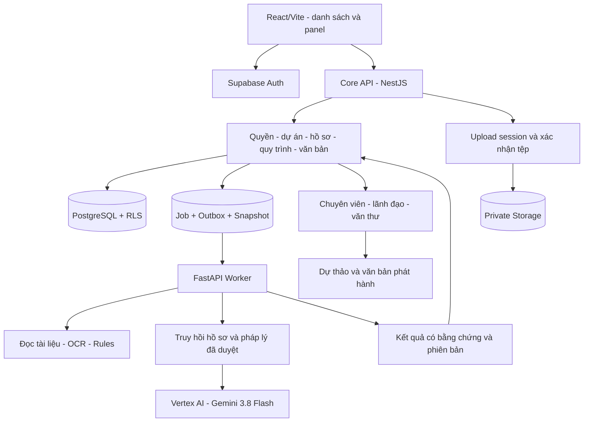

# Kế hoạch nâng cấp và hoàn thiện full stack BuildAppraisal AI

**Ngày lập:** 27/09/2026. **Trạng thái:** Chờ người dùng review và duyệt triển khai.

**Phạm vi:** Toàn bộ dự án `D:\01_Projects\cic-qlhd-SXD`: frontend, backend, cơ sở dữ liệu, hồ sơ điện tử, AI, pháp lý, kiểm thử và vận hành. Đây là kế hoạch; chưa thực hiện các thay đổi kỹ thuật nêu dưới đây.

## 1. Kết luận và mục tiêu

Hệ thống hiện là **MVP cục bộ có luồng BCNCKT và kết nối Vertex AI**. Cần hoàn thiện nền tảng dữ liệu, quyền và nghiệp vụ trước khi vận hành nhiều người dùng với hồ sơ thật.

Năm ưu tiên:

1. **P0 — Bảo vệ dữ liệu:** đóng quyền phát triển đang mở trên cloud, sửa cách xác định người thao tác và các đường ghi bỏ qua nghiệp vụ.
2. **P1 — Một nguồn dữ liệu:** dự án, tổ chức, nhân sự, hồ sơ và dashboard dùng nguồn được xác định rõ; production không tự thay lỗi DB bằng mock.
3. **P1 — Ba quy trình đầy đủ:** BCNCKT, GPXD và hậu kiểm/nghiệm thu có nghiệp vụ riêng, liên kết dự án và lịch sử các lần nộp.
4. **P1/P2 — AI có bằng chứng:** giữ Gemini 3.8 Flash; bổ sung OCR, truy hồi pháp lý/tài liệu, đánh giá chất lượng và kiểm soát chi phí.
5. **P1/P2 — Vận hành:** job bền vững, CI, quan sát hệ thống, triển khai tái lập, sao lưu và khôi phục.

Không dùng tỷ lệ phần trăm hoàn thành khi chưa có bộ tiêu chí nghiệm thu toàn hệ thống. Nghiệm thu theo năng lực cụ thể và bằng chứng.

### Nền tảng đã có để tiếp tục sử dụng

- React/Vite; danh sách và panel dự án; ba phân hệ con dưới Quản lý dự án và ba tab tương ứng.
- Đọc PDF/DOCX/TXT, bản gốc/phiên bản, trích dữ liệu, kiểm tra quy tắc, đối chiếu pháp lý, chuyên viên rà soát, lịch sử và dự thảo đầu ra.
- Revision chống ghi đè, dữ liệu mẫu liên kết dự án, trình xem PDF, xuất A4 và các UI component dùng chung.
- Supabase cloud có danh mục dự án/chủ thể, các hàm dashboard, ngày làm việc, workflow và view lịch sử; cần kế thừa sau rà quyền/nghiệp vụ.
- Vertex cấu hình `gemini-3.8-flash`, endpoint `global`. Có kết quả kiểm tra kết nối thành công đã lưu; chưa nghiệm thu đầu cuối nghiệp vụ trên mô hình này.

### Cơ sở rà soát

Đã đọc mã nguồn/migration/tài liệu; health cục bộ; thống kê SQLite chỉ đọc; metadata, định nghĩa hàm, quyền hiệu lực và số lượng dữ liệu Supabase qua Management API do người dùng cung cấp. Đã đối chiếu nguồn pháp lý/kỹ thuật chính thức. Không chạy lại test, build, benchmark, khai thác lỗ hổng hoặc ghi dữ liệu cloud.

Chi tiết bằng chứng: [Báo cáo rà soát](D:/01_Projects/cic-qlhd-SXD/docs/FULL_STACK_REVIEW_2026_09_27.md). Tài liệu không chứa mật khẩu hoặc token.

## 2. Hiện trạng dữ liệu và chức năng

### 2.1. Cloud và local chưa thống nhất

| Nguồn | Quan sát chỉ đọc | Ý nghĩa |
| --- | --- | --- |
| SQLite demo | 161 hồ sơ/lần nộp, 868 tài liệu; 156 lần nộp seed liên kết 26 dự án | Dữ liệu mẫu và hồ sơ thử ở local |
| Supabase cloud | 26 dự án, 32 tổ chức, 40 nhân sự, 9 staff_users, 5 giá vật liệu | Đã có danh mục để đối soát; chưa xác minh bản ghi nào là nghiệp vụ thật |
| Auth/profile cloud | 0 profiles; chưa có province_id trong profiles | Chưa đáp ứng mô hình identity/scope mà worker mới cần |
| Hồ sơ mới cloud | Chưa có appraisal_cases và RPC tương ứng; Storage chưa có bucket | Không thể chỉ đổi biến môi trường để đưa hồ sơ mới lên cloud |
| Migration | Cloud có ba migration bổ sung ngày 26/09 không có trong thư mục repo hiện tại | Cần baseline và hợp nhất lịch sử trước migration tiếp |
| Quyền cloud | 13 bảng có dev_open_access cho anon/authenticated; transition_dossier dùng x-actor-id | Gate P0 bắt buộc trước hồ sơ thật |

### 2.2. Theo phân hệ

| Phân hệ/lớp | Hiện trạng | Đích hoàn thiện | Ưu tiên |
| --- | --- | --- | --- |
| Dashboard | KPI/biểu đồ UI dùng mẫu; cloud có hàm tổng hợp | KPI từ DB theo quyền và thời gian, mở hồ sơ nguồn | P1 |
| Quản lý dự án | UI dùng 26 dự án mẫu; service cloud có fallback | CRUD, scope, chủ thể, quy mô, TMĐT, tài liệu và ba tab cùng dữ liệu | P1 |
| BCNCKT | Tiếp nhận/rules/pháp lý/AI/review/dự thảo | Phân công, SLA, bổ sung, trình duyệt, phát hành theo version pháp luật | P1 |
| GPXD | Danh sách và workspace tiếp nhận chung | Checklist theo thủ tục, xử lý chuyên môn, ý kiến, giấy phép, điều chỉnh | P1/P2 |
| Hậu kiểm/nghiệm thu | Danh sách, tài liệu, lịch sử mẫu | Lịch kiểm tra, biên bản, tồn tại, khắc phục, kiểm tra lại, kết quả | P1/P2 |
| Tổ chức/cá nhân | UI phần lớn mock; cloud có danh mục | CRUD, quan hệ vai trò/thời kỳ, năng lực, nguồn xác minh, hết hạn | P1/P2 |
| Pháp luật/chat | Kết quả/câu trả lời dựng sẵn | Kho được duyệt, trích dẫn và hiệu lực; hỏi đáp theo phạm vi | P2 |
| Giá/định mức | UI mẫu, cloud có ít dữ liệu giá | Nguồn công bố, địa bàn/thời kỳ/đơn vị/version, import và đối chiếu | P2 |
| GIS/quy hoạch | Dự án mẫu và nền bản đồ | Địa điểm thật, nguồn lớp quy hoạch, hệ tọa độ và quyền truy cập | P2 |
| Văn bản/A4 | Generator mới và màn mẫu cũ tách biệt | Kho mẫu thống nhất, snapshot, duyệt, ký/phát hành và lưu trữ | P1/P2 |
| Quản trị | Mô tả vai trò/trạng thái kết nối tĩnh | Người dùng, quyền thật, cấu hình có version, trạng thái đo được | P0/P1 |
| Core API | NestJS proxy | Module nghiệp vụ, auth, DTO, lỗi chuẩn, tài liệu API | P1 |
| Worker | FastAPI kiêm nghiệp vụ và job trong RAM | Worker tài liệu/AI theo snapshot, retry, telemetry | P1 |
| DB/Storage | Schema cloud cũ + local JSON aggregate | Quan hệ lõi, tệp riêng, snapshot bất biến, truy vấn hiệu quả | P0/P1 |
| DevOps | Script phát triển; chưa có chuỗi CI/deployment chuẩn trong repo | Staging/prod, container, giám sát, backup và rollback | P1/P2 |

## 3. Gói P0: quyền, identity và tính toàn vẹn

### 3.1. Cloud đang mở quyền phát triển

- Sao lưu cấu hình/grant/policy/schema; rà phụ thuộc trước thay quyền để tránh khóa chính đường nghiệp vụ hợp lệ.
- Thu hồi `dev_open_access` và các grant không cần trên bảng nghiệp vụ; bổ sung chính sách tỉnh/phòng/vai trò/phân công cho từng hành động.
- Bảo vệ `schema_migrations` khỏi Data API/client; khóa sửa/xóa audit và AI log đối với người dùng thông thường.
- Kiểm tra cả bảng, view, function, sequence và Storage. Các view lịch sử đã có security_invoker cần tiếp tục giữ và kiểm thử.
- Thay nguồn actor của `transition_dossier`: lấy UUID từ Auth, ánh xạ cán bộ active, kiểm tra scope và quyền trong DB; không lấy quyền từ `x-actor-id` do client truyền. Rà quyền EXECUTE cả `refresh_sla_status` và hàm có side effect khác.
- Profile/Auth UUID và staff_users hiện phải được liên kết có kiểm chứng; không cấp quyền tự chọn role bằng dữ liệu do frontend gửi.
- Admin kỹ thuật tách quyền phê duyệt/ký nghiệp vụ; quyền lãnh đạo liên phòng là phạm vi được giao, không mở toàn DB mặc định.

Grant và RLS phải được xử lý cùng nhau; thêm một policy hẹp không vô hiệu policy rộng đang tồn tại vì policy cho phép mặc định kết hợp bằng OR. Nguồn: [Supabase RLS](https://supabase.com/docs/guides/database/postgres/row-level-security), [PostgreSQL Row Security](https://www.postgresql.org/docs/current/ddl-rowsecurity.html).

### 3.2. Sửa thiết kế ghi hồ sơ mới trước khi áp migration

RPC `save_appraisal_case` trong repo chưa có trên cloud. Không áp nguyên trạng rồi mới sửa sau:

- Thay nhận cả payload bằng command hẹp: tiếp nhận, sửa trường cho phép, gắn dự án, xác nhận dữ liệu, review, trình duyệt, duyệt/trả lại.
- Kiểm tra null-safe cho trường bắt buộc; chặn thay đổi scope/revision sai, xóa finalReview, tự đặt status và giả kết quả AI.
- Audit do server/DB sinh; snapshot, run và review đã duyệt bất biến. Kết quả worker có schema/version và quyền ghi riêng.
- Giao dịch thay dữ liệu, transition và audit phải nhất quán; có idempotency key cho lệnh dễ gửi lại.
- Giữ RLS và quyền tối thiểu; không dùng service_role cho mọi request để thay thế thiết kế authorization.

Quyền EXECUTE và security definer cần cấu hình riêng, theo [Supabase Database Functions](https://supabase.com/docs/guides/database/functions).

### 3.3. Trạng thái và dữ liệu phải phản ánh đúng thực tế

- Demo/staging/production có cấu hình rõ. Production lỗi DB hoặc dữ liệu rỗng không được tự chuyển sang mock.
- Tên người dùng, quyền và đăng xuất gắn Auth thật; xóa cache theo account/scope khi đổi phiên.
- Kết nối chưa triển khai hiển thị chưa cấu hình/chưa kiểm tra; bỏ Online và webhook giả trong Settings.
- Chỉnh ngày hiệu lực và rà nội dung pháp lý mẫu sai; dùng registry chung thay chuỗi viết cứng.
- Giữ Gemini 3.8; tách identity/hạn mức ứng dụng trước production, ưu tiên xác thực không dùng khóa dài hạn khi hạ tầng hỗ trợ. Không đưa credential vào client, log hoặc tài liệu.

## 4. Kiến trúc đích

Giữ React/Vite và nền tảng hiện có. Nâng cấp từng module, không đổi framework đồng thời với chuyển dữ liệu.

| Thành phần | Trách nhiệm | Ranh giới |
| --- | --- | --- |
| Frontend | Hiển thị/nhập liệu/panel/bộ lọc/chứng cứ | Không quyết định quyền hoặc kết luận pháp lý |
| Core API | Auth, authorization, CRUD, state machine, phân công, SLA, audit | Đầu mối lệnh nghiệp vụ của UI |
| PostgreSQL | Ràng buộc, RLS, giao dịch, revision, lịch sử | Kiểm soát cả Data API/RPC trực tiếp |
| Worker | Trích xuất, OCR, rules, retrieval, AI, render | Không tự duyệt/phát hành |
| Storage | Bản gốc, phiên bản, đầu ra | Private, scope theo hồ sơ, URL có hạn |
| Kho pháp lý | Điều khoản, hiệu lực/phạm vi/version/người duyệt | Tách dữ liệu đang nhập với căn cứ đã kiểm chứng |

Mỗi endpoint chỉ có một chủ sở hữu ghi nghiệp vụ. Chuyển dần từ FastAPI sang module Core qua adapter tương thích; tránh hai bộ state machine độc lập. Worker ghi kết quả qua contract nội bộ giới hạn quyền.

### Job bền vững

- Bước đầu dùng PostgreSQL cho job/outbox: trạng thái, lease, heartbeat, retry, idempotency, snapshot và actor. Chỉ thêm dịch vụ hàng đợi riêng khi đo tải cho thấy cần.
- Ghi hồ sơ và outbox cùng giao dịch; worker nhận việc nguyên tử. Thiết kế chịu được giao lại tác vụ, không giả định chỉ chạy một lần.
- GET chỉ đọc; tiến trình quản lý lease phát hiện job treo. API instance không được đánh dấu job ở instance khác là mất.
- Tác vụ dài dùng identity worker giới hạn và acting user, không phụ thuộc JWT người dùng còn hạn đến lúc hoàn thành.
- Hủy dừng bước chưa chạy và bỏ kết quả muộn; cuộc gọi model đã gửi có thể vẫn tốn chi phí, UI phải thể hiện đúng.

## 5. Dữ liệu và liên kết dự án

### 5.1. Mô hình đề xuất

| Nhóm dữ liệu | Thiết kế |
| --- | --- |
| Projects/parties | Dự án, tổ chức, cá nhân, cán bộ Auth, quan hệ vai trò/thời kỳ; scope và FK rõ |
| Dossiers/submissions | Dự án → hồ sơ nghiệp vụ → các lần nộp; loại BCNCKT/GPXD/nghiệm thu; lần trước/lý do/ngày nhận |
| Documents/versions | Bản gốc, SHA-256, MIME, dung lượng, storage key, thành phần, phiên bản dùng trong từng lần nộp |
| Facts/evidence | Giá trị/đơn vị, trang/vùng nguồn, confidence, giá trị xác nhận/người xác nhận |
| Workflow | Assignments, transitions, consultations, SLA events, lịch làm việc có version |
| Analysis | Snapshot bất biến, job, run, finding; model/prompt/rule/corpus version và dữ liệu đầu vào |
| Review/output | Ý kiến, phê duyệt, mẫu và snapshot được duyệt, trạng thái ký/phát hành |
| Legal/rules | Văn bản/điều khoản/hiệu lực/phạm vi/sửa đổi/nguồn/người duyệt |
| Prices/norms | Công bố, kỳ/địa bàn/mã/đơn vị, nguồn và điều kiện áp dụng |
| History | Audit, AI log, integration events nối tiếp, actor thật, request/job ID |

Các trường lọc/sort/join thường dùng là cột có kiểu; JSON dành cho snapshot và kết quả có schema/version. Tiền dùng numeric/Decimal. Ngày nghiệp vụ là date; sự kiện lưu UTC, hiển thị Asia/Saigon.

### 5.2. Liên kết bắt buộc

- Server resolve dự án từ ID có quyền; tự lấy tên/mã/scope. Không tin snapshot tên/tỉnh/phòng do client khai.
- Danh sách phân hệ tổng hợp và tab dự án dùng cùng API; tab thêm projectId. Cùng hồ sơ có cùng ID, trạng thái, phiên bản và số tài liệu ở cả hai nơi.
- Lần bổ sung nối lần trước, tham chiếu phiên bản giữ nguyên; không gộp theo tên.
- GPXD/nghiệm thu tham chiếu kết quả giai đoạn trước khi có căn cứ; ba kịch bản seed độc lập không mặc nhiên là tiến độ pháp lý thật.
- Chuyển đơn vị hoặc đổi dự án là thao tác có quyền/audit; đánh dấu kết quả ảnh hưởng cần rà lại.

### 5.3. Migration dựa trên cloud thực tế

1. Lấy baseline schema/policy/function hiện tại; tìm ba migration cloud bị thiếu. Nếu không tìm được, dựng baseline được review và xác nhận checksum trước thay đổi.
2. Thống nhất public.schema_migrations với cơ chế migration đích; không reset database hoặc chạy lại initial schema trên dữ liệu đang có.
3. Rà/tái sử dụng cloud dashboard, holidays, search_text, workflow và view lịch sử; sửa identity/scope và đưa workflow xuống cấp hồ sơ phù hợp.
4. Liên kết Auth UUID ↔ staff_users/profile; nguồn province_code/province_id được chuẩn hóa có bảng ánh xạ. Không tự cấp vai trò dựa vào email/tên trùng.
5. Giữ ID dự án text hiện có trong đợt đầu; không ép đổi hàng loạt sang UUID. AppraisalCase.id hiện tại giữ như ID công khai của lần nộp hoặc alias tương thích.
6. Tạo hồ sơ cha theo quan hệ dự án/nghiệp vụ đã xác nhận. Trường hợp chưa đủ thông tin vào danh sách cần xử lý; không suy đoán liên kết.
7. Chạy chuyển đổi trên staging, đối soát số lượng/FK/version/hash/audit, giữ snapshot JSON gốc để truy nguyên.
8. Seed có namespace/version/idempotency và môi trường riêng. Không tự đưa toàn bộ dữ liệu mẫu local vào production.

## 6. Hoàn thiện ba quy trình

Khung sản phẩm đề xuất:

`Nháp → Tiếp nhận → Kiểm tra thành phần → Phân công → Xử lý chuyên môn → Trình rà soát → Trình duyệt → Phát hành → Lưu trữ`.

Các nhánh bổ sung/tạm dừng/trả lại/rút hồ sơ/điều chỉnh/mở lại phải có điều kiện, quyền, lý do và bằng chứng. Chuyên viên nghiệp vụ xác nhận khung này trước khi mã hóa thành quy trình pháp lý cụ thể.

- Tách trạng thái nghiệp vụ, trạng thái chạy AI và trạng thái tài liệu.
- Tách bổ sung thành phần với khắc phục nội dung; cấu hình số lần, mốc thời gian, văn bản và ngoại lệ theo căn cứ được duyệt.
- SLA tính từ sự kiện thực tế và lịch làm việc đã xác nhận; không nhận tùy ý deadline từ client như nguồn chân lý.
- Người lập, rà soát, duyệt và phát hành có quyền riêng; có ủy quyền thời hạn và audit khi cần.
- Khi sửa đầu vào sau review, kết quả bị ảnh hưởng chuyển cần rà lại; bản cũ giữ nguyên để truy nguyên.

| Nghiệp vụ | Chức năng phải hoàn thiện | Đầu ra |
| --- | --- | --- |
| BCNCKT | Xác định phạm vi/thẩm quyền; checklist có điều kiện; xác nhận facts; rules/AI; xử lý phát hiện; ý kiến chuyên ngành; trình duyệt | Phiếu/yêu cầu theo tình huống, báo cáo rà soát, dự thảo kết quả, lịch sử và snapshot |
| GPXD | Loại thủ tục/đối tượng; checklist; căn cứ đất đai/quy hoạch/thiết kế theo điều kiện; liên kết thẩm định; lấy ý kiến; duyệt | Dự thảo giấy phép/thông báo; số phát hành khi hợp lệ; lịch sử điều chỉnh/gia hạn/cấp lại trong phạm vi được duyệt |
| Hậu kiểm/nghiệm thu | Xác định phạm vi kiểm tra của cơ quan; kế hoạch/đoàn kiểm tra; tài liệu hoàn thành; ảnh/biên bản; tồn tại/khắc phục/kiểm tra lại | Biên bản, danh sách tồn tại, đối chiếu khắc phục, dự thảo văn bản kết quả |

Phân biệt kiểm tra công tác nghiệm thu của cơ quan quản lý với nghiệm thu của chủ đầu tư. AI hỗ trợ hồ sơ; đánh giá hiện trường, chất lượng và quyết định thuộc người có trách nhiệm.

## 7. AI, OCR và pháp lý

### 7.1. Chuỗi xử lý đích

1. Upload → kiểm tra/cách ly tệp nghi ngờ → bản gốc và hash.
2. Phân loại → đọc text/bảng/trang → OCR nếu cần → giữ tọa độ bằng chứng.
3. Chuẩn hóa dữ liệu/đơn vị → chuyên viên xác nhận trường quan trọng hoặc chưa chắc.
4. Chụp bộ tài liệu và dữ liệu xác nhận → chọn pháp lý/rule đúng thời điểm/phạm vi.
5. Rules kiểm tra nội dung xác định được → truy hồi đoạn cần thiết cho từng vấn đề.
6. Gemini 3.8 đề xuất có nguồn → kiểm tra schema/ID/phạm vi/mức hỗ trợ của trích dẫn.
7. Chuyên viên chấp nhận/sửa/bác bỏ → lưu cả đề xuất và quyết định.
8. Dự thảo từ snapshot được chọn → rà soát/duyệt/phát hành đúng quyền.

### 7.2. Hạng mục AI

- Thay chọn 55.000 ký tự đầu bằng phân đoạn cấu trúc, truy hồi theo nội dung và ngân sách token; thể hiện độ phủ và trang/tài liệu chưa xử lý.
- Tìm pháp lý theo số hiệu/điều khoản/hiệu lực/đối tượng trước; bổ sung ngữ nghĩa. Đánh giá PostgreSQL full-text/vector trên corpus thực tế trước chọn index.
- Lọc quyền trước truy hồi; cache/index có tenant và snapshot. Tách pháp luật công khai với hồ sơ riêng tư.
- Tài liệu là dữ liệu không đáng tin cậy: giữ bảo vệ prompt injection, không cho nội dung tệp điều khiển công cụ hoặc truy cập hồ sơ khác.
- Lưu model, endpoint, prompt/rule/corpus version, input hash, token usage, latency, lỗi và chi phí ước tính theo bảng giá có ngày hiệu lực.
- Hạn mức theo người/đơn vị/job, chống gửi lặp, retry/backoff cho 429/timeout. Không tự chuyển model/nhà cung cấp khi lỗi.
- Giữ `gemini-3.8-flash` theo yêu cầu. Tham chiếu [hướng dẫn mô hình](https://docs.cloud.google.com/gemini-enterprise-agent-platform/models/guides/gemini-3-8-flash).
- Đối chiếu yêu cầu xử lý dữ liệu của đơn vị với endpoint global hiện tại; identity ứng dụng riêng và dữ liệu được phép gửi. Không mặc định mọi cấu hình có lưu giữ bằng không; tham chiếu [điều kiện lưu giữ của Google](https://docs.cloud.google.com/gemini-enterprise-agent-platform/resources/zero-data-retention).

### 7.3. OCR và định dạng

Hoàn thiện OCR tiếng Việt, trang xoay/mờ, bảng, trang trống, số và đơn vị; lưu vùng nguồn để bấm xem. So OCR cục bộ với dịch vụ được phép trên cùng bộ tài liệu theo chất lượng/chi phí/dữ liệu trước chọn nhà cung cấp. OCR thấp confidence phải chuyển xác nhận, không tạo facts “đã xác thực”.

Mở XLSX cho TMĐT sau khi thống nhất công thức/đơn vị/nguồn; xử lý công thức không có giá trị cache và liên kết ngoài rõ ràng. CAD/BIM/tính toán kết cấu là nhánh mở rộng riêng; đọc PDF chưa đáp ứng các năng lực này.

### 7.4. Pháp lý sau 01/07/2026

Hồ sơ trình mới theo chỉ đạo dùng bộ quy định sau 01/07/2026. Hồ sơ lịch sử có chế độ chuyển tiếp riêng; không sửa ngày/bối cảnh bản gốc để khớp bộ luật mới.

NĐ 217/2026/NĐ-CP ban hành 19/06/2026, hiệu lực 01/07/2026 theo [Cổng văn bản Chính phủ](https://vanban.chinhphu.vn/?classid=1&docid=218509&pageid=27160&typegroupid=4). LegalAiPage đang viết 15/05/2026; phải sửa và rà cả tóm tắt nội dung.

- Kế thừa [nghiên cứu pháp lý hiện có](D:/01_Projects/cic-qlhd-SXD/docs/LEGAL_REVIEW_POST_2026_07.md): Luật 135, NĐ 217/206/207/212, thông tư và QCVN trong kho; tiếp tục kiểm chứng điều/phụ lục dùng để vận hành.
- Registry có bản chính thức/hash/điều khoản/hiệu lực/sửa đổi/thay thế/phạm vi/người duyệt; Markdown chỉ là bản đọc hỗ trợ.
- Rule/checklist/template tham chiếu đúng version; thay đổi pháp luật tạo version mới và danh sách hồ sơ cần xem xét theo quyết định nghiệp vụ.
- Ba trạng thái áp dụng/không áp dụng/chưa xác định; chưa đủ dữ liệu thì yêu cầu xác nhận.
- Không lấy thành phần đặc thù Hương Xuân/Hà Tĩnh thành yêu cầu chung cho mọi dự án Điện Biên.
- Chữ ký số cần xác thực mật mã/chứng thư nếu triển khai; dò thấy trường chữ ký chưa đủ kết luận hợp lệ.

## 8. Frontend và trải nghiệm

### Cấu trúc và dữ liệu

- AuthProvider và route guard toàn app; UI hiển thị quyền, API quyết định quyền.
- Tách AppraisalPage thành trang điều phối, danh sách, form và workspace theo nghiệp vụ. Entity resolver trung tâm bỏ import vòng với panel dự án.
- Repository/API chung cho dự án/chủ thể; mapper có schema. Dữ liệu chưa rõ giữ unknown/null, không mặc định thành nhóm/cấp/chủ đầu tư/deadline có vẻ hợp lệ.
- Cache theo account/scope, hủy request cũ khi đổi lọc, refresh danh sách/tab sau mutation; xử lý riêng 401/403/409.
- Search/filter/sort/paging/count toàn tập ở DB; tab dự án dùng cùng endpoint thêm projectId.

### Chuẩn UI bắt buộc

- EntityLink mở panel trung tâm theo ID thật; deep link khôi phục được panel.
- Tooltip chung và AutoTableTooltip; không dùng HTML title. SearchableSelect, DateInput, NumberInput đúng quy tắc.
- Thanh lọc theo thứ tự tìm kiếm → phân loại → cán bộ/chủ đầu tư → trạng thái → thời gian → actions.
- Bảng dùng chung resize/sort/lưu thiết lập; key cột ổn định, cấu hình version và tách theo account khi cần.
- Theme primary/semantic tokens trên mọi phân hệ; bổ sung dark cho phần còn thiếu; kiểm tra mọi bảng màu và ba chế độ nền.
- Guard cho form con/unsaved; Escape chỉ đóng lớp trên; bảo vệ chuyển tab/đóng panel/đổi dự án; header chừa nút đóng.
- Bàn phím, focus trap/return, nhãn trợ năng, loading/empty/error và chống double-click.
- Lazy-load PDF/GIS/charts/trang nặng, tải dữ liệu từng tab; không tải toàn bộ segments/runs/audit cho danh sách.

### Văn bản

Thống nhất nguồn template cho preview/DOCX/PDF, version mẫu và snapshot đầu vào. Giữ A4 210×297mm, lề trái/phải/trên/dưới 30/20/22/20mm theo quy tắc dự án. Phân trang thật trước khi đưa vào khung cao cố định để không cắt mất chữ; kiểm tra font trên Linux/container. Số/ký/phát hành chỉ có sau thao tác hợp lệ.

## 9. API, upload và hiệu năng

- Core có module Auth/Projects/Parties/Dossiers/Workflow/Documents/Jobs/Legal/Audit/Integrations; DTO, OpenAPI tại `/api/docs`, mã lỗi, request ID, rate limit, log lọc bí mật.
- Version hợp đồng API, sinh type UI từ schema, typecheck Core riêng; bật strict theo từng module để tránh thay đổi lớn khó kiểm soát.
- Danh sách dùng projection; index theo scope/procedure/project/status/date và khóa phân trang; đo query plan trên staging. Tái sử dụng index/hàm cloud phù hợp.
- Upload session có quyền, tải trực tiếp Storage, kiểm tra hash/quyền khi finalize; hỗ trợ tải tiếp cho tệp lớn, dọn object mồ côi có audit. Supabase khuyến nghị resumable upload trên 6MB: [tài liệu upload](https://supabase.com/docs/guides/storage/uploads/standard-uploads).
- Parser/OCR chạy nền có hạn thời gian/trang/bộ nhớ/giải nén; giữ giới hạn đã có, bổ sung kiểm tra MIME/magic, tệp hỏng/độc hại.
- Xuất báo cáo lớn là job; không giữ request web dài chờ OCR/AI/render.

**Mục tiêu đề xuất, chưa đo:** danh sách 50 dòng p95 ≤800ms; đọc metadata p95 ≤500ms; nhận job p95 ≤1 giây. Bộ tải ban đầu: 10.000 hồ sơ, 100.000 metadata tài liệu, 30 người dùng đồng thời, nhiều scope. Độ trễ AI/OCR đo riêng theo số trang/model. Chốt ngân sách bundle và giảm token sau baseline, không cam kết tỷ lệ tối ưu khi chưa có số đo.

## 10. Vận hành và tích hợp

- Giữ port phát triển web **3008**, Core **3001**, Worker **8000**. Frontend hiện ở `src/`; cập nhật hướng dẫn lệnh để không chỉ tới `apps/web` chưa tồn tại.
- Pin Node/pnpm/Python, lock dependency, Python venv, kiểm tra cấu hình lúc khởi động.
- Dev/staging/prod tách DB/bucket/identity/quota. Credential không vào bundle/log/mẫu tải xuống/repo.
- Container Core/Worker và frontend build tĩnh sau reverse proxy TLS; worker không public. Chọn host sau khi chốt hạ tầng. Máy chủ Công báo là phương án nếu đơn vị duyệt tài nguyên/cách ly, không mặc định triển khai chung.
- CI gồm type/lint/UI, unit/integration/RLS, build, dependency/secret scan, migration trên DB tạm, artifact có version. AI trả phí chạy trong đợt đánh giá có kiểm soát.
- Tách liveness/readiness/dependency; AI connection có thời điểm kiểm tra, không gọi model trả phí trong mọi health probe.
- Metrics latency/error/queue age/retry/token/cost/OCR/dung lượng; log request/job ID đã lọc dữ liệu nhạy cảm; cảnh báo có người nhận và runbook.
- Backup cả DB, Storage, template/registry; diễn tập restore. Mục tiêu ban đầu đề xuất RPO ≤24h, RTO ≤4h, cần đơn vị chốt theo nghiệp vụ/ngân sách.
- DVC/chữ ký số/CSDL năng lực/giá/quy hoạch dùng adapter, sandbox, idempotency và đối soát; phụ thuộc tài liệu kết nối và quyền truy cập chính thức.

## 11. Lộ trình và gate nghiệm thu

Ước lượng **10–15 tuần làm việc** với giả định 2 kỹ sư full stack, 1 kỹ sư AI/backend, QA và chuyên viên nghiệp vụ/pháp lý tham gia thường xuyên. Đây là ước lượng lập kế hoạch, chưa phải lịch cam kết; thời gian chờ kết nối ngoài/duyệt nghiệp vụ tính riêng.

| Giai đoạn | Thời lượng | Sản phẩm | Điều kiện hoàn tất |
| --- | --- | --- | --- |
| G0 — Baseline và P0 | 1 tuần | Baseline cloud/repo; ma trận quyền; sửa dev access/actor/RPC/auth/status; chuẩn pháp lý tối thiểu | Chặn các đường ghi trái quyền đã phát hiện, trạng thái UI đúng, backup và kế hoạch migration rõ |
| G1 — Nền dữ liệu/API | 2–3 tuần | Identity, project/submission, migration/adapter, API phân trang, Auth toàn app, upload session, queue | Danh sách/tab cùng dữ liệu; scope đúng; đối soát đạt; restart không mất job |
| G2 — Quy trình/UI | 2–3 tuần | Ba state machine, phân công/SLA/review, panel/grid/guard/theme, dự thảo/audit | Hành trình và nhánh bổ sung/khắc phục chạy trên staging; không tự phát hành |
| G3 — AI/OCR/pháp lý | 2–3 tuần | Corpus duyệt, retrieval/OCR, Gemini 3.8, evidence, cost control, tập đánh giá | Đạt ngưỡng đã chốt; không lẫn quyền; xử lý đúng thiếu nguồn/lỗi |
| G4 — Phân hệ hỗ trợ/tích hợp | 2–3 tuần | Dashboard, tổ chức/nhân sự, giá/định mức, GIS, văn bản/quản trị; adapter ngoài | Dữ liệu nguồn thật hoặc trạng thái chưa tích hợp rõ; KPI đối soát được |
| G5 — Thí điểm/bàn giao | 1–2 tuần | UAT, tải/restore, hướng dẫn, triển khai/rollback, sửa lỗi thí điểm | Gate nghiệp vụ/bảo mật/vận hành đạt, không lỗi chặn, có người nhận vận hành |

Phụ thuộc: G0 → G1 → G2; G3 cần nền dữ liệu G1 và căn cứ được duyệt; G4 cần G1; G5 chỉ mở phạm vi đã đạt gate. UI/tài liệu có thể làm đồng thời khi contract ổn định.

Có thể thí điểm BCNCKT trước sau G0–G3 cùng các hạng mục vận hành bắt buộc. GPXD/nghiệm thu và tích hợp ngoài có gate riêng; dữ liệu mẫu đầy đủ không thay thế nghiệm thu quy trình.

## 12. Danh sách file/module dự kiến sửa hoặc thêm

Đường dẫn tính từ `D:\01_Projects\cic-qlhd-SXD`. Tên mới là đề xuất, chưa tạo trong pha kế hoạch.

| Khu vực | File hiện có | Dự kiến thêm/tách |
| --- | --- | --- |
| Auth/bootstrap | `src/App.tsx`, `src/main.tsx`, `src/layouts/AppLayout.tsx`, `src/lib/supabase.ts` | `src/context/AuthContext.tsx`, `src/components/auth/RequireAuth.tsx`, `src/lib/permissions.ts` |
| Entity/panel | `src/components/ui/EntityLink.tsx`, `src/context/SlidePanelContext.tsx`, `src/components/SlidePanelStack.tsx` | `src/lib/entityRegistry.ts`, resolver theo ID |
| API/service | `src/services/projectService.ts`, `organizationService.ts`, `personnelService.ts`, `appraisalService.ts`, `src/types/appraisal.ts` | `src/services/apiClient.ts`, `src/types/generated/`, schema/mapper domain |
| Dự án/lần nộp | `src/pages/ProjectsPage.tsx`, `AppraisalPage.tsx`, `src/pages/projects/ProjectDetailSlidePanel.tsx` | `src/features/projects/`, `submissions/`, `permits/`, `inspections/` |
| Workspace | `src/pages/projects/appraisal/AppraisalWorkspace.tsx`, `src/components/appraisal/SubmissionWorkspace.tsx`, `LegalReview.tsx`, `ModelConnection.tsx` | Assignment/SLA/approval/evidence/job components |
| UI chung | `src/components/MasterTable.tsx`, `TableToolbar.tsx`, `src/components/appraisal/DossierGrid.tsx`, `src/hooks/`, `src/styles/tokens.css` | GridToolbar, AutoTableTooltip, AuditHistoryTab, schema lưu bộ lọc/cột |
| Phân hệ hỗ trợ | `src/pages/DashboardPage.tsx`, `OrganizationsPage.tsx`, `PersonnelPage.tsx`, `LegalAiPage.tsx`, `CostDatabasePage.tsx`, `GisMapPage.tsx`, `DocumentsPage.tsx`, `SettingsPage.tsx`, `src/components/ai/AiChatWidget.tsx` | API/feature theo phân hệ và quyền/nguồn dữ liệu |
| Văn bản | `src/components/documents/A4DocumentPreview.tsx`, `ai/app/reporting.py`, `draft_templates.py` | `templates/` có version, output snapshot, font/render config |
| Core | `services/core/main.ts` | `services/core/src/` với auth/projects/parties/dossiers/workflow/documents/jobs/legal/audit/integrations, TS config riêng |
| Worker | `ai/app/main.py`, `store.py`, `domain.py`, `ingestion.py`, `ocr.py`, `rules.py`, `provider.py`, `vertex.py`, `legal.py` | `ai/app/jobs/`, `retrieval/`, `extraction/`, `schemas/`, prompt/rule registry |
| DB | Hai migration hiện có và baseline cloud cần bổ sung | Migration mới quyền/identity/quan hệ/workflow/jobs/legal/price; `supabase/tests/` |
| Mẫu/chuyển đổi | `src/data/mock*.ts`, `scripts/appraisal.mjs`, `scripts/seed_project_submissions.py`, `.ts`, `ai/app/samples.py` | Dry-run/đối soát migration, seed manifest, bộ mẫu theo kịch bản |
| Tooling | `package.json`, `tsconfig.json`, `vite.config.ts`, `ai/requirements.txt`, `.env.example` | Lock Python, lint/typecheck/UI, contract/E2E/AI eval |
| Vận hành/docs | `README.md`, `docs/APPRAISAL_IMPLEMENTATION.md`, `docs/LEGAL_REVIEW_POST_2026_07.md`, `docs/VERTEX_AI_CONNECTION.md` | `deploy/`, CI, runbook, ma trận quyền, từ điển dữ liệu, hướng dẫn nghiệp vụ |

Không sửa migration đã được áp dụng để giả lập lịch sử mới; thêm migration tương thích sau baseline được xác nhận.

## 13. Kế hoạch kiểm thử sau khi duyệt

Đợt này không chạy các kiểm thử dưới đây. Bộ Python test hiện có là nền mở rộng, chưa đại diện bao phủ toàn hệ thống.

| Nhóm | Tình huống bắt buộc | Tiêu chí |
| --- | --- | --- |
| Auth/RLS/Storage | Anon, khác tỉnh/phòng, chưa phân công, inactive, JWT hết hạn, direct RPC/Data API, giả x-actor-id | Từ chối đúng; không lộ tên/tệp/snippet/số đếm; actor từ Auth |
| Tính toàn vẹn | Scope thiếu/null, giả status/run/audit, xóa review, đổi project sai scope, sửa snapshot duyệt | API/DB đều chặn; lịch sử không bị client tự sửa |
| Liên kết | Tổng danh sách/tab dự án, lần bổ sung, hồ sơ chưa gắn, dự án ngoài mock | Cùng ID/dữ liệu; seed không trùng; không nối theo tên |
| Job/concurrency | Hai người lưu, crash/restart/hai worker, retry/cancel, token hết hạn, upload lỗi | Không ghi đè âm thầm, không mất job, không kết quả trùng, đối soát tệp mồ côi |
| Search/paging | Hơn 1.000 dòng, không dấu, lọc kết hợp, sort/trang kế | Đúng toàn tập và tổng số; không chỉ lọc trang đang tải |
| Pháp lý/SLA | Trước/sau 01/07/2026, chuyển tiếp/ngoại lệ, thiếu dữ liệu, ngày nghỉ, bổ sung/khắc phục | Đúng version được duyệt; không suy diễn thẩm quyền/hạn khi chưa đủ căn cứ |
| OCR/parser | Text/scan/mờ/xoay/bảng, số/đơn vị, tệp hỏng/quá lớn/độc hại | Nguồn trang/vùng truy được; chưa chắc phải xác nhận; worker không sập |
| AI | Injection, thiếu bằng chứng, nguồn không hỗ trợ, corpus hết hiệu lực, timeout/429 | Không tự phê duyệt/giả nguồn; lỗi không thành thành công; có provenance |
| UI | Theme/dark/zoom/bàn phím, panel lồng, Escape/backdrop, unsaved, responsive | Đúng component, không mất dữ liệu, không đè nút |
| Văn bản | Nội dung dài, bảng nhiều trang, font Việt, DOCX/PDF/preview, ký/dự thảo | A4, không mất chữ; snapshot/template đúng; không tự ký/cấp số |
| Vận hành | Load, restore DB+tệp, nâng/hạ bản, rotation, provider outage | Đạt gate staging, có runbook và báo cáo rollback |

### Bộ đánh giá AI và hồ sơ mẫu

- Tập vàng ban đầu tối thiểu 20 hồ sơ được phép dùng/ẩn danh và 150 trang đa chất lượng; chuyên viên gán nhãn, rà bất đồng.
- Tách tập xây prompt/rule với tập đánh giá giữ lại. Đo precision/recall theo nhóm, độ đúng trường, trích dẫn, từ chối hợp lý, latency và chi phí.
- Ngưỡng đề xuất: ≥95% trích dẫn hỗ trợ đúng nhận xét trên tập giữ lại; không chấp nhận tự phê duyệt/giả nguồn trong bộ tình huống chặn. Recall và ngưỡng từng trường cần chốt theo rủi ro; không suy rộng thành bảo đảm đúng mọi hồ sơ.
- Bộ mẫu: lần đầu/bổ sung, không áp dụng, sai thẩm quyền, thiếu nguồn, thay version, scan, xung đột số liệu, timeout và AI bị bác bỏ. Input/output có manifest/hash/version/nhãn mô phỏng/kết quả kỳ vọng.
- Kiểm chứng pipeline Gemini 3.8 trên bộ này; probe kết nối thành công chưa thay thế đánh giá nghiệp vụ.

## 14. Chuyển đổi và rollback

1. Chốt baseline và lưu các thay đổi đã duyệt thành phần riêng, bảo toàn working tree hiện có.
2. Backup và diễn tập phục hồi trên staging trước migration.
3. Schema mở rộng tương thích, adapter và feature flag; đối soát chỉ đọc cũ/mới. Không ghi hai nguồn thiếu cơ chế giao dịch/đối soát.
4. Nếu cần, có cửa sổ đóng băng ghi đã thống nhất; chuyển dữ liệu, kiểm tra hash/FK/quyền/số lượng.
5. Thí điểm nhóm nhỏ, theo dõi lỗi/quyền/chi phí, mở rộng sau UAT.
6. Lỗi chặn: tắt feature, dừng nhận job mới, quay bản app tương thích. Dữ liệu phát sinh sau chuyển đổi phải được đối soát/replay trước restore; không phục hồi mù làm mất hồ sơ mới.
7. Dọn đường cũ sau cửa sổ rollback và nghiệm thu.

## 15. Các quyết định cần chốt khi bắt đầu triển khai

| Quyết định | Khuyến nghị ban đầu | Hạn chốt |
| --- | --- | --- |
| Phạm vi người dùng | Một Sở, nhiều phòng; tenant rõ; lãnh đạo có phạm vi được giao | G0 |
| Nguồn DB | Supabase đã cung cấp sau sửa P0/baseline; staging riêng; local mẫu tách biệt | G0 |
| Identity/quyền ký | Auth UUID liên kết staff; ma trận phê duyệt và ủy quyền; admin kỹ thuật tách nghiệp vụ | G0/G2 |
| Dữ liệu gửi AI | Gemini 3.8, identity riêng, đối chiếu endpoint global/lưu giữ/dữ liệu được phép | Trước hồ sơ thật vào AI |
| Thủ tục/SLA | Chuyên viên xác nhận căn cứ sau 01/07, phạm vi, ngoại lệ và lịch | Trước nghiệm thu G2 |
| Kết nối ngoài | Chỉ triển khai thực khi có tài liệu/credential/sandbox; chưa có thì ghi chưa tích hợp | G4 |
| Tải/RPO/RTO/ngân sách | Đo baseline và duyệt mục tiêu đề xuất ở mục 9–10 | Trước G5 |

## 16. Đề xuất phê duyệt

Ưu tiên **G0 + G1** để xử lý quyền cloud đang mở và hợp nhất nền dữ liệu; sau đó nghiệm thu G2–G5 theo gate. Có thể duyệt toàn lộ trình, nhưng không mở phạm vi vận hành khi giai đoạn phụ thuộc chưa đạt.

Theo **Plan-First của dự án**, công việc hiện dừng ở nghiên cứu và tài liệu. Chưa sửa code/migration/quyền cloud, chưa triển khai hoặc thực hiện các kiểm thử trong kế hoạch. Chỉ chuyển sang thực thi khi người dùng duyệt qua tin nhắn.

Kế hoạch BCNCKT trước đợt này được lưu nguyên trạng tại [bản lưu](D:/01_Projects/cic-qlhd-SXD/docs/plans/20260927-ke-hoach-bcnckt-truoc-ra-soat-full-stack.md).
