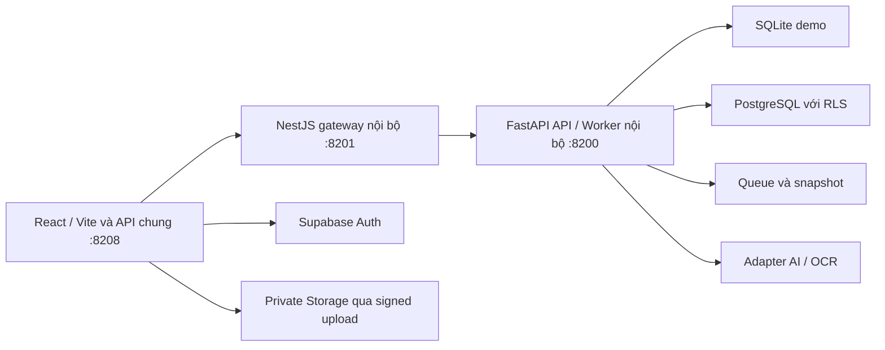

# Kế hoạch tối ưu và hoàn thiện BuildAppraisal AI

**Ngày cập nhật:** 28/09/2026.
**Trạng thái:** ĐÃ ĐƯỢC PHÊ DUYỆT QUA CHAT ("ok"); ĐANG TRIỂN KHAI.
**Workspace:** `D:/QuocAnh/2026/01.Project/cic-qlhd-SXD`.

Cơ sở: [review hiện trạng](docs/PROJECT_REVIEW_2026_09_28.md), code, env và kiểm chứng của đợt review trước. Kế hoạch cũ được giữ tại [bản lưu trước cập nhật](docs/plans/20260928-ban-luu-ke-hoach-truoc-toi-uu.md). Người dùng đã phê duyệt kế hoạch này bằng tin nhắn "ok".

Pha nghiên cứu đã kết thúc. Tiến độ và bằng chứng kiểm chứng được cập nhật tại [bàn giao triển khai ngày 28/09/2026](docs/IMPLEMENTATION_DELIVERY_2026_09_28.md). Theo yêu cầu đổi cổng của người dùng, runtime đã chạy với Web/API 8208, Core 8201, Worker 8200; đã đăng nhập và tải cloud qua trình duyệt. Các gate A–F chưa nghiệm thu toàn bộ.

## 1. Mục tiêu và phạm vi

1. Khắc phục quyền dữ liệu vượt phạm vi; có baseline DB và đường nâng cấp/khôi phục tái lập.
2. Môi trường hiện tại chạy đúng cổng, mode và dependency; demo đọc được đầy đủ các phân hệ, cloud dùng Auth/RLS đúng.
3. Hoàn thiện lưu ảnh, bảo vệ form, bảng/filter, kho văn bản và các nhánh xử lý ba nghiệp vụ.
4. Tối ưu truy vấn, payload, tải trang và hàng đợi bằng số đo trước/sau.
5. AI/OCR có cấu hình, nguồn, coverage, hạn mức, provenance và bộ đánh giá chuyên viên.
6. Có kiểm thử tự động, UAT và hướng dẫn vận hành cho phạm vi thử nghiệm.

Phạm vi đợt này là **demo cục bộ + cloud thử nghiệm**, BCNCKT, GPXD, nghiệm thu và các phân hệ hỗ trợ hiện có. Giữ mô hình chuyên viên xác nhận, rà soát nội bộ và dự thảo A4 chưa ký.

SMTP, domain, triển khai production, ký số/cấp số/phát hành, dịch vụ công, nguồn giá và lớp quy hoạch chính thức tiếp tục ở giai đoạn sau theo phạm vi đã ghi nhận. Chuẩn bị interface/tài liệu khi cần để nối tiếp. Agent không tự đánh dấu xác nhận nghiệp vụ/pháp lý thay chuyên viên.

## 2. Hiện trạng làm căn cứ

Bảng dưới ghi nhận tại thời điểm lập kế hoạch. Bộ cổng đích đã được cập nhật theo yêu cầu mới; kết quả triển khai nằm trong tài liệu bàn giao.

| Hạng mục | Đã xác minh | Phần còn thiếu |
| --- | --- | --- |
| Kiến trúc | React/Vite, gateway NestJS, API/Worker FastAPI | Module/API/types và boundary rõ hơn |
| Env/runtime | Có Supabase trong env; runtime demo; thiếu APPRAISAL_DATABASE_URL; AI/OCR chưa sẵn sàng | Runtime config, readiness và cấu hình cloud trên máy này |
| Cổng | Web 3008, Core 3001; hai file đang sửa đặt Worker 8200 | Worker 8000 theo AGENTS.md |
| Quyền/baseline | Có RLS/backend role trong migration | Chưa đối soát cloud; migration anon mở rộng; thiếu schema tiền đề |
| Hồ sơ | Revision, nguồn/hash, audit, workflow, chuỗi bổ sung, queue, A4 | Đồng bộ trạng thái, SLA, tải chi tiết theo nhu cầu |
| UI | Nhiều component chuẩn đã có | Gallery mất dữ liệu; thiếu guard/resize/sort; tooltip/filter chưa đồng bộ |
| Test | TypeScript frontend và 56/56 unit test đạt ở review trước | Core typecheck, migration/RLS, E2E, hiệu năng, restore |

Số lượng và cấu hình cloud ở bàn giao cũ chưa được đối soát lại trong review hiện tại. Thay đổi có sẵn tại `scripts/appraisal.mjs`, `services/core/main.ts` và migration anonymous phải được đối chiếu trước khi sửa. Không ghi đè công việc hiện có bằng suy đoán.

## 3. Kiến trúc đích và nguyên tắc

- Giữ cấu trúc repository. Tách routes/service/repository của FastAPI từng bước; Core quản lý gateway/boundary. Mỗi quy tắc nghiệp vụ có một nguồn thực thi.
- Demo và cloud cùng contract API, repository riêng. Cloud trả lỗi/rỗng đúng nghĩa; demo dùng fixture cục bộ có nhãn.
- Danh tính từ token đã xác thực; giao dịch DB gắn actor; server kiểm tra province/department/assignment. Không tự dùng kết nối quản trị trong env làm kết nối runtime.
- DB ưu tiên migration bổ sung tương thích, projection/index và command quan trọng. Chuẩn hóa thêm bảng khi yêu cầu ràng buộc hoặc số đo chứng minh cần thiết.
- Bảo toàn revision, idempotency, audit, snapshot, bản gốc/hash và hiệu lực kết quả theo bằng chứng.
- Tuân thủ component UI và A4 theo AGENTS.md. Cấu hình model ở server; giữ provider/model đã chỉ định khi được xác minh khả dụng.

## 4. Lộ trình và điều kiện nghiệm thu

| Giai đoạn | Ưu tiên | Sản phẩm | Điều kiện hoàn tất |
| --- | --- | --- | --- |
| A. Quyền và baseline | P0/P1 | Ma trận quyền thực tế, xử lý migration nguy hiểm, baseline và rollback | Anon/RPC trái quyền bị chặn; dựng/nâng cấp DB thử đạt |
| B. Runtime và dữ liệu | P1 | Demo hoạt động, cloud readiness, đúng cổng | Luồng đọc/đăng nhập đúng mode; lỗi config rõ |
| C. Chức năng và UI | P1/P2 | Gallery bền vững, guard, grid/filter, kho văn bản, workflow/SLA | Reload giữ dữ liệu; E2E chính và lint UI đạt |
| D. API và hiệu năng | P2 | Typed contract, module, payload/query tối ưu, queue/cleanup | Paging/sort đúng; benchmark và restart/cancel đạt |
| E. AI/OCR và A4 | P2 | Provider, coverage, registry, đánh giá, mẫu có version | Nguồn hợp lệ; trường quan trọng được xác nhận; chất lượng được duyệt |
| F. QA và bàn giao | P1/P2 | CI, UAT, runbook, restore | Không còn lỗi chặn trong phạm vi; người phụ trách xác nhận |

Thứ tự chính: **A → B → C → D → E → F**. Tooling/test/tài liệu được bổ sung theo từng gói. Hạng mục độc lập có thể thực hiện cùng thời điểm khi contract ổn định; kế hoạch không yêu cầu tạo subagent.

## 5. Giai đoạn A — Quyền và database

### A1. Đối soát hiện trạng

- Đọc metadata cloud: schema/ledger/grants/default privileges/policies/views, SECURITY DEFINER/RPC, Storage và role backend.
- Ma trận anon/authenticated/officer/head_of_department/director/admin/worker, gồm tỉnh/phòng/phân công/inactive.
- Xác minh `20260928000001_restore_dev_anon_read.sql` đã áp hay chưa; snapshot cấu hình/schema và dữ liệu cần bảo quản ngoài repo trước thay đổi.

### A2. Khắc phục quyền

- Chưa áp migration anon: sửa hoặc thay đề xuất đó trước khi đưa vào chuỗi triển khai.
- Đã áp: migration khắc phục mới bỏ policy đọc anonymous trên bảng nghiệp vụ, thu hồi EXECUTE/default privileges rộng và cấp lại từng quyền cần thiết.
- Rà cả hàm cũ nhận aggregate/chuyển trạng thái và claim/finish/read job. Function backend/worker không có EXECUTE cho client thông thường; API/DB lấy actor và scope đúng.
- Kiểm tra trực tiếp Data API/RPC/Storage, bao gồm tên, số đếm, snippet và tệp. Trang đăng nhập không thay thế kiểm soát DB.

### A3. Baseline và nâng cấp

- Bổ sung định nghĩa staff/catalog/audit/SLA/views/helpers còn thiếu theo schema và lịch sử đã xác nhận.
- Tách bootstrap DB trống với nâng cấp cloud hiện có; có preflight phiên bản/đối tượng tiền đề và dry-run trên môi trường cách ly.
- Giữ migration đã áp như lịch sử. Đối soát FK/count/revision/hash/quyền trước/sau; không reset cloud chứa hồ sơ.

**Gate A:** anon không đọc hồ sơ/profile/log/job; ngoài scope không thấy dữ liệu; worker vẫn hoạt động; bootstrap/nâng cấp DB thử đạt; snapshot và rollback có đối soát.

## 6. Giai đoạn B — Môi trường chạy

- Theo yêu cầu mới của người dùng: Web/API chung **8208**, Core nội bộ **8201**, Worker nội bộ **8200**. Config cùng nguồn tại `config/runtime-ports.json`; cổng bận báo rõ, không tự chuyển. Một lệnh `pnpm dev` khởi động đủ bộ và chờ API sẵn sàng.
- Chuẩn hóa mode/environment, config frontend công khai, credential backend, provider/OCR và origin. Runtime cloud dùng role `appraisal_backend` với TLS/RLS; không tự chuyển credential quản trị sang runtime.
- Validate config/preflight/readiness theo dependency. Health chỉ đọc trạng thái; probe model là thao tác riêng, có thời điểm và hạn mức.
- Dashboard và danh mục demo đọc được từ repository mẫu cục bộ, thống nhất với hồ sơ đang lưu. Chức năng ghi/role được mô phỏng có nhãn rõ. Không có AI/OCR vẫn xử lý quy tắc và dự thảo được.
- Cloud kiểm tra Auth/profile active, scope, DB/Storage trước thao tác. Test-login chỉ staging + loopback + cờ bật.
- Xử lý session hết hạn và sign-out: xóa panel/cache của tài khoản trước. Chọn dự án/danh mục tìm tại DB và paging.

**Gate B:** không còn 422 ở màn hình chỉ đọc demo được hỗ trợ; cloud thông báo đúng khi thiếu config, đúng quyền khi đủ config; dependency và cổng phản ánh đúng thực tế.

## 7. Giai đoạn C — Hoàn thiện luồng và giao diện

### C1. Gallery và dự án

- API metadata ảnh theo project ID/revision/actor/audit. Demo lưu cục bộ; cloud lưu metadata DB + private Storage.
- Form dùng ReviewModal, child guard và dirty guard; ESC xử lý form trên cùng; backdrop không làm mất panel cha/dữ liệu chưa lưu.
- Tải ảnh có kiểm tra loại/dung lượng; URL ngoài lưu tham chiếu hợp lệ khi hỗ trợ, tránh server tải URL tùy ý. Cleanup object chưa finalize theo TTL/ownership.
- Reload giữ ảnh; upload lỗi có thể thử lại; lưu ngày chuẩn. Sửa thông tin dự án theo allowlist/quyền/revision; TT39/chủ thể thiếu hiển thị thiếu.
- Thay đổi ảnh minh họa không tự làm mất kết quả nghiệp vụ; tài liệu được dùng làm bằng chứng vẫn theo cơ chế version/invalidate hiện có.

### C2. Grid, filter và component

- Bảng dự án có resize/persist và sort server; dùng grid chuẩn hoặc bổ sung contract tương đương cho MasterTable.
- GridToolbar đúng thứ tự: tìm kiếm → phân loại → người xử lý/chủ đầu tư → SLA → ngày; actions/reset/count ở cuối.
- Thay HTML title bằng Tooltip; AutoTableTooltip phát hiện nội dung bị cắt và dùng Tooltip chung.
- Chuyển select động/native không hợp lệ, ngày và tiền về component chuẩn; bổ sung EntityLink nơi có ID thật.
- Rà theme sáng/tối, header pr-14/pr-16, nút X, focus/keyboard/touch target; mặt giấy A4 giữ hình thức văn bản in.
- Persist state có version/scope tài khoản khi chứa lựa chọn nghiệp vụ. Debounce lưu độ rộng để tránh localStorage mỗi pointermove; xử lý pointercancel/unmount.
- `lint:ui` kiểm tra vi phạm bằng AST/attribute; không nhầm prop title của component nghiệp vụ với HTML tooltip.

### C3. Văn bản, workflow và SLA

- DocumentHub có paging/total, chọn được lần nộp ngoài 50 dòng đầu và giữ selection đúng khi lọc.
- Đồng bộ `status` và `workflow.state` qua command chung: giao việc/bắt đầu/bổ sung/trình/trả/hoàn tất/mở lại/hiện trường/khắc phục.
- UI/API thống nhất điều kiện khi có successor, final review, rule version cũ hoặc job chạy.
- SLA lưu ngày tiếp nhận/hạn/calendar version/căn cứ; tách hạn pháp định và nội bộ, bổ sung/tạm dừng/lịch nghỉ. Chuyên viên xác nhận quy tắc trước khi bật tính tự động.
- Audit resolve tên, actor/thời điểm/lý do; không hiển thị UUID thay tên. Paging/sort toàn tập nếu UI cung cấp chức năng đó.

### C4. Dashboard, danh mục, GIS và quản trị

- Dashboard phân biệt dự án, hồ sơ gốc và lần nộp; bộ lọc nghiệp vụ/ngày/dữ liệu mẫu có phạm vi thống kê rõ, KPI đối soát được với danh sách nguồn cùng quyền.
- Tổ chức/nhân sự: quan hệ với dự án và vai trò tham gia, revision/audit, trạng thái chứng chỉ theo ngày/nguồn xác minh; không coi thông tin nhập là đã xác nhận năng lực.
- Giá vật liệu: giữ đơn vị/địa bàn/kỳ/nguồn công bố/version; sửa giá có lịch sử. Hiển thị đúng trạng thái chưa kết nối nguồn giá tự động.
- GIS: sửa/lưu tọa độ có quyền và nguồn; lọc/paging hoặc truy vấn theo vùng nhìn để thể hiện đúng phạm vi dự án. Dự án thiếu tọa độ có danh sách riêng; nền ngoại tuyến được nhận biết rõ, không suy diễn tuân thủ quy hoạch từ điểm trên bản đồ.
- Quản trị: hiển thị runtime/dependency đo được; quản lý profile/role/scope có audit và quyền riêng. Không cấp vai trò từ trường client tự gửi; thông tin credential không được trả ra UI hoặc log.

**Gate C:** ảnh giữ sau reload, form con không mất panel, bảng/filter đúng toàn tập, ba nghiệp vụ truy vết được từng lần nộp và nhánh xử lý trong phạm vi.

## 8. Giai đoạn D — Tối ưu API, dữ liệu và queue

- Baseline có dataset/môi trường/cách đo: request count, payload, latency p50/p95, render, query chậm, queue age và parser memory.
- Hợp nhất apiClient/request trùng; chuẩn hóa lỗi/abort/session expiry/typed page. Giảm request runtime/health và polling lặp.
- Tách type domain khỏi mockData.ts; tsconfig Core; tăng strictness từng module và loại any tại boundary/mapper.
- Tách FastAPI routes/service/repository; OpenAPI theo contract, tài liệu `/api/docs` theo quyền/môi trường.
- List lấy projection; snippets/runs/audit tải theo tab/trang khi payload lớn. WHERE/ORDER/count/paging DB, thêm index sau EXPLAIN trên dữ liệu thử.
- Rà getAll/endpoint cases cũ; chỉ xuất toàn tập khi có nhu cầu rõ. Duy trì endpoint summary server paging.
- Finalize/upload idempotent và kiểm tra hash/revision; cleanup session/object mồ côi có dry-run, TTL/ownership và log.
- Queue kiểm tra lease/retry/restart/cancel/actor mất quyền; phân biệt lỗi tạm thời với lỗi tài liệu; không ghi kết quả snapshot đã cũ.
- OCR spool: xác định cùng host hoặc storage bền vững có quyền trước khi mở nhiều host; quota/dọn tệp kết thúc.
- Giới hạn CPU/RAM/thời gian parser; cân nhắc process riêng sau benchmark. Cache public registry/hash; cache dữ liệu riêng kèm tenant/department/actor và clear khi phiên đổi.

**Gate D:** paging/sort đúng với hơn 1.000 và 10.000 bản ghi thử; không lẫn scope/ghi job cũ; benchmark trước/sau có thể tái lập. Chốt ngưỡng latency/tải từ baseline, không lấy số giả định làm bằng chứng.

## 9. Giai đoạn E — AI/OCR, pháp lý và A4

- Cấu hình provider server trên máy hiện tại, kiểm tra model khả dụng; adapter chung cho BCNCKT và Legal assistant. Giữ cấu hình Vertex/model đã chỉ định khi hợp lệ.
- Tesseract/vie/eng và runtime OCR riêng; trạng thái health đúng, hash bản gốc giữ nguyên, facts sau OCR chờ xác nhận lại.
- Chọn đoạn AI theo checklist/câu hỏi/trường và token budget; thể hiện tài liệu/trang đã đọc, chưa đọc/lý do. Test vấn đề nằm cuối hồ sơ để khắc phục chỉ lấy 55.000 ký tự đầu.
- Registry version/hash/hiệu lực/chuyển tiếp/trạng thái duyệt/nguồn chính thức; mở rộng 7 nguồn theo phạm vi chuyên viên duyệt. Đánh giá truy hồi trước quyết định embedding/vector.
- Kiểm tra ID/quote và bằng chứng hỗ trợ diễn giải; chống prompt injection từ tài liệu/câu hỏi. Quote khớp không tự chứng minh kết luận đúng.
- Provenance: provider/model, prompt/rule/corpus version, document revision, source IDs/hash, latency/token/chi phí nếu provider cung cấp.
- Quota/rate/concurrency dùng nguồn chung khi nhiều process; timeout/retry hữu hạn; lỗi AI trả trạng thái đúng và vẫn dùng được rules.
- Bộ nhãn chuyên viên cho tiền/diện tích/ngày/chứng chỉ và 20 tình huống nghiệp vụ; tách tập đánh giá với tập tinh chỉnh.
- Gate đề xuất để chuyên viên chốt: 100% trích dẫn được chấp nhận có nguồn hợp lệ, 0 tự phê duyệt/ghi dữ kiện không có nguồn; đo precision/recall truy hồi và OCR theo từng trường quan trọng.
- PDF/DOCX cùng content model/template version: A4 210×297 mm, lề 30/20/22/20 mm, Times New Roman; nhiều trang/bảng/tiếng Việt/phần ký/dữ liệu thiếu rõ ràng. Render PDF và DOCX độc lập; ghi rõ nếu thiếu runtime render DOCX.

**Gate E:** model/OCR có bằng chứng đầu cuối; không biến thiếu nguồn thành đạt; trường quan trọng chưa xác nhận vẫn chặn hoàn tất; mẫu có nguồn/version và chuyên viên duyệt.

## 10. File dự kiến sửa/thêm

File mới là đề xuất, chưa tạo trong pha kế hoạch. Tên migration/nội dung cuối phụ thuộc ledger/schema thực tế. File frontend rút gọn nằm trong src; Python rút gọn nằm trong ai/app.

| Gói | File hiện có cần sửa | File dự kiến thêm |
| --- | --- | --- |
| Quyền/baseline | Migration anon nếu chưa áp; scripts/bootstrap_cloud.py, provision_backend.py | Migration khắc phục/baseline, supabase/tests/, scripts/verify_schema.py, docs/SECURITY_MATRIX.md |
| Runtime | scripts/appraisal.mjs, services/core/main.ts, .env.example, vite.config.ts, README.md, ai/app/database.py | ai/app/config.py, scripts/check_runtime.mjs, docs/RUNTIME_SETUP.md |
| Demo repository | ai/app/store.py, catalog.py, main.py, RuntimeSettings.tsx | ai/app/repositories/, fixture catalog có manifest |
| Gallery/dự án | ProjectGalleryTab.tsx, ProjectTT39InfoTab.tsx, ProjectDetailSlidePanel.tsx, projectService.ts | projectGalleryService.ts, ai/app/project_gallery.py, migration metadata ảnh/Storage |
| UI | MasterTable.tsx, TableToolbar.tsx, DossierGrid.tsx, ProjectsPage.tsx, AppraisalPage.tsx, SlidePanelStack.tsx, AppLayout.tsx, hooks | src/components/ui/GridToolbar.tsx, AutoTableTooltip.tsx, scripts/lint-ui.mjs |
| Văn bản/audit | DocumentHub.tsx, AuditHistoryTab.tsx, CatalogEditor.tsx, useFilterState.ts | DTO/page state chung nếu cần |
| Workflow/SLA | ai/app/workflow.py, domain.py, main.py, store.py, WorkflowPanel.tsx, SubmissionHistory.tsx | ai/app/sla.py, migration calendar/SLA/command |
| API/types | apiClient.ts, appraisalService.ts, projectService.ts, src/types/appraisal.ts, tsconfig.json, ai/app/main.py | src/types/project.ts, catalog.ts, services/core/tsconfig.json, ai/app/routes/, services/ |
| Queue/parser | ai/app/jobs.py, uploads.py, ocr_jobs.py, ingestion.py, store.py | Cleanup job/script, concurrency/resource tests, telemetry |
| AI/registry | provider.py, vertex.py, legal_assistant.py, legal.py, ai/evaluation/, scripts đánh giá | Registry có version, tập nhãn và prompt metadata |
| A4 | reporting.py, draft_templates.py, procedure_templates.py, PdfPreview.tsx, A4DocumentPreview.tsx | Export manifest và test render nhiều trang |
| QA/bàn giao | package.json, ai/requirements.txt, ai/tests/, docs | playwright.config.ts, tests/e2e/, CI, docs/OPERATIONS_RUNBOOK.md |

## 11. Kế hoạch kiểm thử sau phê duyệt

Chạy kiểm tra phù hợp từng gói; sửa và lặp lại phạm vi bị ảnh hưởng. Staging dùng fixture riêng theo ID, cleanup đúng đối tượng do test tạo và đối soát. Không ghi thử lên hồ sơ người dùng.

| Nhóm | Tình huống bắt buộc | Tiêu chí |
| --- | --- | --- |
| Auth/RLS/Storage | Anon, JWT hết hạn, inactive, khác tỉnh/phòng/người được giao, direct RPC, admin duyệt | Từ chối đúng; không lộ dữ liệu/số đếm/tệp; actor từ Auth |
| Migration | DB trống/snapshot, migration anon đã/chưa áp, ledger lệch, upgrade/restore | Schema/grant đúng, dữ liệu giữ, rollback đối soát |
| Runtime | Demo/cloud, thiếu DB/model/OCR, cổng bận, restart, test-login tắt | Readiness/thông báo đúng; đúng cổng; boundary giữ |
| Gallery/guard | Reload, upload lỗi, hai người sửa, ESC/backdrop/modal/panel/browser | Bền vững, revision đúng, không mất dữ liệu form |
| Grid/filter | >1.000/10.000 dòng, không dấu/viết tắt, lọc kết hợp/sort trang sau/resize | Toàn tập/total đúng, persist đúng scope |
| Nghiệp vụ | 3 luồng, 13 subtype, bổ sung lặp/successor/frozen/reopen/phân công/SLA | UI/API/DB/history đồng nhất |
| Job/upload | Finalize lặp/hash sai/crash/lease/retry/cancel/actor mất quyền/spool thiếu | Không nhân đôi/ghi job cũ; bản gốc giữ; retry hợp lý |
| AI/OCR | Thiếu nguồn/quote giả/injection/scan/bảng/số thập phân/vấn đề cuối hồ sơ | Nguồn/coverage/provenance và xác nhận đúng |
| A4 | Mọi subtype, nhiều trang/bảng dài/tiếng Việt/dữ liệu thiếu/version cũ | A4/lề đúng, không cắt/tràn, dự thảo rõ |
| UI/theme | Sáng/tối, 1366px/màn nhỏ, keyboard/focus, stacking | Không đè X, không mất form, component chuẩn |
| Hiệu năng/restore | Dataset cố định, payload/request/p95, queue tải thử, DB+Storage restore | Benchmark và hash/FK/revision/count đối soát |

Gate kỹ thuật: frontend/Core typecheck, lint/lint:ui, pnpm build, pnpm test:appraisal, test DB/RLS, E2E theo vai trò, đánh giá AI/OCR có nhãn và render A4. CI chạy cách ly; cloud/model thật có credential và gate riêng.

## 12. Triển khai và rollback

1. Đọc Git/diff hiện có, xác định base/ledger/môi trường; snapshot cần thiết ngoài repo.
2. Thực hiện trên môi trường thử; migration có preflight/transaction khi hỗ trợ, báo cáo trước/sau.
3. Chuyển app/DB theo thứ tự tương thích; feature chưa đạt gate hiển thị chưa sẵn sàng.
4. Lỗi chặn: dừng thao tác/job mới liên quan, giữ bản gốc/audit, quay app tương thích; đối soát dữ liệu phát sinh trước restore.
5. F: hoàn thiện CI, ma trận test và hướng dẫn; diễn tập restore cả DB/Storage, UAT có người xác nhận. Unit test hoặc probe AI thành công không đủ để nghiệm thu toàn hệ thống.

## 13. Ước lượng và đề xuất review

Ước lượng sơ bộ theo ngày công triển khai/kiểm thử kỹ thuật, cần hiệu chỉnh sau đối soát cloud/baseline. Không gồm thời gian chờ credential, nhãn chuyên viên hoặc tích hợp ngoài.

| Gói | Ngày công dự kiến |
| --- | --- |
| A. Quyền/baseline | 3–5 |
| B. Runtime/demo/cloud | 2–4 |
| C. Chức năng/UI/workflow | 6–10 |
| D. API/hiệu năng | 4–7 |
| E. AI/OCR/A4 | 5–8 |
| F. QA/CI/UAT/runbook | 4–6 |
| **Tổng sơ bộ** | **24–40 ngày công** |

Đề xuất triển khai A–F theo gate. **A+B** là mốc đầu để môi trường hoạt động đúng và dữ liệu được bảo vệ; **C** hoàn thiện trải nghiệm; **D–F** đưa phạm vi thử nghiệm đến trạng thái có thể nghiệm thu.

**Dừng theo Plan-First của AGENTS.md. Chờ tin nhắn phê duyệt trực tiếp của người dùng trước khi triển khai.**
