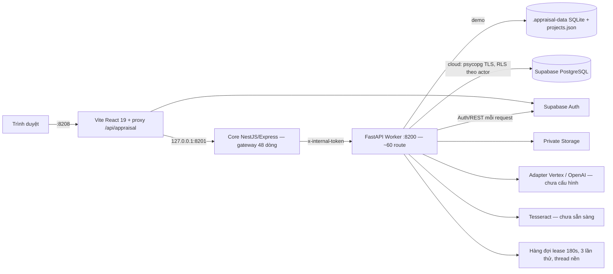

# Kế hoạch tối ưu và hoàn thiện BuildAppraisal AI — sau review tổng thể

**Ngày lập:** 28/09/2026 (16:20).
**Trạng thái:** CHỜ NGƯỜI DÙNG REVIEW/PHÊ DUYỆT QUA CHAT. Chưa sửa code.
**Kế hoạch trước:** [kế hoạch A–F đã duyệt và đang triển khai dở](docs/plans/20260928-ke-hoach-A-F-truoc-review-tong-the.md) · [tiến độ đợt A–F](docs/IMPLEMENTATION_DELIVERY_2026_09_28.md) · [review sáng 28/09](docs/PROJECT_REVIEW_2026_09_28.md).

Kế hoạch này **kế thừa** đợt A–F, không làm lại phần đã đạt. Nó dựa trên review lại toàn bộ code, cấu hình, CI, tài liệu và kết quả kiểm tra chạy lúc 16:00–16:20 cùng ngày.

---

## 1. Kết luận nhanh

Hệ thống đã có nền tảng tốt: ba nghiệp vụ (BCNCKT, GPXD, nghiệm thu), revision/CAS, chuỗi lần nộp, hash bản gốc, audit, hàng đợi có lease, quyền cloud đã đóng anonymous, baseline DB, gallery bền vững, A4 PDF/DOCX. Kiểm tra kỹ thuật hiện tại đều đạt (trừ lỗi build tạm thời do phiên khác đang sửa, xem F01).

Phần còn thiếu để hoàn thiện nằm ở 5 nhóm:

1. **Quản trị thay đổi:** 88 file chưa commit, một phiên khác đang sửa song song, build đang vỡ tạm thời.
2. **Nghiệp vụ:** chưa có **SLA / hạn trả kết quả** ở backend. Đây là cột 4–5 của thanh lọc chuẩn và là trọng tâm quy trình NĐ 217. Hai trường `status` và `workflow.state` đang được đồng bộ thủ công.
3. **Hiệu năng cloud:** mỗi request đều gọi 2 lần tới Supabase Auth/REST và mở một kết nối PostgreSQL TLS mới, không dùng pool. Pooler đặt ở Tokyo.
4. **Chuẩn UI và mã chết:** chưa có bộ `GridToolbar` chuẩn; còn nền dark có độ mờ thấp; có khoảng 10 module không còn được dùng; scanner UI mới kiểm 4 quy tắc.
5. **Chất lượng dài hạn:** `main.py` 780 dòng với khoảng 60 route; code viết nén nhiều lệnh trên một dòng; `strict=false`; chưa có test frontend/E2E; CI chưa từng chạy từ xa; AI/OCR thật chưa cấu hình.

---

## 2. Hiểu biết hệ thống (căn cứ để lập kế hoạch)

### 2.1 Kiến trúc đang chạy

- **Web (`src/`, ~11.500 dòng TS/TSX):** 10 trang lazy. Workspace BCNCKT (`AppraisalWorkspace.tsx`), GPXD/nghiệm thu (`SubmissionWorkspace.tsx`, `ProcedureReview.tsx`), Dashboard, Danh mục (tổ chức/nhân sự/giá vật liệu dùng chung `CatalogPage`), GIS Leaflet, Kho văn bản, Trợ lý pháp luật, Cài đặt runtime.
- **Core (`services/core/main.ts`):** chỉ kiểm tra origin/host/method, chặn test-login, chuyển tiếp nguyên body tới Worker. Không có module/controller/Swagger.
- **Worker (`ai/app/`):** chứa gần như toàn bộ nghiệp vụ: `main.py` (route), `store.py` (persistence demo/cloud), `workflow.py`, `rules.py`, `legal*.py`, `procedure_*.py`, `ingestion/ocr*`, `jobs.py`, `reporting.py`/`*_templates.py` (A4), `gallery.py`, `catalog.py`.
- **DB:** 22 bảng, 32 hàm, 33 policy (baseline `supabase/baselines/20260928.sql`). Dữ liệu lần nộp chủ yếu nằm trong JSONB `appraisal_cases.payload`.

### 2.2 Mô hình nghiệp vụ

**Dự án → Hồ sơ gốc (`appraisal_dossiers`) → Lần nộp (`appraisal_cases`, kiểu TS `Dossier`) → Tài liệu / dữ kiện / phát hiện / phiếu / kết quả.**
Vai trò: `officer`, `head_of_department`, `director`, `admin`. Workflow gồm: tiếp nhận → phân công → xử lý → chờ bổ sung → chờ rà soát → hiện trường → khắc phục → hoàn tất (rà soát nội bộ, chưa ký số/cấp số). Căn cứ pháp lý trong code đã cập nhật theo Luật 135/2025, NĐ 206/207/217/2026, TT 32/39/2026.

### 2.3 Kiểm chứng tại thời điểm review

| Kiểm tra | Kết quả |
| --- | --- |
| `tsc --noEmit` (web) | Lúc 16:05 đạt. Lúc 16:17 **lỗi 1**: `DashboardPage.tsx:1` import `CloudDashboard` vừa bị phiên khác xoá |
| `tsc -p tsconfig.core.json` | Đạt |
| `node scripts/lint-ui.mjs` | 0 vi phạm (4 quy tắc) |
| `node scripts/appraisal.mjs test` | **66/66 đạt** (5,3 giây) |
| Bật thử `--strict` cho web | Chỉ **3 lỗi** (`googleMapsLoader.ts:59`, `projectService.ts:14`, `:18`) |
| Bundle (`dist/` 15:57) | pdf.worker 1,27 MB; pdf-reader 437 KB; Dashboard 324 KB (recharts); supabase 223 KB; react 244 KB. Đều được tách chunk/lazy |
| `pnpm` cục bộ | Bản 12.3.4 (không nhận cờ `-s`); CI khai báo pnpm 10 |

---

## 3. Phát hiện mới (theo mức ưu tiên)

| Mã | Mức | Phát hiện | Bằng chứng |
| --- | --- | --- | --- |
| F01 | **P0** | 88 thay đổi chưa commit, gồm toàn bộ đợt A–F. Một phiên khác đang sửa dashboard/tooltip/catalog song song. Build hiện vỡ tạm thời. Rủi ro mất việc hoặc ghi đè lẫn nhau | `git status`. File sửa trong 15 phút gần nhất: `dashboardData.ts`, `Tooltip.tsx`, `dashboard.css`, `catalog.py`, `demo_catalog.py`. `CloudDashboard.tsx` bị xoá |
| F02 | **P1** | Chưa có SLA/hạn xử lý ở backend: không có ngày tiếp nhận chuẩn, hạn pháp định/nội bộ, tạm dừng khi yêu cầu bổ sung, lịch nghỉ. Thanh lọc chuẩn vị trí 4–5 không có dữ liệu thật để lọc | `ai/app/workflow.py`, `domain.py`: không có trường deadline/SLA. Chưa có `ai/app/sla.py`. Bảng `holidays` chỉ có trong baseline |
| F03 | **P1** | `status` và `workflow.state` được gán tay ở từng action, dễ lệch khi thêm thao tác mới | `workflow.py:56-63` |
| F04 | **P1** | Mỗi request cloud gọi `GET /auth/v1/user` và `GET /rest/v1/profiles`, sau đó mở kết nối psycopg mới (TLS verify-full, không pool). Pooler ở `ap-northeast-1`. Độ trễ cộng dồn nhiều lượt round-trip mỗi thao tác. Chưa có số đo HTTP | `store.py:58-59`, `database.py:14`. Không có `psycopg_pool` |
| F05 | P2 | Workspace poll **toàn bộ payload** lần nộp mỗi 1,5 giây. OcrPanel poll bằng interval. Mỗi thao tác ghi phát sự kiện `appraisal:changed` khiến danh sách tải lại | `AppraisalWorkspace.tsx:51-52`, `OcrPanel.tsx:11`, `apiClient.ts` |
| F06 | P2 | Khoảng 10 module không còn được import: `A4DocumentPreview`, `GoogleMapViewer`, `GoogleApiKeyModal`, `googleMapsLoader`, `gisData`, `KpiCard`, `ChartDefs`, `projectImages`, `mockAppraisalData`. Thư mục `src/data/mock*.ts` (~160 KB) chỉ còn dùng làm **type** trong `src` và làm dữ liệu seed cho `scripts/`. Dependency `@googlemaps/js-api-loader`, `@types/google.maps` có thể bỏ | Quét import tĩnh và lazy. Cần xác nhận lại sau khi phiên dashboard xong |
| F07 | P2 | Chưa có bộ component thanh lọc chuẩn (`GridToolbar`, `GridSearchInput`, `GridResetButton`, `GridCount`) như CLAUDE.md quy định; đang dùng `TableToolbar` riêng. Thứ tự 5 vị trí chưa được cưỡng chế | `src/components/TableToolbar.tsx`. Không tìm thấy `GridToolbar` |
| F08 | P2 | 12 chỗ nền dark có độ mờ thấp (`/30`–`/50`), trái quy chuẩn Dark Mode | `StatusBadge.tsx:20-55`, `SlidePanelStack.tsx:309`, `GoogleApiKeyModal.tsx:123` |
| F09 | P2 | Scanner `lint:ui` chỉ kiểm HTML `title`, `<select>`, `input date`, `toLocaleDateString`. Chưa kiểm: dark opacity, `<a>`/`Link`/`useNavigate` nội bộ, `input type=number`, class màu thiếu `dark:`, `right-0` trong header panel, bảng không resize/sort | `scripts/lint-ui.mjs` |
| F10 | P2 | `main.py` 43 KB/780 dòng với khoảng 60 route và model. Frontend viết nén (`AppraisalWorkspace.tsx` 31 KB trong 195 dòng). Khó review, diff và phối hợp nhiều agent | Kích thước file |
| F11 | P2 | Core dùng NestJS chỉ để bọc Express. Chưa có contract API: Worker tắt OpenAPI, type TS viết tay (`src/types/appraisal.ts`) | `services/core/main.ts`, `main.py:19` |
| F12 | P2 | `strict=false` ở web, dù bật strict chỉ phát sinh 3 lỗi. Chi phí chuyển đổi rất thấp | `tsconfig.json` |
| F13 | P2 | Chưa có test frontend/E2E (Playwright). Các gate C/B về ESC/backdrop/modal lồng, reload gallery, sort/paging mới chỉ kiểm bằng tay. CI chưa từng chạy từ xa và pin pnpm 10, lệch với máy dev (12.3.4) | `.github/workflows/quality.yml` |
| F14 | P2 | AI/OCR thật chưa sẵn sàng (`modelConfigured=false`, `ocrAvailable=false`) | Tiến độ A–F, mục 3 |
| F15 | P3 | Repo chứa nhiều tệp nhị phân lớn (PDF luật tới 16 MB, `DinhMucXayDung.xlsx/.esd` khoảng 21 MB) đặt ở gốc repo. Bốn file quy tắc `AGENTS/CLAUDE/GEMINI/RULES.md` trùng hệt nhau, phải sửa tay cả bốn | `git ls-files`, md5 giống nhau |
| F16 | P3 | Gateway ép `Content-Type: application/json` và nhận body tới 27 MB. Ảnh gallery gửi base64 (tối đa 7 MB) qua JSON, tốn thêm khoảng 33% dung lượng và RAM | `main.ts:12,31`, `main.py AddProjectImage` |

**Ghi chú phạm vi bảo mật:** memory ngày 25/09 ghi "chưa cần bảo mật". Ngày 28/09 người dùng đã duyệt đợt A–F và phần đóng quyền anonymous đã được triển khai. Kế hoạch này chỉ **duy trì** mức bảo mật hiện có (không làm hỏng, không mở lại). Trọng tâm chuyển sang nghiệp vụ, hiệu năng, chuẩn UI và AI.

---

## 4. Mục tiêu đợt này

1. Ổn định nhánh làm việc: commit checkpoint, build xanh, CI chạy được từ xa.
2. Hoàn thiện nghiệp vụ lõi: SLA/hạn trả kết quả, một nguồn trạng thái duy nhất, bộ lọc 5 vị trí có dữ liệu thật.
3. Giảm độ trễ cloud mỗi request và lưu lượng polling phía web, có số đo trước/sau.
4. Đồng bộ chuẩn UI của CLAUDE.md và cưỡng chế tự động bằng scanner.
5. Dọn mã chết, tách module, bật strict, sinh contract API để dễ bảo trì.
6. Đưa AI/OCR thật vào chạy khi có credential, có bộ đánh giá.
7. Có E2E cho các luồng chính và UAT theo vai trò.

---

## 5. Lộ trình theo giai đoạn

Thứ tự: **G0 → (G1 ∥ G2) → G3 → G4 → G5 → G6**. G1 (nghiệp vụ) và G2 (hiệu năng backend) làm song song được vì chạm các file khác nhau.

### G0 — Ổn định nhánh (P0, 0,5–1 ngày)

- Phối hợp với phiên đang sửa dashboard: chờ phiên đó hoàn tất, hoặc người dùng chỉ định phiên nào sở hữu các file `dashboard*`, `Tooltip.tsx`, `catalog.py`.
- Chạy `tsc`/`lint:ui`/test đầy đủ. Tách thành các commit theo chủ đề: quyền/migration, runtime/cổng, gallery, UI, demo/benchmark, AI adapter, tài liệu. Không gộp file `.env`, backup hay credential.
- Chuẩn hoá xuống dòng (`.gitattributes`: LF cho mã nguồn) để hết cảnh báo CRLF.
- Đồng bộ phiên bản pnpm giữa CI và máy dev (`packageManager` trong `package.json`), sau đó đẩy nhánh và chạy CI từ xa lần đầu.
- **Gate G0:** working tree sạch; build + typecheck core + lint:ui + 66 test đạt trên CI.

### G1 — Nghiệp vụ: SLA và nguồn trạng thái duy nhất (P1, 4–6 ngày)

- **Mô hình SLA** (`ai/app/sla.py` mới):
  - Mỗi lần nộp lưu `receivedAt`, `legalDueDate`, `internalDueDate`, `slaBasis` (điều khoản căn cứ), `calendarVersion`, `pausedDays`.
  - Tính theo **ngày làm việc** với bảng `holidays`. Tạm dừng khi `request_supplement` và chạy lại khi nhận bổ sung.
  - Trạng thái SLA gồm: Trong hạn / Sắp đến hạn (ngưỡng cấu hình) / Quá hạn / Tạm dừng.
- **Bảng thời hạn theo thủ tục:** lấy từ NĐ 217/2026, Luật 135/2025 và thủ tục GPXD/nghiệm thu. Đưa vào bảng cấu hình có version. **Chuyên viên phải xác nhận số ngày** trước khi bật tính tự động; agent không tự quyết con số pháp định.
- **Nguồn trạng thái duy nhất:** `workflow.state` là nguồn gốc; `status` hiển thị được suy ra bằng một hàm ánh xạ duy nhất. Có migration/backfill cho dữ liệu cũ và test bất biến "không có tổ hợp lệch".
- **Projection:** thêm cột `sla_state` và `due_date` vào bảng tóm tắt demo và view/cột cloud để lọc, sắp xếp ở DB. Không lọc bằng JavaScript.
- **UI:**
  - Cột "Hạn trả KQ" và badge SLA trong `DossierGrid` và `AppraisalPage`.
  - Bộ lọc vị trí 4 (SLA) và vị trí 5 (khoảng ngày tiếp nhận / hạn chót dùng `DateInput`).
  - Dashboard có KPI "Quá hạn / Sắp đến hạn", đối soát được với danh sách lọc.
- **Audit:** mỗi lần đổi hạn hoặc tạm dừng ghi `audit_logs`, có lý do.
- **Gate G1:** unit test cho ngày nghỉ, tạm dừng/tiếp tục, chuỗi bổ sung và mở lại. Lọc SLA trả đúng toàn tập khi có hơn 1.000 bản ghi. Không có lần nộp nào lệch `status`/`workflow.state`.

### G2 — Hiệu năng backend và polling (P1, 3–4 ngày)

- **Đo trước:** script đo p50/p95 HTTP cho các endpoint list/get/dashboard ở cả demo và cloud, qua Web 8208. Lưu kết quả vào `output/appraisal/benchmark/`.
- **Pool kết nối:** dùng `psycopg_pool.ConnectionPool` (min/max theo cấu hình). Giữ `set_config` actor và `statement_timeout` trong phạm vi từng giao dịch. Pool đóng khi tắt tiến trình.
- **Xác thực:** verify JWT cục bộ bằng JWKS hoặc secret của Supabase (kiểm tra `exp`/`aud`/`iss`). Cache profile theo `user_id` với TTL ngắn (30–60 giây); xoá cache khi profile bị vô hiệu hoá. Không nới quyền: RLS vẫn gắn actor như hiện tại.
- **Polling nhẹ:**
  - Endpoint `GET /cases/{id}/status` chỉ trả `revision`, trạng thái job và tiến độ.
  - Chỉ tải payload đầy đủ khi `revision` đổi. Có backoff (1,5 → 5 giây) và dừng khi tab bị ẩn.
  - OcrPanel dùng chung cơ chế này.
  - Sự kiện `appraisal:changed` mang theo `caseId` để chỉ làm mới đúng phần liên quan.
- **Upload ảnh:** chuyển gallery sang signed upload trực tiếp vào Storage (cloud), bỏ base64 qua gateway. Hạ giới hạn body của gateway.
- **Gate G2:** số đo trước/sau tái lập được; p95 list/get cloud giảm rõ so với baseline (ngưỡng chốt sau khi có số đo); không lẫn scope giữa hai tài khoản chạy đồng thời; toàn bộ test đạt.

### G3 — Chuẩn UI và dọn mã chết (P2, 4–6 ngày)

- **Bộ thanh lọc chuẩn** trong `src/components/ui/grid/`: `GridToolbar`, `GridSearchInput`, `GridResetButton`, `GridCount`.
  - Các slot có thứ tự cố định: tìm kiếm → phân loại → cán bộ/CĐT → SLA → thời gian → actions.
  - Thay `TableToolbar` ở `ProjectsPage`, `AppraisalPage`, `CatalogPage`, `DocumentHub`, `ProjectMap`.
- **Bảng:** hợp nhất `MasterTable` và `DossierGrid` về một contract cột, resize và sort. Mọi bảng hồ sơ có resize lưu localStorage (debounce) và sort theo server.
- **Dark mode:** thay 12 chỗ nền mờ bằng nền full opacity. Rà màu chữ trên nền màu. Mặt giấy A4 được **ngoại lệ có chủ đích** (luôn nền trắng) và đưa vào allowlist.
- **EntityLink:** rà mọi vị trí hiển thị tên thực thể có ID thật. Tên trong TT39 chưa có ID thì giữ văn bản thuần, không tạo ID từ tên.
- **Mở rộng `lint:ui`:** thêm quy tắc cho dark opacity; `<a>`/`Link`/`useNavigate` nội bộ (link ngoài `target=_blank` tới nguồn pháp lý đưa vào allowlist); `input type=number`; `right-0` trong header panel; overlay tự chế `fixed inset-0` ngoài `ReviewModal`/`SlidePanelStack`. CI sẽ fail khi vi phạm.
- **Dọn mã chết (F06):**
  - Xoá các module không dùng (sau khi xác nhận lại) và bỏ dependency Google Maps.
  - Tách type `Project`, `ProjectTT39Data`, … từ `mockData.ts` sang `src/types/project.ts`.
  - Chuyển `src/data/mock*.ts` sang `scripts/fixtures/` vì chỉ script seed còn dùng.
  - Riêng `A4DocumentPreview`: xoá, hoặc gắn vào luồng xem trước nếu người dùng muốn xem trước A4 phía client (xem mục 9).
- **Gate G3:** `lint:ui` mở rộng đạt 0 vi phạm; E2E thanh lọc/resize/sort đạt (G6); kiểm tra thủ công sáng/tối ở 1366 px và màn hình hẹp.

### G4 — Kiến trúc và khả năng bảo trì (P2, 4–6 ngày)

- **Tách `main.py`** thành `ai/app/routes/` (`runtime`, `projects`, `catalog`, `cases`, `workflow`, `legal`, `procedure`, `exports`, `gallery`) và `ai/app/schemas.py`. Chỉ di chuyển mã, giữ nguyên hành vi; 66 test là lưới an toàn.
- **Định dạng mã:** áp `ruff format` (Python) và Prettier (TS/TSX) theo từng thư mục, mỗi thư mục một commit riêng chỉ đổi định dạng. Thêm bước kiểm định dạng vào CI. Làm **sau G0** để tránh xung đột với phiên song song.
- **Contract API:**
  - Bật OpenAPI của FastAPI ở chế độ demo/staging, phục vụ qua Core tại `/api/appraisal/docs` (chỉ loopback).
  - Sinh type TS bằng `openapi-typescript` vào `src/types/api.gen.ts`; `appraisalService`/`projectService` dùng type sinh ra.
- **Core:** quyết định giữ NestJS và dùng đúng cách (module/controller, health, docs), hay thay bằng Express thuần để bỏ `@nestjs/*`, `rxjs`, `reflect-metadata`. Đề xuất: **Express thuần**, vì Core chỉ làm gateway (xem mục 9).
- **TypeScript:** bật `strict: true` cho web (sửa 3 lỗi), sau đó bật dần `noUnusedLocals` và giảm `any` (14 chỗ) tại lớp service/mapper.
- **Quy tắc agent:** giữ `CLAUDE.md` làm nguồn duy nhất và thêm script `scripts/sync-rules.mjs` sinh `AGENTS.md`/`GEMINI.md`/`RULES.md`; CI kiểm tra các bản đồng bộ.
- **Tệp lớn:** chuyển PDF luật và định mức sang Git LFS hoặc thư mục dữ liệu ngoài repo, có manifest hash. Thao tác này cần người dùng xác nhận vì ảnh hưởng lịch sử và dung lượng clone.
- **Gate G4:** hành vi không đổi (66 test đạt cùng E2E G6); build/typecheck strict đạt; type sinh từ OpenAPI khớp.

### G5 — AI/OCR thật và A4 (P2, 5–8 ngày, phụ thuộc credential)

Tiếp tục gate E của kế hoạch trước:

- Cấu hình provider/model ở server (ngoài repo) và probe có hạn mức. Tesseract `vie+eng` với spool riêng.
- Đánh giá có nhãn chuyên viên: tiền, diện tích, ngày, chứng chỉ, và 20 tình huống nghiệp vụ. Tách tập đánh giá khỏi tập tinh chỉnh.
- Provenance đầy đủ: provider/model, prompt/rule/corpus version, token/chi phí, độ trễ.
- Legal assistant: đo precision/recall truy hồi trên kho 7 nguồn trước khi quyết định dùng vector.
- A4: test render nhiều trang cho mọi subtype, kiểm tra lề 30/20/22/20 mm, số trang góc phải và phần ký.
- **Gate G5:** 0 kết luận không có nguồn; trường quan trọng chưa xác nhận vẫn chặn hoàn tất; chuyên viên duyệt chất lượng mẫu.

### G6 — Kiểm thử đầu cuối, CI và UAT (P1/P2, 4–6 ngày, chạy dần từ G1)

- Thêm Playwright (`playwright.config.ts`, `tests/e2e/`) chạy ở chế độ demo cách ly:
  - Đăng nhập theo vai trò (staging).
  - Tiếp nhận, phân công, yêu cầu bổ sung, trình, hoàn tất và mở lại.
  - Modal lồng: ESC chỉ đóng modal trên cùng, bấm backdrop không đóng panel cha.
  - Gallery giữ dữ liệu sau reload.
  - Lọc, sort, resize, paging với dữ liệu hơn 1.000 dòng.
  - Xuất A4.
- Thêm Vitest cho hook và tiện ích: `useFilterState`, `useColumnResize`, `useGridSort`, `smartSearch`, `formatDate`.
- CI có các job: lint/format → typecheck (web strict + core) → unit Python → Vitest → build → E2E demo → baseline PostgreSQL. Artifact gồm báo cáo E2E và benchmark.
- UAT theo phiếu cho từng vai trò, có người phụ trách ký xác nhận. Cập nhật `docs/RUNBOOK` và `docs/SECURITY_MATRIX`.
- **Gate G6:** CI xanh từ xa; E2E các luồng chính đạt; biên bản UAT không còn lỗi chặn.

---

## 6. File dự kiến sửa/thêm

| Giai đoạn | Sửa | Thêm |
| --- | --- | --- |
| G0 | `package.json` (`packageManager`), `.github/workflows/quality.yml` | `.gitattributes` |
| G1 | `ai/app/workflow.py`, `domain.py`, `store.py`, `demo_summary.py`, `main.py`; `src/pages/AppraisalPage.tsx`, `components/appraisal/DossierGrid.tsx`, dashboard, `types/appraisal.ts` | `ai/app/sla.py`, `ai/tests/test_sla.py`, migration `2026xxxx_sla_projection.sql`, cấu hình thời hạn có version |
| G2 | `ai/app/database.py`, `store.py` (`actor_for`), `jobs.py`, `gallery.py`, `main.py`; `services/core/main.ts`; `src/services/apiClient.ts`, `AppraisalWorkspace.tsx`, `OcrPanel.tsx`, `ProjectGalleryTab.tsx`; `ai/requirements.txt` (`psycopg_pool`, thư viện JWT) | `ai/app/auth.py`, `scripts/benchmark_http.py` |
| G3 | `TableToolbar.tsx` → thay thế, `MasterTable.tsx`, `DossierGrid.tsx`, `StatusBadge.tsx`, `SlidePanelStack.tsx`, các trang danh sách, `scripts/lint-ui.mjs`, `package.json` | `src/components/ui/grid/*`, `src/types/project.ts`, `scripts/fixtures/` |
| G3 (xoá) | — | Xoá: `components/gis/*`, `lib/googleMapsLoader.ts`, `lib/gisData.ts`, `lib/projectImages.ts`, `components/KpiCard.tsx`, `ChartDefs.tsx`, `data/mockAppraisalData.ts` (sau khi xác nhận) |
| G4 | `ai/app/main.py` → tách, `services/core/main.ts`, `tsconfig.json`, `services/*.ts` | `ai/app/routes/*`, `ai/app/schemas.py`, `src/types/api.gen.ts`, `scripts/sync-rules.mjs`, cấu hình ruff/prettier |
| G5 | `provider.py`, `vertex.py`, `legal_assistant.py`, `ocr*.py`, `reporting.py`, `*_templates.py` | Tập nhãn đánh giá, test render A4 nhiều trang |
| G6 | `.github/workflows/quality.yml`, `docs/RUNBOOK_*`, `docs/SECURITY_MATRIX.md` | `playwright.config.ts`, `tests/e2e/*`, `vitest.config.ts`, `src/**/*.test.ts`, phiếu UAT |

---

## 7. Kế hoạch kiểm thử

| Nhóm | Tình huống | Tiêu chí đạt |
| --- | --- | --- |
| SLA | Ngày nghỉ lễ/cuối tuần, tạm dừng bổ sung nhiều lần, mở lại, đổi lịch nghỉ (version) | Hạn tính đúng theo bảng đã được chuyên viên xác nhận; có audit |
| Trạng thái | Mọi action workflow × 3 nghiệp vụ × 13 subtype | Không có cặp `status`/`workflow.state` lệch |
| Hiệu năng | 10.000 lần nộp demo; cloud qua Web 8208; hai tài khoản chạy đồng thời | p50/p95 trước/sau có số liệu; không lẫn scope; pool không rò kết nối |
| Polling | Job chạy dài, tab ẩn, mất mạng | Không tải lại payload đầy đủ khi `revision` không đổi; có backoff |
| UI | Thanh lọc 5 vị trí, resize/sort/paging, sáng/tối, ESC/backdrop | `lint:ui` 0 vi phạm; E2E đạt |
| Refactor | Tách route, strict TS, định dạng mã | 66 test Python + E2E + typecheck đều đạt, hành vi không đổi |
| AI/OCR | Thiếu nguồn, trích dẫn giả, prompt injection, bản scan, vấn đề ở cuối hồ sơ | Nguồn/coverage/provenance đúng; không tự phê duyệt |
| A4 | Mọi subtype, nhiều trang, bảng dài | Đúng khổ và lề, không cắt hoặc tràn trang |

Lệnh kỹ thuật: `pnpm lint:ui`, `pnpm typecheck:core`, `pnpm build`, `pnpm test:appraisal`, `pnpm test:web` (mới), `pnpm test:e2e` (mới), `python scripts/benchmark_appraisal.py`, `python scripts/benchmark_http.py` (mới).

---

## 8. Rủi ro và cách kiểm soát

- **Hai phiên sửa song song:** mỗi giai đoạn khai báo danh sách file sở hữu. Việc định dạng hàng loạt (G4) chỉ làm khi không có phiên nào khác đang sửa.
- **Số ngày SLA pháp định:** agent chỉ dựng cơ chế; chuyên viên xác nhận bảng thời hạn. Chưa xác nhận thì hiển thị "Chưa cấu hình hạn", không đoán.
- **Verify JWT cục bộ:** giữ fallback gọi Auth khi JWKS lỗi. Test token hết hạn và tài khoản bị vô hiệu hoá trong thời gian TTL của cache.
- **Tách `main.py`:** chỉ di chuyển mã, không đổi logic trong cùng commit.
- **Xoá mã chết:** xác nhận lại bằng quét import sau G0; xoá theo từng commit để dễ hoàn tác.

---

## 9. Quyết định cần người dùng chốt

1. **Phiên song song:** phiên đang sửa dashboard/tooltip/catalog có tiếp tục không? Tôi có được commit checkpoint toàn bộ thay đổi A–F hiện tại (G0) không?
2. **Core gateway:** thay NestJS bằng Express thuần (đề xuất) hay giữ NestJS và bổ sung module/Swagger?
3. **`A4DocumentPreview` phía client:** xoá (xem trước dùng PDF do server render, như hiện tại) hay giữ và gắn vào luồng xem trước?
4. **Tệp luật/định mức lớn:** chuyển sang Git LFS / thư mục ngoài repo, hay giữ nguyên?
5. **Thứ tự ưu tiên:** giữ G1 (SLA) và G2 (hiệu năng) làm song song sau G0 như đề xuất, hay ưu tiên G3 (UI) trước để phục vụ demo?

---

## 10. Ước lượng

| Giai đoạn | Ngày công |
| --- | --- |
| G0 Ổn định nhánh | 0,5–1 |
| G1 SLA và trạng thái | 4–6 |
| G2 Hiệu năng backend/polling | 3–4 |
| G3 Chuẩn UI và dọn mã | 4–6 |
| G4 Kiến trúc/bảo trì | 4–6 |
| G5 AI/OCR/A4 | 5–8 (chưa gồm thời gian chờ credential và nhãn) |
| G6 E2E/CI/UAT | 4–6 |
| **Tổng** | **24,5–37 ngày công** |

Mốc đề xuất: **G0 + G1 + G2** đưa hệ thống đến mức đúng nghiệp vụ và phản hồi nhanh trên cloud. **G3 + G6** đạt chuẩn UI và có kiểm thử tự động. **G4 + G5** hoàn thiện khả năng bảo trì và AI thật.

**Dừng theo Plan-First của CLAUDE.md. Chờ tin nhắn phê duyệt trực tiếp của người dùng trước khi triển khai.**
