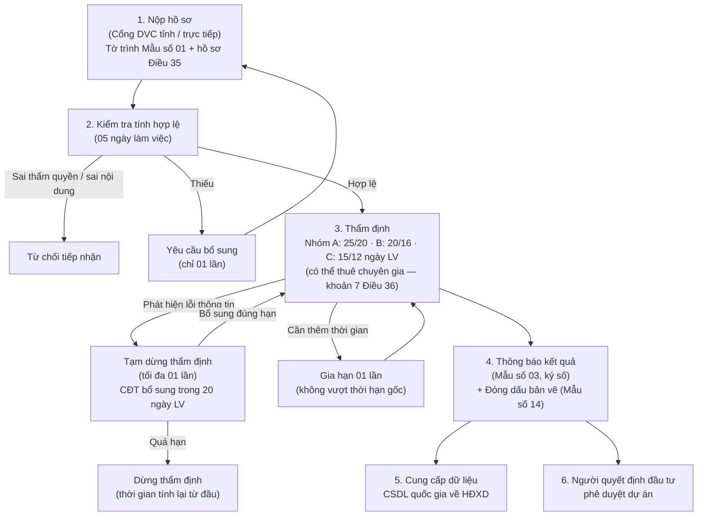

# Phần mềm AI Hỗ trợ Thẩm định Dự án Xây dựng cho Sở Xây dựng

> **Phiên bản**: 2.3 — cập nhật 11/09/2026: Đã chốt phương án thiết kế triển khai thí điểm tại **Sở Xây dựng tỉnh Điện Biên** (tích hợp Cổng DVC Tân Dân), kiến trúc sẵn sàng nhân rộng 34 tỉnh/thành; mô hình Hybrid AI; bổ sung quy trình cấp GPXD (cấp I, II) và phân hệ Kiểm tra dự toán (3B) cho Ban QLDA/CĐT; PCCC mức checklist thông minh. Xem [Nhật ký cập nhật](#11-nhật-ký-cập-nhật).

## 1. Bối cảnh & Cơ sở pháp lý

### 1.1. Hệ thống văn bản pháp luật hiện hành (tính đến 09/2026)

#### A. Pháp luật xây dựng

| Văn bản | Nội dung liên quan | Trạng thái |
|---|---|---|
| **Luật Xây dựng 135/2025/QH15** (thông qua 10/12/2025) | Thay thế Luật 50/2014 & 62/2020. **Bãi bỏ** thẩm định thiết kế triển khai sau TKCS tại cơ quan nhà nước (Điều 29 — chủ đầu tư kiểm soát). Cơ quan chuyên môn chỉ "kiểm soát một lần đối với mỗi dự án", tập trung vào an toàn xây dựng, PCCC, quy chuẩn kỹ thuật. Thẩm tra bắt buộc với công trình quy mô lớn/phức tạp/PCCC (khoản 5 Điều 26). Mở rộng miễn GPXD (Điều 43). Bổ sung hệ thống thông tin & CSDL quốc gia về hoạt động xây dựng. Phân loại dự án theo hình thức đầu tư (công / PPP / kinh doanh) | **Hiệu lực 01/7/2026** (Điều 43, 71, 95 từ 01/01/2026) |
| **NĐ 217/2026/NĐ-CP** (19/6/2026) — Quản lý hoạt động xây dựng | Thay NĐ 175/2024. Thẩm quyền Sở XD (Điều 32), hồ sơ trình thẩm định (Điều 35, Mẫu số 01), quy trình (Điều 36), thời gian (Điều 37), nội dung & kết quả thẩm định (Điều 38, Mẫu số 03), đóng dấu thẩm định (Mẫu số 14), nghĩa vụ cung cấp dữ liệu lên CSDL quốc gia (khoản 4 Điều 7), phân cấp GPXD & thẩm định về UBND cấp xã | Hiệu lực 01/7/2026 |
| **NĐ 206/2026/NĐ-CP** (15/6/2026) — Quản lý chi phí ĐTXD | Thay NĐ 10/2021. **Thẩm định dự toán do chủ đầu tư thực hiện** (không còn qua cơ quan chuyên môn). Cơ chế dữ liệu dự án tương tự, giá sát thị trường, CSDL chi phí, chỉ số giá | Hiệu lực 01/7/2026 |
| **NĐ 207/2026/NĐ-CP** (15/6/2026) — Quản lý chất lượng, thi công, bảo trì | Thay NĐ 06/2021. Điều 11 về BIM trong quản lý thi công; hồ sơ hoàn thành (Điều 28), điều kiện đưa vào sử dụng (Điều 29); kiểm tra công tác nghiệm thu | Hiệu lực 01/7/2026 |
| **NĐ 212/2026/NĐ-CP** (17/6/2026) — Điều kiện năng lực HĐXD | **Bỏ chứng chỉ năng lực tổ chức**; thu hẹp lĩnh vực cần chứng chỉ hành nghề cá nhân (hạng I/II/III) | Hiệu lực 01/7/2026 |
| NĐ 209/2026 (VLXD), NĐ 210/2026 (hợp đồng XD), NĐ 220/2026 (bảo hiểm bắt buộc) | Liên quan gián tiếp | Hiệu lực 01/7/2026 |
| **NQ 66.18/2026/NQ-CP** (18/5/2026) | Cắt giảm, đơn giản hóa TTHC ngành XD (bỏ kiểm tra nghiệm thu PCCC một số công trình...) | Đang thực hiện |
| **TT 36/2026/TT-BXD** (26/6/2026) — Phương pháp xác định & quản lý chi phí ĐTXD | Hướng dẫn NĐ 206/2026: sơ bộ TMĐT, TMĐT, dự toán, giá xây dựng, chi phí tư vấn/QLDA. Thay TT 11/2021, TT 14/2023 và một phần TT 60/2025. Đính chính bằng **QĐ 1538/QĐ-BXD** (28/8/2026) | Hiệu lực 01/7/2026 |
| **TT 37/2026/TT-BXD** (26/6/2026) — Phương pháp xác định định mức dự toán & chỉ tiêu kinh tế – kỹ thuật | 6 phụ lục: xác định/điều chỉnh định mức; khảo sát & công bố giá VLXD; giá nhân công; giá ca máy. Thay TT 13/2021, TT 01/2025, một phần TT 09/2025 và TT 60/2025 | Hiệu lực 01/7/2026 |
| **TT 38/2026/TT-BXD** (26/6/2026) — Ban hành định mức xây dựng | Định mức khảo sát, xây dựng, lắp đặt, thí nghiệm, sửa chữa, sử dụng vật liệu, chi phí QLDA & tư vấn. Thay TT 12/2021, TT 09/2024, TT 08/2025, Điều 2 TT 60/2025 | Hiệu lực 01/7/2026 |
| **QĐ 425/QĐ-BXD** (30/3/2026) | Công bố suất vốn đầu tư xây dựng & giá xây dựng tổng hợp bộ phận kết cấu công trình năm 2025 | Đang áp dụng (công bố hằng năm) |
| **NĐ 140/2025/NĐ-CP** | Phân định thẩm quyền chính quyền địa phương 2 cấp trong lĩnh vực quản lý nhà nước của Bộ XD | Hiệu lực 01/7/2025 |

#### B. PCCC, quy chuẩn kỹ thuật

| Văn bản | Nội dung liên quan | Trạng thái |
|---|---|---|
| **Luật PCCC & CNCH 55/2024/QH15** + **NĐ 105/2025/NĐ-CP** (15/5/2025) | Thẩm định thiết kế về PCCC: công trình thuộc Phụ lục III do **cơ quan chuyên môn về xây dựng** thẩm định (lồng ghép trong thẩm định BCNCKT); còn lại do cơ quan Công an; một số trường hợp chủ đầu tư tự thẩm định | Hiệu lực 01/7/2025 |
| **QCVN 06:2022/BXD** (TT 06/2022/TT-BXD, hiệu lực 16/01/2023) **+ Sửa đổi 1:2023** (TT 09/2023/TT-BXD ngày 16/10/2023, hiệu lực 01/12/2023) | An toàn cháy cho nhà và công trình — **vẫn là phiên bản hiện hành**; đã rà soát 09/2026: **chưa có Sửa đổi 2**, không có "QCVN 06:2025/2026" | Đang có hiệu lực |
| **QCVN 01:2026/BXD** — Quy hoạch đô thị và nông thôn (TT **46/2026/TT-BXD**, 30/6/2026) | **Thay QCVN 01:2021/BXD**. Chuyển tiếp (mục 5.4): quy hoạch đã phê duyệt hoặc **đã thẩm định** trước ngày hiệu lực → tiếp tục theo QĐ phê duyệt đến hết thời hạn; **điều chỉnh sau ngày hiệu lực → theo QC mới**; chưa thẩm định → phải soát xét theo QC mới; quy chuẩn địa phương/quy chế kiến trúc trái QC mới phải sửa | **Hiệu lực 01/01/2027** (QCVN 01:2021 áp dụng đến 31/12/2026) |
| **QCVN 04:2021/BXD + Sửa đổi 01:2026** (TT 31/2026/TT-BXD, 15/6/2026) | Nhà chung cư | Sửa đổi 01:2026 **hiệu lực 15/12/2026** |
| QCVN 07:2023/BXD (hạ tầng kỹ thuật), QCVN 09:2017/BXD (năng lượng hiệu quả) | Hạ tầng kỹ thuật, năng lượng | Đang có hiệu lực, chưa có phiên bản thay thế |

> [!NOTE]
> Trong 6 tháng tới có **3 mốc hiệu lực khác nhau** (QCVN 04 SĐ1: 15/12/2026; QCVN 01:2026: 01/01/2027; QCVN 06 chưa đổi) và quy tắc chuyển tiếp phụ thuộc vào **thời điểm thẩm định/phê duyệt của đồ án quy hoạch**, không chỉ ngày nộp hồ sơ dự án → Knowledge Base bắt buộc quản lý theo `(phiên bản, ngày hiệu lực, ngày hết hiệu lực, quy tắc chuyển tiếp)`; không thể hard-code một phiên bản.

#### C. Pháp luật về AI, dữ liệu, giao dịch điện tử (bắt buộc với hệ thống này)

| Văn bản | Nội dung liên quan | Trạng thái |
|---|---|---|
| **Luật Trí tuệ nhân tạo 134/2025/QH15** + **NĐ 142/2026/NĐ-CP** | Phân loại hệ thống AI theo 3 mức rủi ro (cao / trung bình / thấp); nghĩa vụ minh bạch, giám sát của con người, nhật ký, đánh giá độc lập với hệ thống rủi ro cao. Nguyên tắc "AI là công cụ hỗ trợ, quyết định cuối cùng là con người" | Hiệu lực 01/3/2026 |
| **Luật Bảo vệ dữ liệu cá nhân 91/2025/QH15** | Xử lý dữ liệu cá nhân của chủ đầu tư, cán bộ, cá nhân hành nghề | Hiệu lực 01/01/2026 |
| **Luật Dữ liệu 60/2024/QH15** | Dữ liệu cơ quan nhà nước, chia sẻ, CSDL quốc gia | Hiệu lực 01/7/2025 |
| **Luật Giao dịch điện tử 2023** + **NĐ 23/2025/NĐ-CP** (chữ ký điện tử) + **NĐ 30/2020/NĐ-CP** (văn thư) | Ký số văn bản kết quả thẩm định, lưu trữ hồ sơ điện tử | Đang có hiệu lực |
| Luật An ninh mạng, Luật An toàn thông tin mạng, quy định cấp độ an toàn hệ thống thông tin | Hệ thống của cơ quan nhà nước phải được phê duyệt cấp độ (dự kiến cấp độ 3) | Đang có hiệu lực |
| **NĐ 42/2022/NĐ-CP** | Dịch vụ công trực tuyến **toàn trình / một phần** (thay khái niệm "mức độ 3, 4") | Đang có hiệu lực |

#### D. Bối cảnh tổ chức hành chính (từ 01/7/2025)

- Cả nước còn **34 tỉnh/thành phố** (không còn 63); chính quyền địa phương **2 cấp** (tỉnh – xã), **bỏ cấp huyện**.
- **Sở Xây dựng đã hợp nhất Sở Giao thông vận tải** (từ 01/3/2025) → phạm vi thẩm định bao gồm cả **công trình giao thông**.
- Theo NĐ 217/2026: UBND cấp xã (cơ quan chuyên môn cấp xã) thẩm định BCNCKT dự án do UBND cấp xã quyết định đầu tư; cấp GPXD công trình cấp III, IV và nhà ở riêng lẻ. Các dự án trước đây thuộc cấp huyện chuyển toàn bộ về cấp xã.

> [!IMPORTANT]
> **Khung pháp lý đã thay đổi toàn diện và đang có hiệu lực**. Hệ thống tập trung 100% vào khung pháp luật mới (Luật XD 2025 + NĐ 217/2026), **bỏ qua chế độ chuyển tiếp NĐ 175/2024** trong MVP để tối ưu hóa nguồn lực và tinh gọn quy trình.
>
> Vai trò của Sở Xây dựng (thí điểm tại **Sở Xây dựng tỉnh Điện Biên**):
> - Thẩm định **BCNCKT / Báo cáo kinh tế – kỹ thuật** (bao gồm thiết kế cơ sở) — "một lần cho mỗi dự án", áp dụng cho **TẤT CẢ các hình thức đầu tư** (đầu tư công, PPP, và dự án đầu tư kinh doanh Phụ lục IV).
> - Thẩm định **PCCC** lồng ghép ở mức **Checklist thông minh** (đối chiếu văn bản chấp thuận của Cảnh sát PCCC + rà soát checklist QCVN 06).
> - **Cấp Giấy phép xây dựng (GPXD)** cho công trình cấp I, cấp II trên địa bàn tỉnh theo quy định Luật XD 2025.
> - **Kiểm tra công tác nghiệm thu**, hậu kiểm chất lượng và an toàn công trình.
> - **Cung cấp dữ liệu** đồng bộ lên CSDL quốc gia về hoạt động xây dựng và Cổng DVC tỉnh Điện Biên (nền tảng Tân Dân).
>
> **Phân định đối tượng người dùng**:
> - **Cán bộ Phòng Quản lý Xây dựng**: Người dùng tác nghiệp chính, trực tiếp sử dụng các công cụ AI để tiếp nhận hồ sơ, kiểm tra quy chuẩn/quy hoạch, rà soát TMĐT, lập báo cáo kết quả thẩm định và thẩm định cấp GPXD.
> - **Lãnh đạo Sở Xây dựng**: Chỉ theo dõi Dashboard tổng hợp (chỉ số SLA, tỷ lệ trễ hạn, khối lượng giải quyết, bản đồ dự án) và thực hiện ký số phê duyệt văn bản kết quả.

### 1.2. Chức năng thẩm định & cấp phép của Sở Xây dựng (theo NĐ 217/2026)

#### A. Thẩm định BCNCKT / Báo cáo KT-KT (Điều 32, 38 NĐ 217/2026) — trọng tâm của phần mềm
**Phạm vi áp dụng (Tất cả hình thức đầu tư)**:
- Dự án đầu tư công trên địa bàn tỉnh.
- Dự án đầu tư theo phương thức đối tác công tư (PPP).
- Dự án đầu tư kinh doanh có công trình ảnh hưởng lớn đến an toàn, lợi ích cộng đồng (thuộc Phụ lục IV NĐ 217/2026).
*(Trừ các dự án có công trình cấp đặc biệt thuộc thẩm quyền của Bộ quản lý chuyên ngành)*.

**Nội dung thẩm định (Điều 38)**:
1. Sự phù hợp với **quy hoạch**: chỉ tiêu sử dụng đất, vị trí, hướng tuyến
2. Danh mục và sự tuân thủ **quy chuẩn kỹ thuật, tiêu chuẩn áp dụng**
3. **An toàn xây dựng & PCCC**: kết cấu chịu lực; kiểm tra PCCC ở mức **Checklist thông minh** kết hợp đối chiếu văn bản thỏa thuận của cơ quan Cảnh sát PCCC
4. **Tổng mức đầu tư** (dự án đầu tư công / PPP) — theo NĐ 206/2026

**Sản phẩm**: Văn bản kết quả thẩm định theo **Mẫu số 03** + đóng dấu xác nhận trên bản vẽ (**Mẫu số 14**).

#### B. Cấp Giấy phép xây dựng (GPXD) công trình cấp I, cấp II (Luật XD 2025)
- Thẩm định hồ sơ đề nghị cấp GPXD đối với các công trình cấp I, cấp II trên địa bàn tỉnh thuộc thẩm quyền của Sở Xây dựng.
- Kiểm tra điều kiện cấp phép (quy hoạch, an toàn, môi trường, PCCC), đối chiếu BCNCKT đã được thẩm định.
- Tự động sinh dự thảo Giấy phép xây dựng điện tử theo mẫu quy định và trình ký số.

#### C. Kiểm tra Tổng mức đầu tư & Phân hệ Dự toán (Module 3B)
- **Kiểm tra TMĐT (Cho Sở XD)**: Theo NĐ 206/2026, Sở XD chỉ kiểm tra TMĐT trong bước thẩm định BCNCKT: phương pháp xác định, suất vốn đầu tư, dữ liệu dự án tương tự, chỉ số giá, chi phí dự phòng, chi phí tư vấn/QLDA.
- **Phân hệ Kiểm tra dự toán chi tiết (Module 3B - Cho CĐT / Ban QLDA)**: Cung cấp như một phân hệ chuyên biệt hỗ trợ các Ban QLDA trên địa bàn tỉnh Điện Biên và Chủ đầu tư tự kiểm tra dự toán chi tiết (định mức TT 38/2026, đơn giá và giá liên sở tỉnh Điện Biên) trước khi phê duyệt.

#### D. Hậu kiểm & Kiểm tra nghiệm thu (NĐ 207/2026, NĐ 212/2026)
1. Kiểm tra công tác nghiệm thu công trình xây dựng.
2. Kiểm tra việc chủ đầu tư tổ chức thẩm tra/thẩm định thiết kế sau TKCS (khoản 5 Điều 26 Luật XD 2025).
3. Kiểm tra điều kiện năng lực cá nhân hành nghề (chứng chỉ hạng I/II/III).
4. Kiểm tra hồ sơ hoàn thành, điều kiện đưa vào sử dụng (Điều 28, 29 NĐ 207/2026).

#### E. Nghĩa vụ tích hợp dữ liệu
- Đồng bộ hai chiều với **Cổng DVC tỉnh Điện Biên (nền tảng Tân Dân)**: Nhận hồ sơ, trả kết quả, cập nhật trạng thái xử lý theo thời gian thực.
- Cung cấp thông tin, dữ liệu thẩm định lên **Hệ thống thông tin, CSDL quốc gia về hoạt động xây dựng** (khoản 4 Điều 7 NĐ 217/2026).

### 1.3. Quy trình thẩm định theo NĐ 217/2026 (Điều 35–38)



**Thời gian thẩm định (Điều 37 NĐ 217/2026)** — tính từ ngày nhận đủ hồ sơ hợp lệ, **theo ngày làm việc**:

| Nhóm dự án | Có công trình cấp I trở lên | Còn lại |
|---|---|---|
| Quan trọng quốc gia | 60 ngày | 60 ngày |
| Nhóm A | 25 ngày LV | 20 ngày LV |
| Nhóm B | 20 ngày LV | 16 ngày LV |
| Nhóm C | 15 ngày LV | 12 ngày LV |

> [!NOTE]
> Thời hạn rút ngắn đáng kể so với luật cũ (40/30/20 ngày lịch) → áp lực thời gian lên cán bộ tăng, đây chính là điểm AI tạo giá trị rõ nhất. SLA trong phần mềm phải tính theo **ngày làm việc** (lịch nghỉ lễ Việt Nam), tách riêng thời gian tạm dừng.

---

## 2. Tầm nhìn phần mềm

### 2.1. Tên sản phẩm
**BuildAppraisal AI** - Hệ thống AI Hỗ trợ Thẩm định Xây dựng

### 2.2. Tuyên bố giá trị
> Phần mềm AI hỗ trợ cán bộ thẩm định tại Sở Xây dựng **tăng tốc, giảm sai sót, chuẩn hóa** quy trình thẩm định BCNCKT/thiết kế cơ sở và hậu kiểm — từ tiếp nhận hồ sơ, kiểm tra quy hoạch/quy chuẩn/an toàn/PCCC, kiểm tra tổng mức đầu tư, đến ra văn bản kết quả thẩm định đúng mẫu, đúng hạn — trong khung pháp lý Luật Xây dựng 2025 và Luật Trí tuệ nhân tạo 2025.

### 2.3. Nguyên tắc thiết kế

> [!CAUTION]
> **AI hỗ trợ, không thay thế con người.** Mọi kết quả thẩm định cuối cùng phải được cán bộ có thẩm quyền xem xét, phê duyệt và ký số. AI đóng vai trò **trợ lý thông minh**, không phải **người ra quyết định**. Đây vừa là nguyên tắc sản phẩm, vừa là nghĩa vụ pháp lý theo Luật AI 134/2025/QH15.

1. **Tuân thủ pháp luật & có trích dẫn**: Mọi kết luận AI đưa ra phải kèm điều khoản/QCVN cụ thể, phiên bản và ngày hiệu lực; không có nguồn thì không kết luận.
2. **Quản trị AI theo Luật AI 2025**: Đánh giá phân loại rủi ro ngay từ giai đoạn thiết kế (nhóm **rủi ro cao** vì hỗ trợ quyết định hành chính) → thiết kế sẵn: nhật ký quyết định, giám sát con người (human-in-the-loop), cơ chế giải trình, đánh giá độc lập định kỳ, gắn nhãn rõ nội dung do AI tạo.
3. **Minh bạch, giải thích được**: Mỗi cảnh báo hiển thị lý do, dữ liệu đầu vào đã trích xuất, độ tin cậy; cán bộ có thể chấp nhận/bác bỏ và ghi lý do.
4. **Bảo mật & Chủ quyền dữ liệu (Mô hình Hybrid AI)**:
   - **On-premise / Private Cloud nội địa**: Xử lý toàn bộ tài liệu hồ sơ, bản vẽ, trích xuất dữ liệu, kiểm tra quy chuẩn và dự toán; tuyệt đối **không gửi hồ sơ dự án ra LLM nước ngoài**.
   - **Cloud API**: Chỉ dùng để hỗ trợ RAG tra cứu tri thức pháp luật, QCVN, TCVN đã công bố công khai.
5. **Thí điểm Điện Biên, nhân rộng 34 tỉnh/thành**: Thiết kế adapter chuẩn hóa theo tỉnh; thí điểm đầu tiên tại Sở Xây dựng tỉnh Điện Biên (dữ liệu giá vật liệu, đơn giá, quy hoạch Điện Biên) nhưng kiến trúc lõi sẵn sàng mở rộng toàn quốc.
6. **Kiến trúc module, "pháp luật là dữ liệu"**: Quy tắc kiểm tra và văn bản pháp luật được quản lý như dữ liệu có phiên bản, không hard-code, để cập nhật khi pháp luật thay đổi mà không sửa mã nguồn.
7. **Tích hợp sâu với Cổng DVC Tân Dân (Điện Biên)**: Kênh nộp hồ sơ chính thức của người dân và doanh nghiệp vẫn là Cổng DVC tỉnh Điện Biên (do Công ty Tân Dân phát triển); hệ thống đóng vai trò nền tảng nghiệp vụ thông minh phía sau, đồng bộ hồ sơ và kết quả hai chiều qua API.
8. **Phân cấp giao diện người dùng**: Giao diện tác nghiệp chuyên sâu dành riêng cho **chuyên viên Phòng Quản lý Xây dựng**; giao diện **Executive Dashboard tinh gọn dành riêng cho Lãnh đạo Sở**.

---

## 3. Kiến trúc tổng thể

### 3.1. Sơ đồ kiến trúc

```mermaid
graph TB
    subgraph "Kênh tiếp nhận & Người dùng"
        DVC["Cổng DVC tỉnh Điện Biên\n(Nền tảng Tân Dân)"]
        WEB_CB["Web App Cán bộ\n(Phòng Quản lý Xây dựng)"]
        WEB_LD["Executive Dashboard\n(Lãnh đạo Sở Xây dựng)"]
        PORTAL["Phân hệ CĐT / Ban QLDA\n(Tự kiểm tra dự toán 3B)"]
    end

    subgraph "Lớp tích hợp (Integration Layer)"
        GW["API Gateway\n(Kong / Nginx)"]
        TANDAN_ADAPTER["Tân Dân DVC Adapter\n(Đồng bộ hồ sơ / kết quả)"]
        ESB["Kết nối LGSP/NDXP\nVNeID · QLVB · Ký số"]
    end

    subgraph "Core Services (NestJS Modular Monolith)"
        AUTH["Auth & RBAC\n(Phòng QLXD vs Lãnh đạo)"]
        DOSSIER["Dossier Service\n(Hồ sơ BCNCKT + GPXD)"]
        APPRAISAL["Appraisal Workflow\n(Quy trình + SLA ngày LV)"]
        PERMIT["Permit Service\n(Cấp GPXD cấp I, II)"]
        COST["Cost Check Service\n(TMĐT Sở XD + Dự toán 3B)"]
        INSPECT["Post-Inspection\n(Hậu kiểm)"]
        REPORT["Executive Analytics\n(Dashboard Lãnh đạo)"]
        AUDIT["Audit Log bất biến\n(Luật AI 2025)"]
    end

    subgraph "AI Engine (Python Workers - Hybrid Model)"
        DOC_AI["Document AI\n(OCR + Layout + Bảng)"]
        COMPLIANCE_AI["Compliance AI (L1/L2)\n(Checklist thông minh + Tham số)"]
        FIRE_CHECK["PCCC Smart Checklist\n(QCVN 06 + đối chiếu Công an)"]
        COST_AI["Cost AI\n(TMĐT + phát hiện bất thường)"]
        LEGAL_AI["Legal Assistant\n(RAG có trích dẫn)"]
        AI_GOV["AI Governance & Audit\n(Đánh giá, giải trình, log)"]
    end

    subgraph "Hạ tầng AI Serving (Hybrid)"
        LOCAL_LLM["On-premise / Private Cloud LLM\n(vLLM: Qwen / Llama xử lý hồ sơ)"]
        CLOUD_LLM["Cloud Commercial API\n(Tra cứu pháp luật công khai)"]
    end

    DVC <--> TANDAN_ADAPTER <--> GW
    WEB_CB & WEB_LD & PORTAL --> GW
    GW --> AUTH & DOSSIER & APPRAISAL & PERMIT & COST & INSPECT & REPORT
    DOSSIER --> DOC_AI
    APPRAISAL --> COMPLIANCE_AI & FIRE_CHECK
    COMPLIANCE_AI & FIRE_CHECK & DOC_AI & COST_AI --> LOCAL_LLM
    LEGAL_AI --> CLOUD_LLM
    DOC_AI & COMPLIANCE_AI & COST_AI & LEGAL_AI --> AI_GOV --> AUDIT

    subgraph "Knowledge Base (quản lý có phiên bản & hiệu lực)"
        LAW_DB["Văn bản pháp luật XD"]
        QCVN_DB["QCVN/TCVN Rule Graph\n(QCVN 06, 01, 04, 07...)"]
        PRICE_DB["Định mức TT 38/2026\nĐơn giá & Giá VLXD Điện Biên\nSuất vốn ĐT (QĐ 425)"]
        HIST_DB["Dữ liệu thẩm định lịch sử\n(Golden set hồ sơ)"]
    end

    subgraph "Hạ tầng (On-premise / Private Cloud Điện Biên)"
        DB["PostgreSQL 17 + pgvector\n(Dữ liệu nghiệp vụ & vector)"]
        CACHE["Redis + BullMQ\n(Task queue bất đồng bộ)"]
        S3["MinIO S3 Storage\n(Lưu trữ hồ sơ, bản vẽ WORM)"]
        SEARCH["OpenSearch / Postgres FTS\n(Tìm kiếm văn bản pháp luật)"]
    end

    subgraph "Hệ thống liên kết bên ngoài"
        NAT_DB["CSDL quốc gia về HĐXD\n(Bộ Xây dựng)"]
        SIGN["Dịch vụ Ký số chuyên dùng\n(Ban Cơ yếu / CA công cộng)"]
    end

    COMPLIANCE_AI --> QCVN_DB
    COST_AI --> PRICE_DB
    LEGAL_AI --> LAW_DB & SEARCH
    APPRAISAL --> HIST_DB & SIGN & NAT_DB
    AUTH & DOSSIER & APPRAISAL & PERMIT & COST & INSPECT & REPORT & AUDIT --> DB
    AUTH & APPRAISAL --> CACHE
    DOSSIER --> S3
```



### 3.2. Công nghệ đề xuất

| Lớp | Công nghệ | Lý do / Ghi chú |
|---|---|---|
| **Frontend** | Next.js (App Router) + TypeScript + Tailwind CSS + shadcn/ui | Hiện đại, dễ tuyển nhân sự, dùng chung type với backend TS |
| **Backend nghiệp vụ** | **NestJS (TypeScript)** — modular monolith ở Phase 1 | Một ngôn ngữ cho toàn bộ CRUD/workflow, chia sẻ schema với frontend; tách microservice khi có nhu cầu thực. (Tránh dùng song song FastAPI + NestJS cho nghiệp vụ → nhân đôi chi phí bảo trì) |
| **AI workers** | Python (FastAPI/worker) — LangGraph hoặc LlamaIndex, Pydantic | Python cho pipeline OCR/RAG/rule engine; giao tiếp với core qua hàng đợi + HTTP nội bộ |
| **Database** | PostgreSQL 17 + pgvector | CSDL quan hệ + vector search; đủ cho MVP, giảm số thành phần vận hành |
| **Cache / Queue** | Redis + BullMQ (NestJS) · RabbitMQ hoặc NATS cho job AI đa ngôn ngữ | Xử lý hồ sơ bất đồng bộ |
| **Search** | Phase 1: PostgreSQL full-text (tsvector + unaccent) · Phase 2: OpenSearch/Elasticsearch với bộ phân tích tiếng Việt | Bắt đầu đơn giản, nâng cấp khi khối lượng văn bản lớn |
| **Storage** | MinIO (S3-compatible) + WORM bucket cho hồ sơ đã ký | Lưu trữ hồ sơ, bản vẽ, file lớn; bất biến sau khi ký |
| **LLM** | **Hybrid**: API thương mại (Claude / GPT / Gemini) cho tra cứu pháp luật công khai; **open-weights on-prem** (Qwen 3, Llama, Gemma — phục vụ qua vLLM) cho dữ liệu hồ sơ. Thay thế PhoGPT/Vietcuna (đã lỗi thời, năng lực thấp) | Bảo mật + chất lượng; router theo độ nhạy cảm dữ liệu |
| **Embedding / Rerank** | bge-m3 hoặc multilingual-e5 (tiếng Việt tốt, chạy on-prem) + bge-reranker | RAG có độ chính xác trích dẫn cao |
| **LLM Observability** | Langfuse (self-hosted) hoặc tương đương | Bắt buộc để đáp ứng nhật ký/giải trình theo Luật AI |
| **OCR / Đọc tài liệu** | Docling / Marker (PDF layout, bảng) + PaddleOCR / VietOCR / Tesseract (scan tiếng Việt); Google Document AI / Azure DI nếu được phép dùng cloud | Hồ sơ phần lớn là PDF scan + DOCX + bảng dự toán XLSX |
| **CAD / BIM** | IfcOpenShell (Python) cho IFC; web-ifc / That Open Engine (kế thừa IFC.js) cho viewer; ezdxf cho DXF; DWG cần chuyển đổi (ODA File Converter / LibreDWG) | Thực tế đa số hồ sơ là PDF/DWG 2D; BIM chỉ bắt buộc với dự án lớn |
| **Ký số** | Ký số chuyên dùng Chính phủ (Ban Cơ yếu) cho cán bộ; USB token / ký số từ xa (CA công cộng) cho chủ đầu tư; chuẩn PAdES, đóng dấu điện tử trên PDF bản vẽ (Mẫu số 14) | NĐ 23/2025, NĐ 30/2020 |
| **Tích hợp** | REST/SOAP qua LGSP/NDXP; VNeID (định danh); API Cổng DVC tỉnh; API CSDL quốc gia về HĐXD (theo hướng dẫn BXD) | Nghĩa vụ pháp lý + tránh nhập liệu 2 lần |
| **DevOps** | Docker Compose (MVP) → Kubernetes (production); GitLab CI; IaC | Triển khai on-prem tại Trung tâm dữ liệu tỉnh |
| **Bảo mật** | SSO (Keycloak), RBAC/ABAC, mã hóa at-rest, WAF, SIEM; hồ sơ phê duyệt cấp độ ATTT (dự kiến cấp độ 3) | Yêu cầu bắt buộc với hệ thống cơ quan nhà nước |

---

## 4. Các Module chức năng chi tiết

### Module 1: Quản lý Hồ sơ Thẩm định & Cấp phép (Dossier Management)

**Mục tiêu**: Số hóa toàn bộ quy trình tiếp nhận, lưu trữ, theo dõi hồ sơ thẩm định BCNCKT và hồ sơ cấp Giấy phép xây dựng (cấp I, II); tích hợp hai chiều với Cổng DVC tỉnh Điện Biên.

#### Chức năng:
- **Tiếp nhận hồ sơ qua Cổng DVC Tân Dân**: Tích hợp API chuyên biệt với Cổng DVC tỉnh Điện Biên (nền tảng Tân Dân) để tự động kéo hồ sơ nộp trực tuyến và đẩy kết quả, trạng thái xử lý; hỗ trợ tiếp nhận trực tiếp tại Trung tâm Phục vụ Hành chính công tỉnh.
- **Hỗ trợ 2 luồng thủ tục chính**:
  1. Thẩm định BCNCKT / Báo cáo KT-KT (áp dụng cho tất cả hình thức đầu tư: công, PPP, kinh doanh Phụ lục IV).
  2. Cấp Giấy phép xây dựng (GPXD) công trình cấp I, II thuộc thẩm quyền Sở Xây dựng.
- **Kiểm tra tính hợp lệ tự động (AI)** trong 05 ngày làm việc:
  - Phân loại tài liệu tự động: Tờ trình (Mẫu 01), thuyết minh BCNCKT, bản vẽ TKCS, văn bản chủ trương đầu tư, chứng chỉ quy hoạch, báo cáo thẩm tra, văn bản thỏa thuận PCCC, hồ sơ môi trường, đơn đề nghị cấp GPXD...
  - Đối chiếu danh mục hồ sơ Điều 35 NĐ 217/2026 (cho thẩm định) và Điều 44 Luật XD 2025 (cho cấp GPXD).
  - Tự động kiểm tra thẩm quyền (Điều 32): xác định đúng thẩm quyền Sở XD hay thuộc cấp xã / Bộ quản lý chuyên ngành.
  - Tự động sinh dự thảo văn bản yêu cầu bổ sung (chỉ được yêu cầu 01 lần) theo đúng mẫu quy định.
- **Tự động xác định nhóm dự án, cấp công trình** → kích hoạt đồng hồ đếm ngược SLA (ngày làm việc).
- **Quản lý phiên bản hồ sơ**: Lưu trữ lịch sử bổ sung, chỉnh sửa; so sánh phiên bản thuyết minh (diff).
- **Mã hồ sơ / QR Code**: Liên kết chặt chẽ giữa hồ sơ điện tử và hồ sơ bản cứng lưu tại văn thư.

---

### Module 2: AI Kiểm tra Quy hoạch, Quy chuẩn & An toàn (Compliance Checker)

**Mục tiêu**: Hỗ trợ chuyên viên Phòng Quản lý Xây dựng rà soát sự tuân thủ quy hoạch, quy chuẩn, an toàn kết cấu và PCCC, soạn sẵn nhận xét kèm trích dẫn điều khoản. **Đây là module AI ưu tiên số 1 sau MVP**.

#### Chiến lược triển khai (Ưu tiên L1/L2):
| Mức | Đầu vào | Năng lực | Giai đoạn & Ưu tiên |
|---|---|---|---|
| **L1 – Checklist thông minh** | Thuyết minh, tờ trình (text) | Tự động sinh checklist theo loại công trình; tìm kiếm và trích dẫn đoạn thuyết minh trả lời từng mục; cảnh báo các mục "chưa đề cập" | **Ưu tiên 1 (Phase 2)** |
| **L2 – Kiểm tra tham số** | Thông số trích xuất từ thuyết minh/bảng | Rule engine so khớp thông số (mật độ, tầng cao, khoảng lùi, diện tích...) với QCVN và chỉ tiêu quy hoạch; cảnh báo vi phạm kèm điều khoản | **Ưu tiên 1 (Phase 2)** |
| **L3 – Kiểm tra hình học** | IFC (BIM), DXF chuẩn lớp | Tính toán hình học tự động từ mô hình | Thí điểm dự án BIM (Phase 3) |

#### Chức năng chi tiết:
- **Kiểm tra quy hoạch**: Mật độ xây dựng, hệ số SDĐ, chiều cao công trình, chỉ giới xây dựng, khoảng lùi, khoảng cách an toàn — đối chiếu QĐ phê duyệt quy hoạch tại Điện Biên.
  - Chọn phiên bản quy chuẩn theo đồ án quy hoạch (QCVN 01:2021 đối với đồ án trước 01/01/2027; QCVN 01:2026 đối với đồ án lập/điều chỉnh sau 01/01/2027).
- **Kiểm tra danh mục quy chuẩn, tiêu chuẩn**: Phát hiện tiêu chuẩn hết hiệu lực, thiếu QCVN bắt buộc, TCVN 5575:2024 (kết cấu thép), TCVN 2737:2023 (tải trọng).
- **Kiểm tra PCCC mức Checklist thông minh**:
  - Đối chiếu tính hợp lệ của văn bản chấp thuận/thỏa thuận của cơ quan Cảnh sát PCCC & CNCH.
  - Rà soát tự động bảng checklist các yêu cầu an toàn cháy cốt lõi theo QCVN 06:2022/BXD (+SĐ1:2023): bậc chịu lửa, khoảng cách thoát nạn, số lối thoát, giải pháp ngăn cháy lan, đường tiếp cận cho xe chữa cháy.
- **Kiểm tra an toàn kết cấu**: Đánh giá giải pháp kết cấu chịu lực, tải trọng thiết kế, điều kiện địa chất công trình dựa trên hồ sơ khảo sát.
- **Công trình giao thông (Sở XD Điện Biên phụ trách)**: Cấp kỹ thuật đường, tải trọng thiết kế cầu, quy chuẩn kỹ thuật hạ tầng giao thông.
- **Tự động sinh nhận xét**: Điền sẵn vào các mục tương ứng của Mẫu số 03 để chuyên viên Phòng QLXD rà soát và chỉnh sửa.

---

### Module 3: AI Kiểm tra Chi phí đầu tư (Cost Checker)

**Mục tiêu**: Cung cấp công cụ kiểm tra TMĐT cho Sở Xây dựng và phân hệ kiểm tra dự toán chi tiết độc lập phục vụ Chủ đầu tư / Ban QLDA.

#### 3A. Kiểm tra Tổng mức đầu tư (Dành cho chuyên viên Sở Xây dựng):
- Phục vụ thẩm định BCNCKT dự án đầu tư công / PPP (theo NĐ 206/2026 và TT 36/2026/TT-BXD).
- Kiểm tra phương pháp lập TMĐT: Suất vốn đầu tư (QĐ 425/QĐ-BXD), dữ liệu dự án tương tự tại Điện Biên, hoặc khối lượng cơ sở.
- So sánh suất đầu tư và cơ cấu chi phí (xây dựng, thiết bị, QLDA, tư vấn theo TT 38/2026, dự phòng) với dữ liệu lịch sử các dự án trên địa bàn tỉnh Điện Biên.
- Phát hiện bất thường về tổng mức đầu tư so với quy mô dự án.

#### 3B. Phân hệ Kiểm tra dự toán chi tiết (Dành cho Chủ đầu tư / Ban QLDA / Tư vấn thẩm tra):
- Cung cấp như một sản phẩm / phân hệ chuyên biệt để các Ban QLDA trên địa bàn tỉnh tự kiểm tra trước khi phê duyệt dự toán.
- Đọc và chuẩn hóa file dự toán (XLSX từ G8, F1, Acitt...).
- Tra cứu và đối chiếu tự động với:
  + Hệ thống định mức xây dựng quốc gia mới nhất (Thông tư 38/2026/TT-BXD).
  + Bảng đơn giá xây dựng công trình tỉnh Điện Biên.
  + Thông báo giá vật liệu xây dựng liên Sở Xây dựng – Tài chính tỉnh Điện Biên định kỳ.
  + Giá nhân công, giá ca máy công bố của tỉnh Điện Biên (theo Thông tư 37/2026/TT-BXD).
- Tự động phát hiện sai sót: Sai mã định mức, áp sai đơn giá địa phương, trùng lặp công việc, lệch khối lượng.

---

### Module 4: Trợ lý AI Pháp luật Xây dựng (Legal AI Assistant)

**Mục tiêu**: Trả lời câu hỏi pháp luật xây dựng bằng tiếng Việt **có trích dẫn kiểm chứng được**, phục vụ chuyên viên Phòng QLXD tác nghiệp và hỗ trợ CĐT tra cứu.

#### Chức năng:
- **Tra cứu pháp luật thông minh**: Hỏi – đáp ngôn ngữ tự nhiên về Luật XD 2025, NĐ 217/2026, NĐ 206/2026, NĐ 105/2025, các thông tư mới và quy định của tỉnh Điện Biên.
- **Cơ chế Hybrid an toàn**: Sử dụng API Cloud cho văn bản pháp luật công khai; tuyệt đối không đưa thông tin dự án nhạy cảm lên Cloud.
- **Có trích dẫn điều khoản chính xác**: Nêu rõ số hiệu văn bản, điều, khoản, hiệu lực thi hành; từ chối suy đoán khi không có căn cứ.
- **Theo dõi cập nhật văn bản**: Tự động thông báo khi có văn bản quy phạm pháp luật hoặc quyết định mới của UBND tỉnh Điện Biên.

---

### Module 5: Quản lý Quy trình Thẩm định & Cấp phép (Workflow Engine)

**Mục tiêu**: Vận hành chuẩn xác quy trình theo NĐ 217/2026 và Luật XD 2025, phân quyền rõ ràng giữa Chuyên viên và Lãnh đạo Sở.

#### Chức năng:
- **Các quy trình nghiệp vụ chuẩn**:
  1. Quy trình thẩm định BCNCKT / Báo cáo KT-KT (Điều 35–38 NĐ 217/2026).
  2. Quy trình thẩm định & cấp Giấy phép xây dựng (công trình cấp I, II).
  3. Quy trình hậu kiểm / kiểm tra công tác nghiệm thu (NĐ 207/2026).
- **Phân định rõ vai trò & luồng công việc**:
  - **Chuyên viên Phòng Quản lý Xây dựng**: Tiếp nhận phân công, tương tác với AI để rà soát quy chuẩn/TMĐT/PCCC, lập báo cáo kết quả thẩm định, dự thảo văn bản Mẫu số 03 hoặc dự thảo GPXD.
  - **Lãnh đạo Phòng QLXD**: Rà soát, duyệt nội dung chuyên môn, chuyển Lãnh đạo Sở.
  - **Lãnh đạo Sở Xây dựng**: Xem xét báo cáo tổng hợp, phê duyệt và ký số phát hành văn bản kết quả thẩm định / Giấy phép xây dựng.
- **Theo dõi SLA theo ngày làm việc**:
  - Đếm ngược thời hạn thẩm định theo ngày làm việc (Nhóm A: 25/20; Nhóm B: 20/16; Nhóm C: 15/12 ngày LV; cấp GPXD: 20 ngày).
  - Tự động trừ ngày nghỉ, lễ Tết theo lịch nhà nước.
  - Quản lý tạm dừng (tối đa 01 lần, đếm 20 ngày LV cho CĐT bổ sung), quản lý gia hạn.
- **Ký số & Đóng dấu điện tử**:
  - Đóng dấu xác nhận thẩm định trên file bản vẽ PDF (**Mẫu số 14 NĐ 217/2026**).
  - Tích hợp ký số chuyên dùng Ban Cơ yếu Chính phủ cho Lãnh đạo Sở.
  - Tự động đẩy kết quả sang Cổng DVC Tân Dân và CSDL quốc gia về HĐXD.

---

### Module 6: Dashboard Điều hành & Báo cáo (Executive Analytics)

**Mục tiêu**: Cung cấp Dashboard tổng hợp trực quan phục vụ **Lãnh đạo Sở Xây dựng** và báo cáo thống kê gửi UBND tỉnh Điện Biên, Bộ Xây dựng.

#### Chức năng:
- **Executive Dashboard (Dành riêng cho Lãnh đạo Sở)**:
  - Xem tổng quan tức thời: Tổng số hồ sơ đang xử lý, tỷ lệ đúng hạn/trễ hạn (SLA), thời gian xử lý trung bình.
  - Cảnh báo sớm các hồ sơ sắp đến hạn (T-5, T-2 ngày làm việc).
  - Phân bổ hồ sơ theo loại hình đầu tư (công, PPP, kinh doanh Phụ lục IV), theo lĩnh vực (dân dụng, giao thông, hạ tầng kỹ thuật).
  - Bản đồ nhiệt (GIS) phân bố các dự án xây dựng trên địa bàn các huyện/thị/thành phố tỉnh Điện Biên.
- **Báo cáo định kỳ tự động**: Xuất báo cáo tháng, quý, năm gửi UBND tỉnh Điện Biên và Bộ Xây dựng theo biểu mẫu quy định.
- **Báo cáo hiệu quả ứng dụng AI**: Đo lường tỷ lệ gợi ý AI được cán bộ chấp nhận, thời gian thẩm định tiết kiệm được sau khi áp dụng AI.

---


### Module 7: Cổng thông tin Chủ đầu tư (Investor Portal)

**Mục tiêu**: Bổ trợ Cổng DVC — không thay thế kênh nộp hồ sơ chính thức.

#### Chức năng:
- Tiếp nhận hồ sơ qua **Cổng DVC tỉnh (DVC trực tuyến toàn trình, NĐ 42/2022)**; portal đồng bộ và hiển thị chi tiết
- Đăng nhập bằng **VNeID** / tài khoản DVC
- Theo dõi trạng thái, xem yêu cầu bổ sung, **nộp bổ sung trực tuyến** đúng phiên bản
- Nhận kết quả thẩm định đã ký số, tải bản vẽ đã đóng dấu
- Thanh toán phí thẩm định qua nền tảng thanh toán DVC (mức thu theo quy định Bộ Tài chính)
- **Chatbot hướng dẫn thủ tục** (phiên bản công khai của Module 4): checklist hồ sơ theo Điều 35, xác định thẩm quyền (Sở / xã / Bộ), thời hạn dự kiến
- **Tự kiểm tra trước khi nộp** (pre-check): chạy Completeness Check của Module 1 để giảm hồ sơ bị trả

---

### Module 8: Hậu kiểm & Kiểm tra nghiệm thu (Post-Inspection) — *mới*

**Mục tiêu**: Hỗ trợ vai trò mới của Sở XD sau khi bỏ thẩm định thiết kế sau TKCS.

#### Chức năng:
- Quản lý danh mục công trình thuộc diện **kiểm tra công tác nghiệm thu** (NĐ 207/2026; loại trừ theo NQ 66.18/2026)
- Tiếp nhận thông báo khởi công, báo cáo tiến độ, hồ sơ hoàn thành (Điều 28) — kiểm tra đầy đủ bằng AI
- Kế hoạch kiểm tra dựa trên rủi ro (cấp công trình, loại, lịch sử vi phạm) → lập đoàn, biên bản, kết luận
- Kiểm tra việc CĐT đã tổ chức **thẩm tra** đúng khoản 5 Điều 26 Luật XD 2025 (báo cáo thẩm tra, năng lực tổ chức thẩm tra)
- Tra cứu **chứng chỉ hành nghề** cá nhân (hạng I/II/III) — tích hợp CSDL Bộ XD
- Ứng dụng di động cho đoàn kiểm tra hiện trường (ảnh, định vị, biên bản offline)

---

### Module 9 (xuyên suốt): Quản trị AI & Nhật ký (AI Governance & Audit) — *mới*

- Hồ sơ phân loại rủi ro hệ thống AI theo Luật AI 2025 / NĐ 142/2026; đánh giá tác động trước triển khai
- Nhật ký bất biến: đầu vào, phiên bản mô hình/prompt/KB, đầu ra, quyết định của cán bộ (chấp nhận/bác bỏ + lý do)
- Bộ đánh giá định kỳ (golden set), báo cáo độ chính xác, trôi dạt (drift), tỷ lệ ảo giác
- Gắn nhãn rõ nội dung do AI tạo trong giao diện và văn bản dự thảo
- Quy trình phê duyệt cập nhật KB pháp luật/rule (4 mắt), lịch sử thay đổi

---

## 5. Kế hoạch triển khai theo giai đoạn

> [!WARNING]
> Tổng thời lượng **~12 tháng** cho Phase 0–3 là mức tối thiểu với đội 8–12 người. Yếu tố quyết định thành công không phải công nghệ mà là **dữ liệu hồ sơ thực tế và sự tham gia của cán bộ thẩm định** từ Phase 0.

### Phase 0: Khảo sát & Chuẩn bị dữ liệu tại Điện Biên (6 tuần)

> **Mục tiêu**: Khảo sát thực tế tại Sở Xây dựng tỉnh Điện Biên (Phòng Quản lý Xây dựng); kết nối kỹ thuật với đối tác Tân Dân (Cổng DVC); xây dựng bộ dữ liệu đánh giá (golden set).

| Tuần | Công việc | Deliverable |
|---|---|---|
| 1-2 | Khảo sát quy trình tác nghiệp thực tế tại Phòng Quản lý Xây dựng - Sở XD Điện Biên; làm việc kỹ thuật với Công ty Tân Dân về đặc tả API Cổng DVC tỉnh | Báo cáo hiện trạng + Tài liệu tích hợp API Tân Dân |
| 2-4 | Thu thập **50–100 bộ hồ sơ đã thẩm định tại Điện Biên** (ẩn danh hóa) gồm cả vốn công, PPP và kinh doanh → **golden set** | Bộ dữ liệu đánh giá có nhãn |
| 3-5 | Xây dựng KB pháp luật v0: Luật XD 2025 + bộ NĐ 2026 + bảng giá liên sở, đơn giá XD tỉnh Điện Biên, QCVN cốt lõi | KB pháp luật & giá Điện Biên |
| 4-6 | Đánh giá rủi ro AI (Luật AI 2025), thiết kế hồ sơ bảo mật Hybrid (On-prem tại TTDL tỉnh / Private Cloud nội địa); chốt kiến trúc | Hồ sơ thiết kế Hybrid & bảo mật |
| 6 | Chốt phạm vi MVP thí điểm Điện Biên, KPI, tiêu chí nghiệm thu | PRD v1 (Điện Biên Pilot) |

### Phase 1: MVP - Nền tảng Thẩm định & Cấp phép Điện Biên (3 tháng)

> **Mục tiêu**: Hoàn thành hệ thống quản lý hồ sơ thẩm định BCNCKT và Cấp GPXD (cấp I, II) theo Luật XD 2025; kết nối Cổng DVC Tân Dân; Legal AI Assistant; Executive Dashboard cho Lãnh đạo.

| Tuần | Công việc | Deliverable |
|---|---|---|
| 1-2 | Hạ tầng Hybrid (On-prem / Private Cloud), CI/CD, DB schema, Keycloak SSO phân quyền Phòng QLXD vs Lãnh đạo Sở | Nền tảng hạ tầng sẵn sàng |
| 3-4 | Module Auth & RBAC; Audit log bất biến (theo Luật AI); mô hình dữ liệu hồ sơ dự án & công trình | Auth service, Audit system |
| 5-7 | Module 1: Tiếp nhận hồ sơ qua Tân Dân Adapter; AI phân loại & completeness check Điều 35 (BCNCKT) và Điều 44 (GPXD) | Dossier & Permit Intake service |
| 7-9 | Module 5: Workflow NĐ 217/2026 + Quy trình cấp GPXD; SLA ngày làm việc; tự động sinh dự thảo Mẫu số 03 và Giấy phép XD | Workflow engine chuẩn |
| 9-11 | Module 4: Legal AI Assistant (RAG hybrid, tra cứu Luật XD 2025, NĐ 217, quy định tỉnh Điện Biên có trích dẫn) | Legal AI chatbot |
| 10-12 | Frontend: Web App cho chuyên viên Phòng QLXD + Executive Dashboard cho Lãnh đạo Sở; thông tuyến API Cổng DVC Tân Dân | Web App hoàn chỉnh cho Sở XD Điện Biên |

**Đầu ra Phase 1**:
- ✅ Tiếp nhận hồ sơ thẩm định BCNCKT và cấp GPXD cấp I, II tự động từ Cổng DVC Tân Dân.
- ✅ Workflow chuẩn xác theo ngày làm việc, sinh dự thảo Mẫu số 03 và GPXD điện tử.
- ✅ Executive Dashboard trực quan phục vụ Lãnh đạo Sở theo dõi tiến độ toàn tỉnh.
- ✅ Trợ lý AI pháp luật xây dựng đạt độ chính xác ≥85% trên benchmark có trích dẫn.

### Phase 2: AI Core - Kiểm tra Quy chuẩn (L1/L2) & Chi phí (4 tháng)

> **Mục tiêu**: Triển khai ưu tiên AI Compliance Checker L1/L2 (Checklist thông minh + Tham số quy hoạch); PCCC checklist; kiểm tra TMĐT (3A); phân hệ kiểm tra dự toán chi tiết (3B) cho Ban QLDA.

| Tuần | Công việc | Deliverable |
|---|---|---|
| 1-3 | Rule Graph QCVN/TCVN v1 (QCVN 06, 01:2021 & 01:2026, 04, 07; TCVN 5575:2024, TCVN 2737:2023) có phiên bản | QCVN Knowledge Base |
| 3-6 | **Module 2 (Ưu tiên 1)**: L1 Checklist thông minh + L2 Kiểm tra tham số an toàn kết cấu và PCCC (Smart checklist QCVN 06) | Fire & Structural Checker |
| 6-8 | **Module 2 (Ưu tiên 1)**: L2 Kiểm tra quy hoạch (mật độ, tầng cao, khoảng lùi theo quy hoạch Điện Biên) & danh mục tiêu chuẩn | Planning & Standards Checker |
| 8-10 | Module 3A: Kiểm tra TMĐT (suất vốn đầu tư, dữ liệu tương tự Điện Biên, cơ cấu chi phí theo TT 36/2026) | Cost Checker TMĐT |
| 10-12 | Module 3B: Phân hệ Kiểm tra dự toán chi tiết cho CĐT / Ban QLDA (định mức TT 38, đơn giá & giá liên sở Điện Biên) | Phân hệ Dự toán 3B |
| 12-14 | Ký số chuyên dùng Ban Cơ yếu cho Lãnh đạo Sở + Đóng dấu điện tử bản vẽ (Mẫu số 14) + Đẩy kết quả sang DVC Tân Dân | Digital Signature & Stamping |
| 14-16 | Thử nghiệm đánh giá trên golden set tại Phòng QLXD Điện Biên, hiệu chỉnh và tinh chỉnh mô hình | Pilot Release nội bộ |

**Đầu ra Phase 2**:
- ✅ AI Compliance Checker hoạt động hiệu quả ở mức L1/L2, tự động phát hiện vi phạm quy chuẩn và quy hoạch.
- ✅ Checklist thông minh kiểm tra PCCC kết hợp đối chiếu văn bản Công an.
- ✅ Công cụ kiểm tra TMĐT cho Sở XD và phân hệ kiểm tra dự toán 3B cho các Ban QLDA.
- ✅ Ký số và đóng dấu điện tử bản vẽ theo Mẫu số 14 NĐ 217/2026.

### Phase 3: Hậu kiểm, Thí điểm BIM & Đóng gói Nhân rộng (3 tháng)

| Tuần | Công việc | Deliverable |
|---|---|---|
| 1-3 | Module 8: Hậu kiểm & kiểm tra công tác nghiệm thu (NĐ 207/2026) trên địa bàn tỉnh | Post-inspection Module |
| 3-5 | Module 2 – L3: Đọc file IFC/DXF, thí điểm kiểm tra hình học tự động trên một số dự án có BIM | BIM Pilot Checker |
| 5-6 | Kết nối đồng bộ dữ liệu với CSDL quốc gia về hoạt động xây dựng (Bộ Xây dựng) | National DB Integration |
| 6-8 | Hoàn thiện Executive Dashboard nâng cao; đóng gói chuẩn hóa cấu hình theo tỉnh (Localization Engine) | Multi-province Engine |
| 8-10 | UAT toàn diện tại Sở Xây dựng tỉnh Điện Biên, đào tạo toàn thể chuyên viên Phòng QLXD | UAT & Đào tạo người dùng |
| 11 | Đánh giá độc lập hệ thống AI theo Luật Trí tuệ nhân tạo 2025 và kiểm thử an toàn thông tin | Báo cáo đánh giá AI & ATTT |
| 12 | **Go-live chính thức tại Sở Xây dựng Điện Biên**; ban hành tài liệu hướng dẫn nhân rộng 34 tỉnh | Production Launch & Rollout Plan |

**Đầu ra Phase 3**:
- ✅ Hệ thống vận hành chính thức tại Sở Xây dựng tỉnh Điện Biên.
- ✅ Đầy đủ tính năng hậu kiểm, tích hợp CSDL quốc gia, kiểm tra BIM thí điểm.
- ✅ Khung sản phẩm chuẩn hóa (Template + Adapter) sẵn sàng chuyển giao và nhân rộng ra các Sở XD trên toàn quốc.

---

## 6. Cấu trúc mã nguồn đề xuất

```
d:/@Vibe_code_projects/Thẩm định/
├── apps/
│   ├── web/                          # Next.js — giao diện cán bộ
│   │   └── src/app/
│   │       ├── (auth)/
│   │       ├── (dashboard)/
│   │       ├── (dossier)/            # Hồ sơ
│   │       ├── (appraisal)/          # Thẩm định
│   │       ├── (inspection)/         # Hậu kiểm
│   │       ├── (assistant)/          # Trợ lý pháp luật
│   │       └── (admin)/              # Quản trị, KB, cấu hình tỉnh
│   ├── portal/                       # Cổng chủ đầu tư (thin client, tích hợp DVC)
│   └── mobile/                       # App kiểm tra hiện trường (Phase 3)
│
├── services/
│   └── core/                         # NestJS modular monolith
│       └── src/modules/
│           ├── auth/                 # SSO, RBAC
│           ├── dossier/              # Hồ sơ, tài liệu, phiên bản
│           ├── appraisal/            # Workflow, SLA ngày LV, mẫu văn bản
│           ├── cost/                 # Kiểm tra TMĐT / dự toán
│           ├── inspection/           # Hậu kiểm
│           ├── report/
│           ├── notification/
│           ├── audit/                # Nhật ký bất biến
│           └── integration/          # DVC, LGSP, VNeID, QLVB, ký số, CSDL quốc gia
│
├── ai/                               # Python workers
│   ├── document_ai/                  # OCR, layout, phân loại, trích xuất
│   ├── compliance_ai/
│   │   ├── rule_graph/               # Quy tắc QCVN/TCVN có phiên bản
│   │   ├── rule_engine/              # Kiểm tra deterministic
│   │   └── checkers/
│   │       ├── fire_safety.py        # QCVN 06
│   │       ├── planning.py           # QCVN 01
│   │       ├── standards_list.py     # Danh mục tiêu chuẩn áp dụng
│   │       ├── structural.py
│   │       ├── transport.py          # Công trình giao thông
│   │       └── mep.py
│   ├── cost_ai/                      # TMĐT, suất đầu tư, bất thường
│   ├── legal_ai/                     # RAG: ingest, index, retrieve, answer
│   ├── bim_ai/                       # IfcOpenShell, ezdxf
│   └── governance/                   # Đánh giá, golden set, drift
│
├── knowledge-base/
│   ├── laws/                         # Văn bản pháp luật (chunk theo Điều, metadata hiệu lực)
│   ├── qcvn/
│   ├── tcvn/                         # Chỉ lưu khi có bản quyền
│   ├── prices/                       # Đơn giá, chỉ số giá 34 tỉnh; suất vốn đầu tư
│   ├── norms/                        # Định mức
│   ├── templates/                    # Mẫu số 01, 03, 14... theo NĐ 217/2026
│   └── provinces/                    # Cấu hình riêng từng tỉnh
│
├── evals/                            # Golden set, benchmark, báo cáo đánh giá AI
├── infrastructure/                   # docker, k8s, IaC, scripts
├── docs/                             # api, user-guide, architecture, legal-mapping
├── tests/                            # unit, integration, e2e
├── docker-compose.yml
├── turbo.json
└── README.md
```

---

### 7. Các quyết định thiết kế đã thống nhất (Design Decisions)

> [!NOTE]
> Các quyết định chiến lược đã được thống nhất để định hình trực tiếp phạm vi và kiến trúc hệ thống:

### 7.1. Phạm vi triển khai
- **Quyết định**: **Thí điểm tại Sở Xây dựng tỉnh Điện Biên**, nhưng toàn bộ kiến trúc được thiết kế theo mô hình chuẩn hóa (Multi-tenant / Configurable Engine) để **nhân rộng ra 34 tỉnh/thành phố trên cả nước**.
- **Tích hợp Cổng DVC**: Bắt buộc tích hợp hai chiều với Cổng DVC của tỉnh Điện Biên (nền tảng do Công ty Tân Dân phát triển).

### 7.2. Mô hình triển khai AI
- **Quyết định**: **Tùy chọn C (Mô hình Hybrid)**:
  - **On-premise / Private Cloud nội địa** (Trung tâm Dữ liệu tỉnh hoặc Cloud trong nước Viettel/VNPT): Xử lý toàn bộ dữ liệu hồ sơ, bản vẽ, trích xuất OCR, kiểm tra quy chuẩn và dự toán; đảm bảo tuyệt đối an toàn thông tin cơ quan nhà nước theo Luật BVDLCN 2025 và Luật Dữ liệu 2024.
  - **Cloud Commercial API**: Chỉ dùng để hỗ trợ RAG tra cứu tri thức văn bản pháp luật, quy chuẩn, tiêu chuẩn công khai (không gửi thông tin dự án ra ngoài).

### 7.3. Chế độ chuyển tiếp
- **Quyết định**: **Bỏ qua** chế độ chuyển tiếp đối với hồ sơ nộp trước 01/7/2026 (NĐ 175/2024). MVP tập trung 100% vào việc tối ưu hóa quy trình mới theo Luật XD 2025 và NĐ 217/2026.

### 7.4. Phạm vi nghiệp vụ mở rộng
- **Cấp Giấy phép xây dựng (GPXD)**: **CÓ**. Bổ sung quy trình tiếp nhận, thẩm định và cấp GPXD đối với công trình cấp I, cấp II thuộc thẩm quyền Sở Xây dựng.
- **Module 3B (Kiểm tra dự toán chi tiết)**: **CÓ**. Xây dựng thành một phân hệ riêng phục vụ các Ban QLDA trên địa bàn tỉnh Điện Biên và Chủ đầu tư tự kiểm tra dự toán theo định mức TT 38/2026 và bảng giá địa phương.
- **Thẩm định PCCC (Module 2)**: **Mức Checklist thông minh**. Tập trung đối chiếu tính hợp lệ văn bản thỏa thuận của cơ quan Cảnh sát PCCC + rà soát checklist các điều khoản cốt lõi của QCVN 06:2022/BXD; không đi sâu vào mô phỏng 3D/nhiệt khói phức tạp.

### 7.5. Ưu tiên Module AI sau MVP
- **Quyết định**: **AI Compliance Checker (L1/L2)** là ưu tiên cao nhất trong Phase 2 (tự động rà soát quy hoạch, an toàn, quy chuẩn và soạn sẵn nhận xét).

---

## 8. Các thông số dự án đã xác định & Công việc khảo sát Phase 0

> [!IMPORTANT]
> ### Các thông số cốt lõi đã được xác nhận:

1. **Địa bàn thí điểm**: **Sở Xây dựng tỉnh Điện Biên**.
2. **Đối tượng người dùng chính**:
   - **Cán bộ, chuyên viên Phòng Quản lý Xây dựng**: Người dùng tác nghiệp chính, trực tiếp sử dụng AI hỗ trợ thẩm định BCNCKT, cấp GPXD, rà soát quy chuẩn và TMĐT.
   - **Lãnh đạo Sở Xây dựng**: Chỉ theo dõi Executive Dashboard tổng hợp (chỉ số SLA, tỷ lệ trễ hạn, khối lượng giải quyết, bản đồ dự án) và thực hiện ký số văn bản kết quả.
3. **Hình thức đầu tư áp dụng**: **TẤT CẢ** các hình thức đầu tư thuộc thẩm quyền Sở XD (Đầu tư công, PPP, và dự án đầu tư kinh doanh có công trình ảnh hưởng lớn đến an toàn/lợi ích cộng đồng theo Phụ lục IV NĐ 217/2026).
4. **Nền tảng Cổng DVC tỉnh hiện tại**: **Công ty Cổ phần Công nghệ Tân Dân** (Cổng DVC tỉnh Điện Biên).
5. **Thẩm định PCCC**: Tích hợp luồng phối hợp, kiểm tra checklist và đối chiếu văn bản thỏa thuận của Phòng Cảnh sát PCCC & CNCH - Công an tỉnh Điện Biên.

> [!NOTE]
> ### Các nội dung kỹ thuật cần làm rõ trong Phase 0 (Khảo sát tại Điện Biên):
> 1. Làm việc kỹ thuật với đối tác Tân Dân: Tài liệu đặc tả API (Swagger), cơ chế Webhook/Polling nhận hồ sơ và trả kết quả.
> 2. Đánh giá hạ tầng máy chủ tại Trung tâm Dữ liệu tỉnh Điện Biên: Khả năng cấp VM có GPU phục vụ chạy mô hình LLM on-premise, hoặc phương án thuê Private Cloud nội địa (VNPT/Viettel IDC).
> 3. Thu thập 50–100 bộ hồ sơ mẫu đã thẩm định tại Phòng QLXD Điện Biên (gồm cả vốn công, tư nhân, giao thông, dân dụng) để làm bộ dữ liệu benchmark (Golden Set).
> 4. Thu thập toàn bộ các Quyết định công bố đơn giá xây dựng, bảng giá ca máy, giá nhân công và thông báo giá VLXD liên Sở Xây dựng – Tài chính Điện Biên mới nhất.

---

## 9. Rủi ro chính & Biện pháp

| Rủi ro | Mức | Biện pháp |
|---|---|---|
| Tích hợp API Cổng DVC Tân Dân gặp vướng mắc kỹ thuật | Trung bình | Tiếp cận làm việc với Tân Dân ngay từ tuần 1 Phase 0; chuẩn bị sẵn cổng tải hồ sơ trực tiếp dự phòng |
| Pháp luật tiếp tục thay đổi (Thông tư hướng dẫn 2026, QCVN mới) | Cao | KB có phiên bản; rule là dữ liệu; quy trình cập nhật KB có phê duyệt |
| Trích xuất từ bản vẽ 2D không đáng tin cậy | Cao | Chiến lược L1→L2→L3; tập trung trích xuất từ thuyết minh và bảng biểu; KPI theo từng mức |
| Thiếu dữ liệu hồ sơ thực tế để đánh giá | Cao | Phase 0 bắt buộc thu thập golden set tại Phòng QLXD Điện Biên |
| Cán bộ không tin/không dùng AI | Trung bình | Human-in-the-loop, giải thích rõ căn cứ, đo tỷ lệ chấp nhận, đào tạo cầm tay chỉ việc |
| Vi phạm Luật AI / BVDLCN / ATTT | Cao | Mô hình Hybrid (hồ sơ lưu nội bộ); đánh giá độc lập; phê duyệt cấp độ ATTT trước go-live |
| Bản quyền TCVN | Trung bình | Chỉ dùng QCVN + TCVN đã có bản quyền; trích dẫn số hiệu thay vì hiển thị toàn văn |
| Chi phí GPU on-prem tại địa phương | Trung bình | Bắt đầu với mô hình nhẹ (Qwen 14B/32B quantize) hoặc Private Cloud trong nước linh hoạt |

---

## 10. Verification Plan

### Automated Tests
```bash
# Unit tests (core + AI)
pnpm --filter core test
pytest ai/ -v --cov=ai/ --cov-report=html

# Integration tests (kèm Tân Dân adapter mock)
pytest tests/integration/ -v

# E2E tests
npx playwright test

# AI evaluation (golden set Điện Biên)
python evals/run.py --suite legal_rag        # accuracy, citation precision, refusal rate
python evals/run.py --suite fire_safety      # precision/recall checklist QCVN 06
python evals/run.py --suite planning         # quy hoạch Điện Biên
python evals/run.py --suite cost_tmdt        # TMĐT & suất vốn đầu tư
python evals/run.py --suite cost_estimate    # Module 3B (đơn giá Điện Biên)
python evals/run.py --suite completeness     # Điều 35 (BCNCKT) & Điều 44 (GPXD)

# SLA / ngày làm việc
pnpm --filter core test -- sla.workingdays   # lịch nghỉ lễ VN, tạm dừng, gia hạn
```

### Manual Verification
- Chạy lại **≥30 bộ hồ sơ trong golden set Điện Biên** qua toàn bộ quy trình; so sánh Mẫu số 03 dự thảo với văn bản thật.
- Compliance checker L1/L2: **precision ≥ 90%, recall ≥ 80%** theo từng rule; mọi cảnh báo có trích dẫn đúng điều khoản.
- Legal assistant: **accuracy ≥ 85%**, **citation accuracy ≥ 95%**, tỷ lệ trả lời sai khi không có nguồn (ảo giác) **< 2%** trên 100+ câu benchmark (bao gồm quy định riêng của tỉnh Điện Biên).
- Completeness check: **recall ≥ 95%** với tài liệu thiếu (cả BCNCKT và cấp GPXD).
- SLA: kiểm chứng tính ngày làm việc với các kịch bản nghỉ lễ, tạm dừng, gia hạn.
- Hiệu năng: xử lý hồ sơ 500 trang < 15 phút (OCR + phân loại + L1/L2); phản hồi chatbot < 10 giây.
- UAT thực tế với chuyên viên Phòng Quản lý Xây dựng và Lãnh đạo Sở XD Điện Biên; đo **tỷ lệ chấp nhận gợi ý AI** và thời gian tiết kiệm.
- Đánh giá độc lập theo Luật AI 2025 trước go-live; kiểm thử ATTT (pentest) và phê duyệt cấp độ.

---

## 11. Nhật ký cập nhật

### v2.3 — 11/09/2026
- **Chốt phương án thiết kế triển khai thí điểm tại Sở Xây dựng tỉnh Điện Biên**, định hình kiến trúc chuẩn hóa để nhân rộng 34 tỉnh/thành phố trên toàn quốc.
- **Tích hợp Cổng DVC Tân Dân**: Xây dựng adapter chuyên biệt kết nối với Cổng DVC tỉnh Điện Biên do Công ty Tân Dân phát triển.
- **Chốt mô hình Hybrid AI**: On-premise / Private Cloud trong nước cho dữ liệu hồ sơ dự án; Cloud Commercial API chỉ dùng cho tra cứu tri thức pháp luật công khai.
- **Bỏ chế độ chuyển tiếp NĐ 175/2024**: Tập trung 100% vào khung pháp luật mới (Luật XD 2025 + NĐ 217/2026).
- **Bổ sung quy trình Cấp Giấy phép xây dựng (công trình cấp I, II)** thuộc thẩm quyền Sở Xây dựng theo Luật XD 2025.
- **Bổ sung Phân hệ Kiểm tra dự toán chi tiết (Module 3B)** phục vụ các Ban QLDA trên địa bàn tỉnh Điện Biên và Chủ đầu tư.
- **Xác định rõ vai trò người dùng**: Chuyên viên Phòng Quản lý Xây dựng sử dụng tác nghiệp chính; Lãnh đạo Sở sử dụng Executive Dashboard tổng hợp.
- **PCCC mức Checklist thông minh**: Đối chiếu văn bản chấp thuận của Cảnh sát PCCC + rà soát checklist QCVN 06:2022/BXD.
- **Ưu tiên Module AI sau MVP**: Đặt trọng tâm số 1 vào AI Compliance Checker (L1/L2).

### v2.2 — 11/09/2026
- Rà soát TCVN kết cấu: **TCVN 5575:2024** (thiết kế kết cấu thép, Bộ KH&CN công bố 24/12/2024) đã thay TCVN 5575:2012; TCVN 5574:2018 (BTCT) chưa có bản thay thế. Cập nhật danh mục Rule Graph ở Module 2.
- Rà soát QCVN 06:2022/BXD: **chưa có Sửa đổi 2** (chỉ có SĐ1:2023, hiệu lực 01/12/2023); bổ sung ngày hiệu lực vào bảng 1.1.B.
- **QCVN 01:2021/BXD sẽ bị thay thế bởi QCVN 01:2026/BXD** (Quy hoạch đô thị và nông thôn; TT 46/2026/TT-BXD ngày 30/6/2026; hiệu lực 01/01/2027; quy tắc chuyển tiếp mục 5.4 theo thời điểm thẩm định/phê duyệt đồ án). **QCVN 04:2021/BXD có Sửa đổi 01:2026** (TT 31/2026/TT-BXD, hiệu lực 15/12/2026). QCVN 09:2017 chưa đổi. Cập nhật bảng 1.1.B, Module 2 (logic chọn phiên bản theo đồ án), Phase 2.

### v2.1 — 11/09/2026
- Xác nhận số hiệu Thông tư hướng dẫn NĐ 206/2026 (đều ban hành 26/6/2026, hiệu lực 01/7/2026): **TT 36/2026/TT-BXD** (chi phí, thay TT 11/2021), **TT 37/2026/TT-BXD** (định mức dự toán & chỉ tiêu KTKT, thay TT 13/2021), **TT 38/2026/TT-BXD** (định mức xây dựng, thay TT 12/2021); **QĐ 425/QĐ-BXD** (suất vốn đầu tư 2025). Cập nhật bảng 1.1, Module 3, Module 4.

### v2.0 — 11/09/2026
**Pháp lý (sửa sai/lỗi thời):**
- Thay NĐ 175/2024 → **NĐ 217/2026/NĐ-CP**; NĐ 10/2021 → **NĐ 206/2026**; NĐ 06/2021 → **NĐ 207/2026**; bổ sung NĐ 212, 209, 210, 220/2026, NQ 66.18/2026 (tất cả hiệu lực 01/7/2026)
- Xác nhận Luật XD **135/2025/QH15** (thông qua 10/12/2025, hiệu lực 01/7/2026); ghi rõ Điều 26, 29, 43
- Sửa quy trình & thời hạn thẩm định theo **Điều 35–38 NĐ 217/2026**: 05 ngày LV kiểm tra hợp lệ; 25/20 – 20/16 – 15/12 **ngày làm việc** theo nhóm A/B/C (thay 40/30/20 theo cấp công trình); tạm dừng ≤ 01 lần, 20 ngày LV bổ sung; Mẫu số 01/03/14
- **Thẩm định dự toán không còn là chức năng của Sở XD** (NĐ 206/2026) → Module 3 đổi thành Kiểm tra TMĐT; dự toán chi tiết thành tùy chọn
- Bổ sung PCCC theo **NĐ 105/2025** (Phụ lục III — Sở XD thẩm định lồng ghép); xác nhận QCVN 06:2022 + SĐ1:2023 vẫn hiện hành
- Bổ sung **Luật AI 134/2025/QH15 + NĐ 142/2026**, Luật BVDLCN 2025, Luật Dữ liệu 2024, NĐ 23/2025, NĐ 42/2022
- Cập nhật bối cảnh **34 tỉnh/thành, chính quyền 2 cấp**, Sở XD hợp nhất Sở GTVT, phân cấp về UBND cấp xã
- Bỏ khái niệm "DVC mức 4" → "DVC trực tuyến toàn trình"

**Sản phẩm & kiến trúc:**
- Thêm Module 8 (Hậu kiểm), Module 9 (Quản trị AI & Audit), Phase 0 (Khảo sát & Dữ liệu), mục Rủi ro
- Compliance Checker chia 3 mức L1/L2/L3 để tránh cam kết phi thực tế với bản vẽ 2D
- Kiến trúc: modular monolith NestJS + Python AI workers (bỏ song song FastAPI/NestJS cho nghiệp vụ); thêm lớp tích hợp DVC/LGSP/VNeID/QLVB/CSDL quốc gia; thay PhoGPT/Vietcuna → Qwen 3/Llama/Gemma; IFC.js → IfcOpenShell/web-ifc; thêm Langfuse, bge-m3
- KB pháp luật/quy tắc quản lý theo phiên bản & ngày hiệu lực; lưu ý bản quyền TCVN
- Cập nhật tiêu chí nghiệm thu (precision/recall, citation accuracy, ảo giác, SLA ngày LV)
